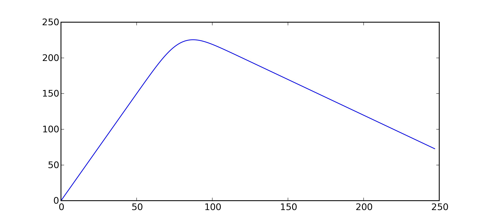

.. _l-exemple_optim_alea:

====================================
Optimisation avec données aléatoires
====================================

.. contents::
    :local:

Un problème simple
==================

Un supermarché pourrait vendre en moyenne 80 poulets par
semaine s'il pouvait savoir à l'avance combien de poulets
à acheter pour satisfaire la demainde. En réalité, le magasin
se réapprovisionne une fois par semaine et lorsque la fin de
la semaine arrive, tous les poulets invendus sont soldés et
supposés vendus. Le gérant du supermarché voudrait savoir quel
est le nombre optimal de poulets à commander chaque semaine.
On suppose que le prix d'un poulet à l'achat est :math:`p`, son prix à
la vente est :math:`q>p`, son prix soldé est :math:`s`. Admettons que
le supermarché achète :math:`X` poulets, en vende au mieux :math:`N` non
soldés et :math:`X-N` soldés s'il en reste. Pour calculer son bénéfice
:math:`B`, il faut tenir compte de deux cas et du fait que le
supermarché ne peut pas vendre plus de poulets qu'il n'en a acheté :

.. math::

    \begin{array}{ll}
    B = X (q-p)  & \text{si } N \supegal X \\
    B = N (q-p) + (X-N) (s-p) = X (s-p) + N (q-s) & \text{si } N < X
    \end{array}

On peut réduire ces deux expressions à une seule en utilisant
la fonction indicatrice :

.. math::

    B = f(N,X,p,q,s)= X (q-p) \indicatrice{ N \supegal X } +  \cro{ X (s-p) + N (q-s)} \indicatrice{ N < X }

Si :math:`N` était connu avec certitude, il suffirait de
choisir :math:`X=N`, ce serait la réponse optimale mais
le nombre de poulets :math:`N` vendus est inconnu car il
varie chaque semaine. Pour avoir une idée plus précise, le
gérant du supermarché a délibérément acheté trop de poulets
pendant plusieurs semaines. Il s'est aperçu que la variable
aléatoire :math:`N` suit une `loi de Poisson <https://fr.wikipedia.org/wiki/Loi_de_Poisson>`_
de paramètre :math:`\lambda = 80`. On connaît seulement la
probabilité que  :math:`N` soit égale à une valeur fixée.
La figure suivante montre l'allure de cette distribution.

.. math::

    \pr{X=i} = e^{-\lambda} \frac{ \lambda^i}{i!}

.. image:: images/poisson.png

Ce graphe répresente la fonction de densité d'une loi de Poisson de paramètre 80.
On observe que le pic est obtenu pour une valeur
proche de 80, c'est la valeur la plus probable.
Ceci signifie que le nombre de poulets achetés le plus probable est 80.

Comme le nombre de poulets achetés varie d'une semaine à l'autre,
le bénéfice du supermarché varie aussi d'une semaine à l'autre.
Ce que le gérant veut optimiser, c'est la somme de ses profits
sur une année ce qui est équivalent à maximiser la moyenne de
ses profits chaque semaine. Il faut donc chercher à maximiser
l'espérence de la variable aléatoire :math:`B` à :math:`p,q,s` constant
puis à obtenir la valeur :math:`X` ayant mené à ce maximum.

.. math::

    \max_X \esp{B} =\max_X \esp{f(N,X,p,q,s)} = \max_X \acc{ \sum_{i=0}^{\infty} f(N,X,p,q,s) \pr{N=i} }

Etant donné la forme de la fonction :math:`f`, il n'est pas
évident de construire une expression exacte de :math:`X^*` défini par
:math:`\max_X \esp{f(N,X,p,q,s)} = f(N,X^*,p,q,s)`. Comme :math:`l=80`,
d'après la figure précédente, on cherche :math:`X^*` dans l'ensemble
:math:`\acc{0,...,2l=180}`, aller au delà de 180 est inutile
tant la probabilité est faible. Il suffit de calculer :math:`f` pour
chacune de ces valeurs et de prendre celle qui permet d'obtenir
le maximum. Ces calculs longs et répétitifs vont être effectués par
un programme informatique qui sera découpé en fonctions comme ceci :

.. list-table::
    :widths: 5 10
    :header-rows: 1

    * - fonction
      - objectif
    * - :func:`factorielle(x) <mlstatpy.garden.poulet.factorielle>`
      - calcule :math:`x!`
    * - :func:`profit(N,X,p,q,s) <mlstatpy.garden.poulet.profit>`
      - calcule la fonction :math:`f`
    * - :func:`proba_poisson(l, i) <mlstatpy.garden.poulet.proba_poisson>`
      - calcule la probabilité de Poisson connaissant :math:`\lambda`
        et :math:`i`
    * - :func:`esperance(X,p,q,s,l) <mlstatpy.garden.poulet.esperance>`
      - calcule l'espérance (sa moyenne) de la fonction :math:`f`
    * - :func:`maximum(p,q,s,l) <mlstatpy.garden.poulet.maximum>`
      - construit une liste de toutes les valeurs de :math:`f``
    * - :func:`find_maximum (res) <mlstatpy.garden.poulet.find_maximum>`
      - cherche le maximum dans la liste retournée par la
        fonction :func:`maximum <mlstatpy.garden.poulet.maximum>`

Le programme obtenu ressemble à :py:mod:`poulet.py <mlstatpy.garden.poulet>`,
les dernières lignes servent à tracer la courbe présentée par la figure qui suit.

.. runpython::
    :showcode:

    from mlstatpy.garden.poulet import maximum
    res = maximum (2,5,1,80)
    # res est la courbe affichée plus bas
    print(res[:4])

.. list-table::
    :widths: auto
    :header-rows: 0

    * - .. image:: images/poissonb.png
      - .. image:: images/poissonb2.png

Cette courbe est celle de l'évolution des profits en fonction du
nombre de poulets commandés. On suppose que
le nombre de poulets achetés suit une loi de Poisson de paramètre 80,
que les poulets sont achetés 2 euros, revendu 5 euros et soldés 1 euros.
Le maximum de 228 euros est obtenu pour 86 poulets.
La seconde courbe montre le résultat dans le cas où les poulets
soldés sont vendus 2 euros
égal au prix des poulets achetés. Le modèle montre ses limites dans ce
cas car il suppose que tous les poulets
soldés seront achetés et que les contraintes de stockage
sont négligeables.

Modélisation de la demande
==========================

La représentation de la demande est essentielle, c'est elle qui détermine
le résultat. Il est possible de l'affiner comme par exemple supposer que
certaines personnes achètent deux ou trois poulets et que la somme des
poulets achetés peut être décomposée comme :math:`N = N_1 + 2N_2 + 3N_3`
où :math:`N_i` est le nombre de personnes achetant :math:`i`
poulets. Dans ce cas, ce n'est plus :math:`N` qui suit une loi de
Poisson mais :math:`N_1`, :math:`N_2`, :math:`N_3` qui suivent chacune
des lois de Poisson de paramètres différents dont il faudra estimer
les paramètres.

Cette modification implique l'écriture d'une fonction
:func:`proba_poisson_melange <mlstatpy.garden.poulet.proba_poisson_melange>`
au lieu de :func:`proba_poisson <mlstatpy.garden.poulet.proba_poisson>`.
La demande n'est plus une loi connue mais un mélange de lois connues
dont la densité n'a pas d'expression connue : il faut la tabuler.
Pour cela, on utilise deux propriétés sur les lois exponentielles.

.. mathdef::
    :title: simulation d'une loi quelconque
    :tag: Théorème
    :lid: theoreme_inversion_variable

    Soit :math:`F=\int f` une fonction de répartition de densité
    :math:`f` vérifiant :math:`f > 0`, soit :math:`U` une variable
    aléatoire uniformément distribuée sur :math:`\cro{0,1}` alors
    :math:`F^{-1}(U)` est variable aléatoire de densité :math:`f`.

La démonstration est courte.
Soit :math:`X` une variable aléatoire de densité :math:`f`,
par définition, :math:`\pr{X \leqslant x} = F(x)`. Soit :math:`U` une
variable aléatoire uniformément distribué sur :math:`\cro{0,1}`, alors :

.. math::
    :nowrap:

    \begin{eqnarray*}
    \forall u \in \cro{0,1}, \; \pr{U \leqslant u} &=& u \\
    \Longleftrightarrow \pr{F^{-1}(U)\leqslant F^{-1}(u)} &=& u \\
    \Longleftrightarrow \pr{F^{-1}(U)\leqslant F^{-1}(F(t))} &=& F(t) \\
    \Longleftrightarrow \pr{F^{-1}(U)\leqslant t} &=& F(t)
    \end{eqnarray*}

Si la fonction :math:`F` n'est pas strictement croissante,
on pourra prendre :math:`F^{-1}(t) = \inf\acc{ u \sac F(u) \supegal t}`.
Ce théorème sera appliqué à une loi exponentielle de paramètre
:math:`\lambda`. La densité d'une telle loi est
:math:`f(x) = \lambda \exp{- \lambda x}`,
:math:`F(x) = \int_0^x f(t)dt = 1 - \exp^{- \lambda x}`.
On en déduit que :math:`F^{-1}(t) = -\frac{ \ln(1-t)}{\lambda}`,
par conséquent : :math:`-\frac{ \ln(1-U)}{\lambda}` suit une loi
exponentielle de paramètre :math:`\lambda` si :math:`U` est
une loi uniforme sur :math:`\cro{0,1}`.

.. mathdef::
    :title: simulation d'une loi de Poisson
    :tag: Théorème
    :lid: theoreme_simulation_poisson

    On définit une suite infinie :math:`(X_i)_i>0` de loi
    exponentielle de paramètre :math:`\lambda`. On définit ensuite
    la série de variables aléatoires :math:`S_i = \sum_{k=1}^{i} X_k`
    et enfin :math:`N(t) = \inf \acc{ i \sac S_i > t}`.
    Alors la variable aléatoire :math:`N(t)` suit une loi
    de Poisson de paramètre :math:`\lambda t`.

La loi exponentielle est souvent utilisée pour modéliser le temps
d'attente d'un événement comme le temps d'attente d'un métro
une fois sur le quai. On l'utilise aussi pour modéliser la
durée de vie d'un outil, d'une ampoule par exemple. La loi de
Poisson peut par exemple modéliser le nombre d'ampoules nécessaire
pour éclairer une pièce sur une certaine durée.
Avant de démontrer le théorème, il faut définir d'abord la
`loi Gamma <https://fr.wikipedia.org/wiki/Loi_Gamma>`_.
On pose au préalable :math:`\Gamma(\alpha) = \int_0^{\infty} u^{\alpha-1}e^{-u}du`.
Une variable aléatoire de loi Gamma de paramètres :math:`\pa{\alpha,\lambda}`
a pour densité : :math:`f(x) = \frac{\lambda^{\alpha}} {\Gamma(\alpha)}t^{\alpha-1}e^{-\lambda t}`.
La fonction :math:`\Gamma` vérifie une propriété utile par la suite :
:math:`\forall n \in \N^*, \, \Gamma(n) = (n-1)!`.

.. mathdef::
    :title: somme de loi exponentielle iid
    :tag: Théorème
    :lid: theoreme_convolution_poisson

    Soit :math:`X_1,...,X_n` :math:`n` variables aléatoires indépendantes
    et identiquement distribuées de loi :math:`Exp(\lambda)` alors la
    somme :math:`\sum_{k=1}^n X_k` suit une loi :math:`Gamma(n,\lambda)`.

La démonstration utilise l'unicité de la fonction caractéristique
:math:`\esp{e^{iX}}`. Il suffit de démonstrer que la fonction caractéristique
de la somme est celle d'une loi Gamma. On suppose que
:math:`X_1,...,X_n` suivent des lois exponentielles de paramètre
:math:`\lambda` et :math:`Y` suit une loi :math:`Gamma(n,\lambda)`.

.. math::
    :nowrap:

    \begin{eqnarray*}
    \esp{\exp\pa{i\sum_{k=1}^n X_k}} &=& \prod_{k=1}^n \esp{e^{iX_k}} \\
    &=& \cro{  \int_0^{\infty} \lambda e^{ix} e^{-\lambda x} dx}^n = \lambda^n \cro{\int_0^{\infty} e^{(i-\lambda) x} dx}^n  \\
    &=&  \lambda^n \cro{ - \frac{1}{(i-\lambda)} }^n  = \cro{ \frac{ \lambda} { \lambda - i} }^n  \\
    \esp{e^{iY}} &=& \int_0^{\infty}   \frac{\lambda^{n}} {\Gamma(n)}t^{n-1}e^{-\lambda t} e^{it} dt =
                     \int_0^{\infty}   \frac{\lambda^{n}} {\Gamma(n)}t^{n-1}e^{ (i-\lambda) t} dt \\
    &=& \frac{\lambda^{n}} {\Gamma(n)}  \frac{\Gamma(n)}{(i-\lambda)^{n}}   =  \cro{ \frac{ \lambda} { \lambda - i} }^n
    \end{eqnarray*}

Ces lignes démontrent le théorème.
On démontre maintenant :ref:`simulation d'une loi de Poisson <theoreme_simulation_poisson>`.
La démonstration repose sur le fait que
:math:`\pr{N(t) \supegal n} \Longleftrightarrow \pr{S_n \leqslant t}`.
On en déduit que :

.. math::

    \pr{N(t) = n} = \pr{N(t) \supegal n} - \pr{N(t) \supegal n+1} = \pr{S_n \leqslant t} - \pr{S_{n+1} \leqslant t}

Or d'après le théorème :ref:`somme de loi exponentielle iid <theoreme_convolution_poisson>`,
:math:`S_n` suit une loi :math:`Gamma(n,\lambda)`.

.. math::
    :nowrap:

    \begin{eqnarray*}
    \pr{N(t) = n} &=& \int_0^t  \frac{\lambda^n} {\Gamma(n)}u^{n-1}e^{-\lambda u} du -
                      \int_0^t  \frac{\lambda^{n+1}} {\Gamma(n+1)}u^{n}e^{-\lambda u} du \\
                  &=& \int_0^t  \cro{ \frac{\lambda^n} {(n-1)!} u^{n-1} e^{-\lambda u} - \frac{\lambda^{n+1}} {n!}u^{n}  e^{-\lambda u} } du \\
                  &=& \cro{ \frac{ \lambda^n}{n!} u^n e^{-\lambda u} }_0^t = e^{-\lambda t} \frac{ (\lambda t)^n}{n!}
    \end{eqnarray*}

Il suffit d'utiliser ce théorème pour simuler une loi de Poisson de
paramètre :math:`\lambda`, ce que fait la fonction
:func:`poisson <mlstatpy.garden.poulet.poisson>` suivante :

.. runpython::
    :showcode:

    import random
    import math

    def exponentielle(l):
        u = random.random ()
        return -1.0 / l * math.log(1.0 - u)

    def poisson(l) :
        s = 0
        i = 0
        while s <= 1:
            s += exponentielle(l)
            i += 1
        return i-1

    print(poisson(2))

On vérifie que cette méthode de simulation permet de retrouver
les résultats théoriques. Pour cela, on effectue 1000 tirages d'une
variable suivant une loi de Poisson avec :math:`\lambda=10`
puis on compte le nombre de fois qu'on obtient chaque entier compris
entre 0 et 40. La figure qui suit permet de comparer les résultats obtenus.

.. image:: images/poishis.png

Comparaison entre une fonction de densité estimée
empiriquement pour la loi de Poisson de paramètre
:math:`\lambda=10` et sa densité théorique
:math:`f(i) = e^{-\lambda} \frac{ \lambda^i}{i!}`.

On cherche maintenant à calculer les probabilités
:math:`\pr{N = i}` sachant que :math:`N = N_1 + 2 N_2 + 3 N_3`
et :math:`N_1 \sim \mathcal{P}(48)`, :math:`N_2 \sim \mathcal{P}(10)`,
:math:`N_3 \sim \mathcal{P}(4)`. L'addition de deux lois de Poisson
indépendantes est une loi de Poisson. En revanche, si :math:`N_1`
suit une loi de Poisson, :math:`2N_1` ne suit pas une loi de Poisson.
:math:`2N_1` est une variable paire, c'est une propriété qui n'est
jamais vérifiée par une loi de Poisson.
Il n'existe pas d'expression évidente pour la densité du mélange :math:`N`,
il faut donc simuler cette variable. C'est l'objectif de la fonction
:func:`poisson_melange <mlstatpy.garden.poulet.poisson_melange>`.
De la même manière, on estime l'histogramme du mélange avec cette fois-ci
un plus grand nombre de tirages (10000) pour aboutir
à la figure suivante.

.. list-table::
    :widths: auto
    :header-rows: 0

    * - .. image:: images/poishist2.png
      - .. image:: images/poishist3.png

Comparaison entre une fonction de densité estimée empiriquement
pour un mélange de loi Poisson :math:`N = N_1 + 2 N_2 + 3 N_3`
vérifiant :math:`N_1 \sim \mathcal{P}(48)`,
:math:`N_2 \sim \mathcal{P}(10)`, :math:`N_3 \sim \mathcal{P}(4)`
avec la densité de la loi de Poisson de paramètre :math:`\lambda=80=48+2*10+3*4`.
Il apparaît que ce sont deux densités différentes, celle du mélange
étant plus applatie. La seconde image montre ce qu'on obtient lorsque
le nombre de tirages n'est pas assez important.

On utilise ces éléments pour modéliser la demande de poulets
selon ce mélange de lois Poisson. Le premier programme est modifié
pour aboutir au suivant.

Dans le cas du mélange de lois Poisson,
le maximum est cette-fois ci obtenu pour 87 poulets et est
de 225 euros. Ces résultats sont légèrement différents
de ceux obtenus par une simple loi Poisson (80).

Variations saisonnières et prolongations
========================================

Les paragraphes précédents supposent que la demande est constante
et ne dépend pas des saisons. Cette affirmation est peut-être
vraie en ce concerne les poulets mais ce n'est certainement pas
le cas des huîtres qui sont traditionnellement consommées en décembre.
Appliqué à l'exemple des poulets décrits dans cet énoncé, la loi de Poisson
appliquée à la consommation dépend maintenant de la semaine.

Tenir compte de la saisonnalité n'est pas forcément un problème de
modélisation mais plutôt d'estimation. Au lieu d'avoir une seule
consommation moyenne, il y a en aura maintenant 52. Ceci implique d'avoir
des données en nombre suffisant pour estimer les paramètres du modèle :
la précision des résultats dépend de celle de l'estimation. Il est possible
d'estimer séparément les variations saisonnières et la demande elle-même
mais la présentation de ces techniques dépassent le cadre de ce livre, il
est préférable de se reporter à [Gouriéroux1983]_ ou [Saporta2006]_.

Les poulets soldés ne sont pas plus mauvais que les poulets
non soldés bien que la date de péremption soit certainement plus rapprochée
de la date d'achat. On suppose qu'un gérant concurrent de ce supermarché
a eu vent de la technique d'optimisation du magasin, il connaît également
le prix du poulet et son prix soldé. Il a également accès au prix d'achat
puisqu'il se fournit chez les mêmes agriculteurs. Il lui reste à
connaître le nombre de poulets commandés et une estimation de la demande
pour savoir si les poulets de son concurrents se vendent mieux que les siens.
Il se rend dans le supermarché concurrent tous les jours où les poulets
sont soldés et les comptent. Il voudrait pouvoir en déduire le nombre de poulets vendus.

Bibliographie
=============

.. [Gouriéroux1983] Analyse des séries temporelles,
    Christian Gouriéroux, Alain Monfort,
    Editions Economica

.. [Saporta2006] Probabilités, analyse des données et statistique,
    Gilbert Saporta, Editions Technip
