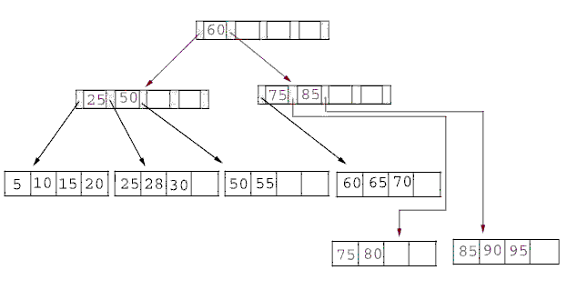

================================================
Classification à l'aide des plus proches voisins
================================================

.. index:: ppv, knn, plus proches voisins

La figure suivante représente un problème de classification
classique. On dispose d'un nuage de points réparti en deux classes.
Un nouveau point semblable aux précédents se présente, sa classe est
inconnue. L'objectif est de lui attribuer une classe en utilisant
le fait qu'on connaît la classe d'appartenance des autres points.

.. image:: knnimg/classif.png

A partir d'un nuage de points pour lesquels la classe d'appartenance est connue, comment classer
un nouveau point pour lequel cette classe est inconnue ?
Une méthode simple consiste à attribuer à ce nouveau point la même
classe que le plus proche des points appartenant au nuage initial.
C'est la méthode des plus proches voisins
(ou `nearest neighbours <https://en.wikipedia.org/wiki/K-nearest_neighbors_algorithm>`_)
Elle est facile à implémenter mais peu utilisée car souvent très
gourmande en temps de calcul lorsque le nuage de points est conséquent.
Le premier paragraphe décrit cette méthode, les suivants cherchent à
accélérer l'algorithme selon que le nuage de points appartient à un
espace vectoriel ou non. La dernière partie présente l'algorithme
*LAESA* pour le cas où le nuage de points appartient à un
espace métrique quelconque.

Principe
========

Cette méthode est la plus simple puisqu'elle consiste à associer
à :math:`x`, l'élément à classer, le label
:math:`c\pa{x_{i^*}}` de l'élément le plus proche
:math:`x_{i^*}` dans l'ensemble :math:`\vecteur{x_1}{x_N}`.
Ceci mène à l'algorithme de classification suivant :

.. index:: 1-PPV

.. mathdef::
    :title: 1-PPV ou plus proche voisin
    :tag: Algorithme
    :lid: clas_super_1ppv_algo

    Soit :math:`X = \vecteur{x_1}{x_N} \subset E` un ensemble
    d'éléments d'un espace métrique quelconque,
    soit :math:`\vecteur{c\pa{x_1}}{c\pa{x_N}}` les classes
    associées à chacun des éléments de :math:`X`. On note
    :math:`d` la distance définie sur l'espace métrique
    :math:`E`. Soit :math:`x` un élément à classer, on cherche
    à déterminer la classe :math:`\hat{c}(x)` associée à :math:`x`.
    On définit :math:`x_{i^*}` comme étant :

    .. math::

        x_{i^*} = \underset{i \in \intervalle{1}{N}}{\arg \min} \; d\pa{x_i,x}

    Alors :math:`\hat{c}(x) = c\pa{x_i^*}`.

Cet algorithme est souvent appelé *1-PPV*
(ou *1-NN* pour Nearest Neighbors).
Il existe une version améliorée *k-PPV* qui
consiste à attribuer à :math:`x` la classe
la plus représentée parmi ses :math:`k` plus proches voisins.

.. mathdef::
    :title: k-PPV ou k-plus proches voisins
    :tag: Algorithme
    :lid: clas_super_kppv_simple

    Soit :math:`X = \vecteur{x_1}{x_N} \subset E` un ensemble
    d'éléments d'un espace métrique quelconque,
    soit :math:`\vecteur{c\pa{x_1}}{c\pa{x_N}}` les classes
    associées à chacun des éléments de :math:`X`. On note
    :math:`d` la distance définie sur l'espace métrique :math:`E`.
    :math:`\omega\pa{x,y}` est une fonction strictement positive
    mesurant la ressemblance entre :math:`x` et :math:`y`.
    Soit :math:`x` un élément à classer, on cherche à déterminer la
    classe :math:`c(x)` associée à :math:`x`.
    On définit l'ensemble :math:`S^*_k`
    incluant les :math:`k`-plus proches voisins de
    :math:`x`, cet ensemble vérifie :

    .. math::

        card{S^*_k} = 0 \text{ et } \underset{y \in S^*_k}{\max} \; d\pa{y,x}
        \leqslant \underset{y \in X - S^*_k}{\min} \; d\pa{y,x}

    On calcule les occurrences :math:`f(i)` de chaque classe
    :math:`i` dans l'ensemble :math:`S^*_k` :

    .. math::
        :label: class_super_kppv_contribution_eq

        f(i) = \sum_{y \in S^*_k} \, \omega\pa{x,y} \, \indicatrice{c(y) = i}

    On assigne alors à :math:`x` la classe :math:`c(x)` choisie dans l'ensemble :

    .. math::

        \hat{c}(x) \in \underset{i \in \N}{\arg \max} \; f(i)

Dans sa version la plus simple, la fonction :math:`\omega\pa{x,y}`
utilisée lors du calcul de la contribution :math:`f` :eq:`class_super_kppv_contribution_eq`
est constante. Mais il est possible de lui affecter une valeur tenant
compte de la proximité entre :math:`x` et :math:`y`.
La table suivante donne quelques exemples de contributions possibles.

.. list-table::
    :header-rows: 0
    :widths: 5 10

    * - fonction constante     
      - :math:`\omega\pa{x,y} = 1`
    * - distance inverse
      - :math:`\omega\pa{x,y} = \frac{1}{1 + d\pa{x,y}}`
    * - noyau                                
      - :math:`\omega\pa{x,y} = \exp\pa{ - d^2 \pa{x,y}}`

Exemple de contribution :math:`w\pa{x,y}` pour
l'algorithme des :ref:`k-ppv <clas_super_kppv_simple>`.
Ces fonctions sont toutes décroissantes (strictement ou non)
par rapport à la distance :math:`d`.
L'inconvénient majeur de la méthode des plus proches voisins
est sa longueur puisqu'elle implique le calcul des distances
entre :math:`x` et chacun des éléments de l'ensemble
:math:`\vecteur{x_1}{x_N}`. C'est pourquoi de nombreuses
méthodes d'optimisation ont été développées afin d'accélérer ce
processus. Les deux premiers paragraphes traitent le cas où les
points :math:`x_i` appartiennent à un espace vectoriel et ont donc
des coordonnées. Les suivant traitent le cas où les points :math:`x_i`
n'ont pas de coordonnées et appartiennent à un espace métrique quelconque.

B+ tree
=======

.. index:: B+ tree

Ce premier algorithme :epkg:`B+ tree`
s'applique dans le cas réel afin d'ordonner
des nombres dans un arbre de sorte que chaque noeud ait un
père et pas plus de :math:`n` fils.

.. mathdef::
    :title: B+ tree
    :tag: Définition

    Soit :math:`B_n` un :epkg:`B+ tree`, soit :math:`N` un noeud de :math:`B_n`,
    il contient un vecteur :math:`V\pa{N} = \vecteur{x_1}{x_t}`
    avec :math:`0 \leqslant t \leqslant n` et :math:`x_1 < ... < x_t`.
    Ce noeud contient aussi exactement :math:`t-1` noeuds fils
    notés :math:`\vecteur{N_1}{N_{t-1}}`. On désigne par :math:`D\pa{N_t}`
    l'ensemble des descendants du noeud :math:`N_t` et
    :math:`G\pa{N_t} = \acc{ V\pa{M} \sac M \in D\pa{N_t}}`.
    Le noeud :math:`N` vérifie :

    .. math::
        :nowrap:

        \begin{eqnarray*}
        && \forall x \in G\pa{N_t}, \; x_{t} \leqslant x < x_{t+1} \\
        && \text{avec par convention } x_0 = -\infty \text{ et } x_{t+1} = + \infty
        \end{eqnarray*}
        
.. index:: quicksort
        
Cet arbre permet de trier une liste de nombres, c'est une
généralisation du tri `quicksort <https://fr.wikipedia.org/wiki/Tri_rapide>`_
pour lequel :math:`n=2`. Comme pour le tri *quicksort*, l'arbre est construit
à partir d'une série d'insertions et de cet ordre dépend la rapidité du
tri. L'espérance du coût (moyenne sur tous les permutations possibles de
:math:`k` éléments), le coût de l'algorithme est en :math:`O\pa{k \log_n k}`.

R-tree ou Rectangular Tree
==========================

.. index:: R-tree

L'arbre :epkg:`R-tree` est l'adaptation du mécanisme du :epkg:`B+ tree` au cas multidimensionnel
(voir [Guttman1984]_). La construction de cet arbre peut se faire
de manière globale - construction de l'arbre sachant l'ensemble de points à classer -
ou de manière progressive - insertion des points dans l'arbre les uns à la suite des autres -.
Toutefois, ces méthodes sont resteintes à des espaces vectoriels.

.. list-table::
    :header-rows: 0
    :widths: auto

    * - .. image:: knnimg/rtree1.png
      - .. image:: knnimg/rtree2.png

Illustration d'un :epkg:`R-tree` en deux dimensions,
figure extraite de [Sellis1987]_, la première image montre des rectangles
pointillés englobant d'autres rectangles en trait plein. Chaque style de trait correspond
à un niveau dans le graphe de la seconde image.
            
Il n'existe pas une seule manière de construire un :epkg:`R-tree`,
les noeuds de ces arbres suivent toujours la contrainte des
:epkg:`B+ tree` qui est d'avoir un père et au plus :math:`n` fils.
Les :epkg:`R-tree` ont la même structure que les :epkg:`B+ tree` ôtée de
leurs contraintes d'ordonnancement des fils. De plus, ces arbres organisent
spatialement des rectangles ou boîtes en plusieurs dimensions comme le suggère la
figure précédente. Les boîtes à organiser seront nommés les objets,
ces objets sont ensuite regroupés dans des boîtes englobantes.
Un noeud :math:`n` d'un :epkg:`R-tree` est donc soit une feuille,
auquel cas la boîte qu'il désigne est un objet, dans ce cas, il n'a
aucun fils, soit le noeud désigne une boîte englobante :math:`B\pa{n}`.
On désigne par :math:`\mathcal{B}` l'ensemble des boîtes d'un espace
vectoriel quelconque et :math:`v\pa{b}` désigne son volume. Pour un
noeud :math:`n` non feuille, :math:`A\pa{n}` désigne l'ensemble
des descendants de ce noeud. :math:`B\pa{n}` est défini par :

.. math::

    B\pa{n} = \arg \min \acc{ v\pa{b} \sac b \in \mathcal{B} \text{ et } \forall n' \in A\pa{n'}, \; B\pa{n'} \subset B\pa{n} }

La recherche dans un :epkg:`R-tree` consiste à trouver tous les objets
ayant une intersection avec une autre boîte ou fenêtre :math:`W`, soit l'ensemble :math:`L` :

.. math::

    L = \acc{ B\pa{n} \sac B\pa{n} \text{ est un objet et } B\pa{n} \cap W \neq \emptyset }

Cet ensemble est construit grâce à l'algorithme suivant :

.. mathdef::
    :title: recherche dans un R-tree
    :tag: Algorithme
    :label: space_metric_algo_r_tree_search

    Les notations sont celles utilisées dans ce paragraphe.
    On désigne par :math:`r` le noeud racine d'un :epkg:`R-tree`.
    Soit :math:`n` un noeud, on désigne par :math:`F\pa{n}`
    l'ensemble des fils de ce noeud.

    *initialisation*

    | :math:`L \longleftarrow 0`
    | :math:`N \longleftarrow \acc{r}`

    *itération*

    | while :math:`N \neq \emptyset`
    |     for n in :math:`1..N`
    |         if :math:`W \cap B\pa{n} \neq \emptyset`
    |             :math:`N \longleftarrow N \cup F\pa{n}`
    |             if :math:`B\pa{n}` est un objet
    |                 :math:`L \longleftarrow B\pa{n}`

    :math:`L` est l'ensemble cherché.

Il reste à construire le :epkg:`R-tree`, opération effectuée
par la répétition successive de l'algorithme suivant
permettant d'insérer un objet dans un :epkg:`R-tree`.

.. mathdef::
    :title: insertion d'un objet dans un R-tree
    :tag: Algorithme
    :label: space_metric_algo_r_tree_insert

    Les notations utilisées sont les mêmes que celles de
    l'algorithme de :ref:`recherche <space_metric_algo_r_tree_search>`.
    On cherche à insérer l'object :math:`E` désigné par son noeud
    feuille :math:`e`. On suppose que l'arbre contient au
    moins un noeud, sa racine :math:`r`. On désigne également
    par :math:`p\pa{n}` le père du noeud :math:`n`. Chaque noeud
    ne peut contenir plus de :math:`s` fils. On désigne par
    :math:`v^*\pa{G} = \min \acc{ P \sac P \in \mathcal{B} \text{ et } \cup_{g \in G} B\pa{g}  \subset P }`.

    *sélection du noeud d'insertion*

    | :math:`n^* \longleftarrow r`
    | tant que :math:`n^*` n'est pas un noeud feuille
    |     On choisit le fils :math:`f` de :math:`n^*`
    |     qui minimise l'accroissement :math:`v_f - v\pa{B\pa{f}}`
    |     du volume avec :math:`v_f` défini par :
    |     :math:`v_f = \min \acc{ v\pa{P} \sac P \in \mathcal{B} \text{ et } B\pa{f} \cup B\pa{e}  \subset P }`
    |     :math:`n^* \longleftarrow f`

    *ajout du noeud*

    Si :math:`p\pa{n^*}` a moins de :math:`s` fils, alors le
    noeud :math:`e` devient le fils de :math:`p\pa{n^*}`
    et :math:`B\pa{p\pa{n^*}}` est mis à jour d'après l'étape précédente.
    L'insertion est terminée. Dans le cas contraire, on sépare découpe le
    noeud :math:`p\pa{n^*}` en deux grâce à l'étape suivante.

    *découpage des noeuds*

    L'objectif est de diviser le groupe :math:`G` composé de
    :math:`s+1` noeuds en deux groupes :math:`G_1` et :math:`G_1`.
    Tout d'abord, on cherche le couple :math:`\pa{n_1,n_2}` qui minimise
    le critère :math:`d = v^*\pa{\acc{n_1,n_2}} - v\pa{B\pa{n_1}} - v\pa{B\pa{n_2}}`
    alors : :math:`G_1 \longleftarrow n_1`, :math:`G_2 \longleftarrow n_2` et
    :math:`G \longleftarrow G - G_1 \cup G_2`

    | tant que :math:`G \neq \emptyset`
    |     On choisit un noeud :math:`n \in G`, on détermine :math:`i^*`
    |     tel que :math:`v\pa{\acc{n} \cup G_i} - v\pa{G_i}` soit minimal.
    |     :math:`G \longleftarrow G - \acc{n}`
    |     :math:`G_{i^*} \longleftarrow G_{i^*} \cup \acc{n}`

Si la recherche est identique quel que soit l'arbre construit,
chaque variante de la construction de l'arbre tente de minimiser
les intersections des boîtes et leur couverture. Plus précisément,
l'étape qui permet de découper les noeuds est conçue de manière à obtenir
des boîtes englobantes de volume minimale et/ou d'intersection minimale
avec d'autres boîtes englobantes. L'algorithme R+~Tree (voir [Sellis1987]_)
essaye de minimiser les intersections entre boîtes et les objets à
organiser sont supposés n'avoir aucune intersection commune.
La variante :epkg:`R* tree` (voir [Beckmann1990]_) effectue un compromis
entre l'intersection et la couverture des boîtes englobantes.
L'algorithme :epkg:`X-tree` (voir [Berchtold1996]_) conserve
l'historique de la construction de l'arbre ce qui lui
permet de mieux éviter les intersections communes entre boîtes.
Ces techniques appartiennent à une classe plus larges d'algorithmes
de type :epkg:`Branch and Bound`.

LAESA
=====

.. index:: LAESA

Cet algorithme permet de chercher les plus proches voisins
dans un ensemble inclus dans un espace métrique quelconque.
Il s'appuie sur l'inégalité triangulaire. L'algorithme :epkg:`LAESA`
ou *Linear Approximating Eliminating Search Algorithm*,
(voir [Rico-Juan2003]_) consiste à éviter un trop grand nombre
de calculs de distances en se servant de distances déjà calculées
entre les éléments de :math:`E` et un sous-ensemble :math:`B`
inclus dans :math:`E` contenant des *pivots*. La sélection des pivots
peut être aléatoire ou plus élaborée comme celle effectuée par
l'algorithme qui suit, décrit dans l'article [Moreno2003]_.

.. mathdef::
    :title: LAESA : sélection des pivots
    :tag: Algorithme
    :label: space_metric_algo_laesa_pivtos_sel

    Soit :math:`E = \ensemble{y_1}{y_N}` un ensemble de
    points, on cherche à déterminer un sous-ensemble de pivots
    :math:`B = \ensemble{p_1}{p_P} \subset E`.

    *initialisation*

    | :math:`B \longleftarrow y \in E` choisi arbitrairement.

    *calcul de la fonction* :math:`g`

    | for y in :math:`E - B`
    |     :math:`g\pa{y} \longleftarrow 0`
    |     for p in :math:`B`
    |         :math:`g\pa{y} \longleftarrow g\pa{y} + d\pa{y,p}`

    *mise à jour de* :math:`B`

    | Trouver :math:`p^* \in \arg \max \acc { g\pa{p} \sac p \in E - B}`
    | :math:`B \longleftarrow B \cup \acc{ p^*}`
    | Si :math:`card{B} < P`, retour à l'étape précédente sinon fin.

L'algorithme :epkg:`LAESA` utilise les pivots pour diminuer
le nombre de calculs en utilisant l'inégalité triangulaire.
Par exemple, soit :math:`x` un élément à classer, :math:`p_j`
un pivot, :math:`y_i` un point du nuage. On suppose qu'on connaît
:math:`d\pa{x,p_j}`, :math:`d\pa{p_j,y_i}` et :math:`d^*` la distance
du point :math:`x` à un autre point du nuage. L'inégalité triangulaire
permet d'affirmer que si : :math:`d\pa{x,y_i} \supegal \abs{ d\pa{x,p_j} - d\pa{p_j,y_i}} > d^*`,
alors il n'est pas nécessaire de calculer la distance :math:`d\pa{x,y_i}`
pour affirmer que :math:`d\pa{x,y_i} > d^*`. L'élément :math:`y_i`
ne peut être l'élément le plus proche.

.. mathdef::
    :title: LAESA
    :tag: Algorithme
    :label: space_metric_algo_laesa_prime

    Soit :math:`E = \ensemble{y_1}{y_N}` un ensemble de points,
    :math:`B = \ensemble{p_1}{p_P} \subset E`
    un ensemble de pivots inclus dans :math:`E`.
    On cherche à déterminer le voisinage :math:`V\pa{x}` de :math:`x`
    inclus dans :math:`E` vérifiant :

    .. math::

        \forall y \in V\pa{x}, \; d\pa{x,y} \leqslant \rho

    On suppose que la matrice
    :math:`M = \pa{m_{ij}}_{ \begin{subarray} 1 \leqslant i \leqslant P \\ 1 \leqslant j \leqslant N \end{subarray} }`
    a été calculée préalablement comme suit :

    .. math::

        \forall \pa{i,j}, \; m_{ij} = d\pa{p_i, y_j}

    *initialisation*

    | for i in :math:`1..P`
    |     :math:`d_i \longleftarrow d\pa{x, p_i}`
    | :math:`d^* \longleftarrow  \min \acc{ d_i \sac 1 \leqslant i \leqslant P }`
    | :math:`d^*` est la distance du point :math:`x` au pivot le plus proche.

    *recherche du plus proche élément*

    | :math:`S \longleftarrow \emptyset`
    | for i in :math:`1..N`
    |     :math:`d' \longleftarrow \max \acc{ \abs{ d_j - m_{ji} } }`
    |     if :math:`d' < d^*`
    |         :math:`d \longleftarrow d\pa{x,y_i}`
    |         if :math:`d' \leqslant d^*`
    |             :math:`d^* \longleftarrow d'`
    |             :math:`S \longleftarrow \acc{y_i}`

Résultats théoriques
====================

L'article [Farago1993]_ démontre également qu'il existe une
majoration du nombre moyen de calcul de distances pour peu
que la mesure de l'espace contenant l'ensemble :math:`E`
et l'élément :math:`x` soit connue et que l'ensemble
:math:`B = \ensemble{p_1}{p_P}` des pivots vérifie :

.. math::
    :nowrap:

    \begin{eqnarray*}
    \exists \pa{\alpha,\beta} \in \mathbb{R}^+_* \text{ tels que } && \nonumber\\
    \forall \pa{x,y} \in E^2, \; \forall i\, && \alpha \, d\pa{x,y} \supegal
                    \abs{d\pa{x,p_i} - d\pa{p_i,y}} \label{space_metric_cond_1} \\
    \forall \pa{x,y} \in E^2, && \underset{i}{\max} \; \abs{d\pa{x,p_i} - d\pa{p_i,y}} \supegal
                    \beta \, d\pa{x,y} \label{space_metric_cond_1}
    \end{eqnarray*}

L'algorithme développé dans [Farago1993]_ permet de trouver
le point de plus proche d'un élément :math:`x` dans un
ensemble :math:`E = \ensemble{x_1}{x_N}` selon l'algorithme suivant :

.. mathdef::
    :title: plus proche voisin d'après [Farago1993]_
    :tag: Algorithme
    :label: space_metric_algo_farago

    Soit :math:`E = \ensemble{x_1}{x_N}` et
    :math:`B = \ensemble{p_1}{p_P} \subset E \subset X`.
    Soit :math:`x \in X`, un élément quelconque.
    On suppose que les valeurs :math:`m_{ij} = d\pa{x_i, p_j}`
    ont été préalablement calculées.

    *initialisation*

    On calcule préalablement les coefficients
    :math:`\gamma\pa{x_i}` :

    .. math::

        \forall i \in \ensemble{1}{N}, \; \gamma\pa{x_i} \longleftarrow
        \underset{j \in \ensemble{1}{P} } {\max} \; \abs{ m_{ij} - d\pa{x,p_j} }

    *élaguage*

    On définit :math:`t_0 \longleftarrow \underset{i} {\min} \; \gamma\pa{x_i}`.
    Puis on construit l'ensemble
    :math:`F\pa{x} = \acc{ x_i \in E \sac \gamma\pa{x_i} }\leqslant \frac{\alpha}{\beta} \, t_0`.

    *plus proche voisin*

    Le plus proche :math:`x^*` voisin est défini par :
    :math:`x^* \in \arg \min \acc{ d\pa{x,y} \sac y \in F\pa{x}}`.

Et un petit théorème.

.. mathdef::
    :title: [Farago1993]_ 1
    :tag: Théorème
    :label: space_metric_farago_1

    Les notations sont celles de l'algorithme précédent.
    Il retourne le plus proche voisin :math:`x^*` de
    :math:`x` inclus dans :math:`E`.
    Autrement dit, :math:`\forall x \in X, \; x^* \in F\pa{x}`.

.. mathdef::
    :title: [Farago1993]_ 2
    :tag: Théorème
    :label: space_metric_farago_2

    Les notations sont celles du même algorithme.
    On définit une mesure sur l'ensemble :math:`X`,
    :math:`B\pa{x,r}` désigne la boule de centre
    :math:`x` et de rayon :math:`r`,
    :math:`Z \in X` une variable  aléatoire, de plus :

    .. math::

        p\pa{x,r} = P_X \pa{B\pa{x,r}} = \pr{  Z \in B\pa{x,r}}

    On suppose qu'il existe :math:`d > 0` et une fonction :math:`f : X \longrightarrow \mathbb{R}`
    tels que :

    .. math::

        \underset { r \rightarrow 0 } { \lim } \; \frac{ p\pa{x,r} } { r^d } = f\pa{x} > 0

    La convergence doit être uniforme et presque sûre.
    On note également :math:`F_N` le nombre de calculs de
    dissimilarité effectués par l'algorithme
    où :math:`N` est le nombre d'élément de :math:`E`,
    :math:`P` désigne toujours le nombre de pivots, alors :

    .. math::

        \underset{ n \rightarrow \infty } { \lim \sup } \; \esp{F_N} \leqslant k + \pa{\frac{\alpha}{\beta}}^{2d}

Implémentation
==============

La classe :class:`NuagePoints <mlstatpy.ml.kppv.NuagePoints>` implémente
les nuages de points sans optimisation. Il utilise la même interface que
:class:`sklearn.neighbors.NearestNeighbors`. La second classe
:class:`NuagePointsLaesa <mlstatpy.ml.kppv_laesa.NuagePointsLaesa>`.

.. runpython::
    :showcode:

    import numpy
    from mlstatpy.ml.kppv_laesa import NuagePointsLaesa

    X = numpy.array([[0, 0], [3, 3], [1, 1]])
    nuage = NuagePointsLaesa(2)
    nuage.fit(X)
    dist, indices = nuage.kneighbors(X)
    print("distance", dist)
    print("indices", indices)

Bilbiographie
=============

.. [Beckmann1990] The R$^*$-tree: an efficient and robust access method for points and rectangles,
    N. Beckmann, H. P. Kriegel, P. Schneider, B. Seeger,
    Proceedings of SIGMOD conference, Atlantic City, pages 322-331

.. [Berchtold1996] The X-Tree: An index structure for high dimension data,
    S. Berchtold, D. A. Keim, H. P. Kriegel,
    Proceedings of the 22nd Internation Conference on Very Large Databases, Bombay, India

.. [Farago1993] Fast Nearest-Neighbor Search in Dissimilarity Spaces,
    A. Farago, T. Linder, G. Lugosi,
    IEEE Transactions on Pattern Analysis and Machine Intelligence, volume 15(9), pages 957-962

.. [Guttman1984] R-Trees: A Dynamic Index Structure for Spatial Searching,
    A. Guttman, Proceedings ACM SIGMOD, pages 47-57

.. [Moreno2003] A modification of the LAESA algorithm for approximated k-NN classification,
    Francisco Moreno-Seco, Luisa Mico, Jose Oncina,
    Pattern Recognition Letters, volumne 24, pages 47-53

.. [Rico-Juan2003] Comparison of AESA and LAESA search algorithms using string and tree-edit-distances,
    J. R. Rico-Juan, L. Mico,
    Pattern Recognition Letters, volume 24, pages 1417-1426

.. [Sellis1987] The R+tree - a Dynamic Index for Multi-Dimensional Objects,
    T. Sellis, N. Roussopoulos, C. Faloutos,
    Proceedings of the 13th VLDB conference, pages 507-518
