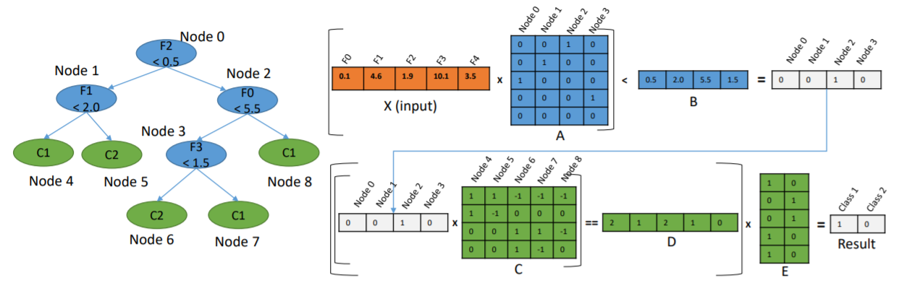

.. _l-lr-trees-nn:

======================================================
Régression logistique par morceaux, arbres de décision
======================================================

.. index:: régression logistique, arbre de décision, réseaux de neurones

Ce qui suit explore une façon fantaisiste de construire des régressions
logistiques à mi-chemin entre les arbres de décisions
et les réseaux de neurones. Dans un premier temps, on s'intéresse
uniquement à une classification binaire.

.. contents::
    :local:

Parallèle entre un neurone et une régression logistique
=======================================================

Les paragraphes :ref:`rn-classification` et
:ref:`nn-classification` présente le problème de la classification
qui consiste à trouver une fonction *f* qui maximise la vraisemblance
du nuage de points :math:`(X_i, y_i)_i` où :math:`X_i \in \R^d`
et :math:`y_i \in \acc{0, 1}`.

.. math::

    \ln L(\Theta, X, y) = \sum_{i=1}^n y_i \ln f(\Theta, X_i) + (1-y_i) \ln (1-f(\Theta, X_i))

Dans le cas de la régression logistique, la fonction *f* est définie comme suit :

.. math::

    f(\Theta, X_i) = \frac{1}{1 + e^{-\sum_{k=1}^d \theta_k x_{ik}}}

Cela ressemble beaucoup à la définition d'un :ref:`neurone <l-rn-neurone>`
où la fonction d'activation :math:`f(x) = \frac{1}{1 + e^{-x}}` est une
fonction sigmoïde.

.. _l-lr-log-likelihood:

Principe d'un arbre de décision
===============================

Un arbre de décision se construit peu à peu en répétant toujours
la même optimisation sur des sous-ensemble de plus en plus petit.
Il faut d'abord un critère qui permette d'évaluer la pertinence
de la division effectuée par un noeud de l'arbre.
Pour un ensemble :math:`(X_i, y_i)_{1 \infegal i \infegal n}`, on
peut estimer la probabilité
:math:`p(y_1, ..., y_n) = p(Y) = \frac{1}{n}\sum{i=1}^n y_i`.
Le critère de Gini *G* qui évalue la pertinence d'une classification est
défini par :math:`G(Y) = p(Y) (1 - p(Y))`.
Un autre critère est le gain d'information ou entropie *H* :
:math:`H(Y) = - p(Y) \ln p(Y) - (1-p(Y)) \ln (1 - p(Y))`.

On note :math:`Y_S` l'ensemble des :math:`\acc{y_i | i \in S}`
où *S* est un sous-ensemble. :math:`S^C` est noté le complémentaire.

Pour le premier noeud de l'arbre de décision, on calcule pour
toutes les variables et toutes les observations la diminution
du critère choisi :

.. math::

    \begin{array}{rcl}
    S_{ik} &=& \acc{ m | x_{mk} \infegal x_{ik}} \\
    \Delta_{ik} &=& H(Y) - ( H(Y_{S_{ik}}) + H(Y_{S_{ik}^C} )
    \end{array}

On choisit alors la variable *k* et le seuil :math:`x_{ik}` qui
maximise le gain. Dans le cas d'une régression logistique,
la vraisemblance correspond à :

.. math::

    \ln L(\Theta, X, y) = \sum_{i=1}^n y_i \ln f(\Theta, X_i) + (1-y_i) \ln (1-f(\Theta, X_i))

Si on suppose que la fonction *f* retourne une constante *c*,
cette expression devient :

.. math::

    \ln L(\Theta, X, y) = \sum_{i=1}^n y_i \ln c + (1-y_i) \ln (1-c) = p(Y) \ln c + (1-p(Y)) \ln (1-c)

Or cette expression admet un maximum pour :math:`c=p(Y)` puisque la dérivée
s'annule de façon évidente pour cette valeur :

.. math::

    \frac{\partial \ln L(\Theta, X, y)}{\partial c} = \frac{p(Y)}{c} - \frac{1-p(Y)}{1-c}

On remarque que l'optimisation d'un noeud d'un arbre de décision
correspond à l'optimisation de la vraisemblance par une
fonction constante. Une régression logistique calculée sur une
seule variable est en quelque sorte une généralisation de ce modèle.
On apprend un arbre de décision qu'on exporte au format :epkg:`dot`.

.. runpython::
    :showcode:
    :warningout: RuntimeWarning

    from sklearn.datasets import load_iris
    from sklearn.tree import DecisionTreeClassifier, export_graphviz
    ds = load_iris()
    X, y = ds.data, ds.target
    y = y % 2
    dt = DecisionTreeClassifier(max_depth=3, criterion='entropy')
    dt.fit(X, y)
    print(dt)
    # export_graphviz(dt)

Ce qui donne :

.. gdot::
    :format: png

    digraph Tree {
        node [shape=box] ;
        0 [label="X[3] <= 0.8\nentropy = 0.918\nsamples = 150\nvalue = [100, 50]"] ;
        1 [label="entropy = 0.0\nsamples = 50\nvalue = [50, 0]"] ;
        0 -> 1 [labeldistance=2.5, labelangle=45, headlabel="True"] ;
        2 [label="X[3] <= 1.75\nentropy = 1.0\nsamples = 100\nvalue = [50, 50]"] ;
        0 -> 2 [labeldistance=2.5, labelangle=-45, headlabel="False"] ;
        3 [label="X[2] <= 4.95\nentropy = 0.445\nsamples = 54\nvalue = [5, 49]"] ;
        2 -> 3 ;
        4 [label="entropy = 0.146\nsamples = 48\nvalue = [1, 47]"] ;
        3 -> 4 ;
        5 [label="entropy = 0.918\nsamples = 6\nvalue = [4, 2]"] ;
        3 -> 5 ;
        6 [label="X[2] <= 4.85\nentropy = 0.151\nsamples = 46\nvalue = [45, 1]"] ;
        2 -> 6 ;
        7 [label="entropy = 0.918\nsamples = 3\nvalue = [2, 1]"] ;
        6 -> 7 ;
        8 [label="entropy = 0.0\nsamples = 43\nvalue = [43, 0]"] ;
        6 -> 8 ;
    }

.. _l-criteria-reg-log:

Construction d'un pseudo arbre
==============================

Et si on remplaçait chaque noeud par une régression logistique
appris sur les exemples passant par ce noeud... Plutôt que de prendre
une décision basée sur une variable donnée et de retourner une probabilité
constante, on estime une régression logistique et on retourne
la probabilité retournée par la régression.

S'il n'y a théoriquement aucun obstacle, en pratique, certains cas
posent quelques problèmes comme le montre l'exemple
:ref:`l-example-logistic-decision` et repris ci-dessous.
La fonction :func:`criteria <mlstatpy.ml.logreg.criteria>`
calcule les différents gains selon les points de coupure.

.. plot::

    import matplotlib.pyplot as plt
    from mlstatpy.ml.logreg import criteria, random_set_1d, plot_ds

    X1, y1 = random_set_1d(1000, 2)
    X2, y2 = random_set_1d(1000, 3)
    X3, y3 = random_set_1d(1000, 4)
    df1 = criteria(X1, y1)
    df2 = criteria(X2, y2)
    df3 = criteria(X3, y3)

    fig, ax = plt.subplots(1, 3, figsize=(14, 5), sharey=True)
    plot_ds(X1, y1, ax=ax[0], title="easy")
    plot_ds(X2, y2, ax=ax[1], title="difficult")
    plot_ds(X3, y3, ax=ax[2], title="more difficult")
    df1.plot(x='X', y=['Gini', 'Gain', 'p1', 'p2'], ax=ax[0], lw=5.)
    df2.plot(x='X', y=['Gini', 'Gain', 'p1', 'p2'], ax=ax[1], lw=5.)
    df3.plot(x='X', y=['Gini', 'Gain', 'p1', 'p2'], ax=ax[2], lw=5.)
    plt.show()

Le seuil de coupure est évident dans le premier cas et
quasiment impossible à trouver de façon numérique dans le second
avec les algorithmes tels qu'ils sont implémentés.
Les arbres de décision contournent
ce problème en imposant que le seuil de coupure laisse au moins
quelques exemples de chaque côté ce que la régression logistique
ne fait pas. On peut réflechir à d'autres critères.
Le suivant explore la log-vraisemblance.

.. plot::

    import matplotlib.pyplot as plt
    from mlstatpy.ml.logreg import criteria2, random_set_1d, plot_ds

    X1, y1 = random_set_1d(1000, 2)
    X2, y2 = random_set_1d(1000, 3)
    X3, y3 = random_set_1d(1000, 4)
    df1 = criteria2(X1, y1)
    df2 = criteria2(X2, y2)
    df3 = criteria2(X3, y3)
    print(df3)

    fig, ax = plt.subplots(1, 3, figsize=(14, 5), sharey=True)
    plot_ds(X1, y1, ax=ax[0], title="easy")
    plot_ds(X2, y2, ax=ax[1], title="difficult")
    plot_ds(X3, y3, ax=ax[2], title="more difficult")
    df1.plot(x='X', y=['LL', 'LL-10', 'LL-100'], ax=ax[0], lw=5.)
    df2.plot(x='X', y=['LL', 'LL-10', 'LL-100'], ax=ax[1], lw=5.)
    df3.plot(x='X', y=['LL', 'LL-10', 'LL-100'], ax=ax[2], lw=5.)
    plt.show()

La log-vraisemblance dans ce problème à une dimension
est assez simple à écrire. Pour avoir une expression qui
ne change pas en invertissant les classes, on considère
le maxiimum des vraisemblance en considérant deux classifieurs
opposés. Le graphe précédent fait varier :math:`x_0` avec
différents :math:`\theta`.

.. math::

    LL(x_0, \theta) = \max \left\{ \begin{array}{ll}
    \frac{1}{1 + \exp{\left(\frac{x-x_0}{\theta}\right)}} \\
    \frac{1}{1 + \exp{\left(-\frac{x-x_0}{\theta}\right)}}
    \end{array}\right.

Aparté mathématique
===================

La log-vraisemblance d'une régression logistique pour
un jeu de données :math:`(X_i, y_i)` s'exprime comme
suit pour une régression logistique de paramètre
:math:`\beta`.

.. math::

    \begin{array}{rcl}
    L(\beta, X, y) &=& \sum_{i=1}^n y_i \ln f(\beta, X_i) + (1-y_i) \ln (1-f(\beta, X_i)) \\
    \text{avec } f(\beta, X_i) &=& \frac{1}{1 + \exp(- (\beta_0 + \sum_{k=1}^d x_{ik} \beta_k))}
    \end{array}

On remarque que :

.. math::

    \begin{array}{rcl}
    f(x) &=& \frac{1}{1 + e^{-x}} \\
    \Rightarrow f(-x) &=& \frac{1}{1 + e^{x}} = \frac{e^{-x}}{1 + e^{-x}} \\
    \Rightarrow f(x) + f(-x) &=& \frac{1}{1 + e^{-x}} + \frac{e^{-x}}{1 + e^{-x}} = 1
    \end{array}

Cela explique pour on utilise souvent cette fonction pour transformer
une distance en probabilité pour un classifieur binaire.
L'apprentissage d'un arbre de décision
:class:`sklearn.tree.DecisionTreeClassifier` propose le
paramètre ``min_samples_leaf``. On se propose dans le cadre
de la régression logistique de chercher le paramètre
:math:`\beta_0` qui permet de vérifier la contrainte
fixée par ``min_samples_leaf``. Cela revient à trounver
un classifieur linéaire parallèle au premier qui vérifie
les contraintes.

Approche EM et régression logistique
====================================

L'article [Scott2013]_ explicite un algorithme d'apprentissage EM
pour une régression logistique.

.. image:: lrtreesimg/bayes.png

Il faudrait adapter cet agorithme pour apprendre deux régressions
logistiques dont la combinaison sur deux parties disjointes
serait meilleure qu'une seule régression logistique sur
la réunion des deux parties. Cet algorithme devrait trouver à
la fois les modèles et la séparation entre les deux parties.

.. _l-decnntrees:

Lien vers les réseaux de neurones
=================================

En remplaçant chaque noeud par une régression logistique,
l'arbre de décision deviendrait un réseau de neurones,
avec une structure particulière certes mais un réseau de
neurones tout de même.
Chaque noeud du graphe serait transformé en un neurone
avec une régression logistique impliquant toutes les variables.
Il ne resterait plus qu'à continuer l'apprentissage avec des
algorithmes à base de gradient stochastique. Cela reviendrait
à changer l'initialisation du réseau de neurones.
On considère le petit arbre décision suivant,
trois features, trois noeuds, deux classes.

.. gdot::

    digraph tree {
        A [label="X1 &lt; 5",shape=record];
        B [label="X2 &lt; 3",shape=record];
        C [label="X3 &lt; 2",shape=record];
        A -> B;
        A -> C;
        D [label="<c0> 0|<c1> 1",shape=record];
        E [label="<c0> 0|<c1> 1",shape=record];
        B -> D:c0;
        B -> D:c1;
        C -> E:c0;
        C -> E:c1;
    }

On souhaite le transformer en réseau de neurones avec une
structure qui serait celle qui suit. On note tout d'abord
la fonction sigmoïde :math:`f(x, s, h)=\frac{1}{1 + e^{-h(x - s)}}`.
Elle vaut *1/2* lorsque *x* vaut *s*, vaut 1 lorsque *x*
est très grand, et 0 lorsque *x* est très petit.
C'est équivalent à la fonction
:math:`f(x, s, h)=g(X, S, v_0, h)\frac{1}{1 + e^{h(<X,V> + v_0)}}`
où :math:`X=(x_1, x_2, x_3)`, :math:`V=(-1, 0, 0)` et :math:`v_0=s`.

.. gdot::

    digraph tree {
        A [label="y1=g(X, (-1, 0, 0), 5, h)",shape=record];
        B [label="y2=g(X, (0, -1, 0), 3, h)",shape=record];
        C [label="y3=g(X, (0, 0, -1), 2, h)",shape=record];
        D [label="y4=g((y1, y2), (-1, -1), 1, h)",shape=record];
        E [label="y5=g((y1, y3), (-1, -1), 1, h)",shape=record];
        A -> D;
        A -> E;
        B -> D;
        C -> E;

        F [label="y6=g((y4, y5), (-1, -1), 1, h)",shape=record];
        CL3 [label="<c0> 0|<c1> 1"];
        D -> F;
        E -> F;
        F -> CL3:c0;
        F -> CL3:c1;
    }

Le problème avec la structure proposée est que chaque noeud
final retourne toujours une classe alors que dans un arbre de
décision, seule une feuille répond. Un noeud final fait la somme
de toutes les feuilles, deux dans cet exemple. L'implémentation
de :epkg:`scikit-learn` n'est pas la plus facile à manipuler
dans le sens où chaque couche ne peut prendre comme entrée
que les sorties de la précédente et la fonction d'activation
est la même pour tous les neurones. On ne peut pas non plus
geler certains coefficients lors de l'apprentissage.
C'est à ce moment-là qu'on se demande si ça vaut le coup
de se lancer dans une implémentation à la rigueur jolie mais
sans doute pas porteuse d'une innovation majeure. Et ce n'est
pas la première fois que quelqu'un se lance dans la conversion
d'un arbre en réseaux de neurones.

J'ai quand même essayé avec le notebook :ref:`notebooks/ml/neural_tree.ipynb`
et les classes :class:`NeuralTreeNode <mlstatpy.ml._neural_tree_node.NeuralTreeNode>`,
:class:`NeuralTreeNet <mlstatpy.ml.neural_tree.NeuralTreeNet>`.
Si l'idée de départ est séduisante, elle requiert une contrainte
supplémentaire qui est de créer un réseau de neurones qui ne soit
pas un minimum local de la fonction d'erreur auquel cas
un apprentissage avec un algorithme à base de gradient ne pourra
pas améliorer les performances du réseau de neurones.

.. image:: lrtreesimg/mloc.png
    :width: 200

La structure proposée n'est cependant pas la meilleure et elle
pourrait être simplifiée. D'autres projets s'appuie des librairies
existantes :

* `Soft-Decision-Tree <https://github.com/kimhc6028/soft-decision-tree>`_
* `Neural-Decision-Forests <https://github.com/jingxil/Neural-Decision-Forests>`_
* `hummingbird <https://github.com/microsoft/hummingbird>`_

Ce dernier package convertit un réseau de neurones en autant de couches
que la profondeur de l'arbre. L'image qui suit est tiré de l'article
[Nakandalam2020]_ et qui résume leur idée.

Plan orthogonal
===============

Dans un espace à plusieurs dimensions, la régression logistique
divise l'espace à l'aide d'un hyperplan. La fonction de décision
reste similaire puisque la probabilité de classification dépend de la
distance à cet hyperplan. On suppose qu'il existe une
régression logistique binaire apprise sur un nuage de points
:math:`(X_i, y_i)`. La probabilité de bonne classification est
définie par :

.. math::

    f(\Theta, X_i) = \frac{1}{1 + e^{-\theta_0 + \sum_{k=1}^d \theta_k x_{ik}}}

Le vecteur :math:`\Theta` définit un hyperplan. On choisit un vecteur
:math:`\Theta'` de telle sorte que :math:`<\Theta,\Theta'> = 0`. Les deux
vecteurs sont orthogonaux. On définit maintenant deux
autres vecteurs :math:`\Theta_1, \Theta_2` pour deux autres régressions
logistiques. Pour classer un point :math:`X`, on procède comme suit :

* si :math:`<\Theta',X> < 0`, on classe le point en appliquant
  la régression logistique définie par :math:`Theta_1`,
* si :math:`<\Theta',X> \leqslant 0`, on classe le point en appliquant
  la régression logistique définie par :math:`Theta_2`.

De manière évidente, les performances en classification sont les mêmes
que la première régression logistique. On peut ensuite réestimer les
vecteurs :math:`\Theta_1, \Theta_2` pour maximiser la vraisemblance
sur chacune des parties. Il ne reste plus qu'à montrer que la vraisemblance
globale sera supérieur à celle obtenue par la première régression logistique.

On pourrait implémenter l'algorithme suivant
(Arbre de régressions logistiques en cascade orthogonale) :

* Apprendre une régression logistique
* Choisir un hyperplan perpendiculaire en optimisation
    un critère :ref:`l-criteria-reg-log`
* Apprendre une régression logistique sur chacune des parties.
* Continuer jusqu'à ce l'amélioration soit négligeable

Interprétabilité
================

Bibliographie
=============

.. [Scott2013] `Expectation-maximization for logistic regression <https://arxiv.org/pdf/1306.0040.pdf>`_,
    James G. Scott, Liang Sun

.. [Nakandalam2020] A Tensor-based Approach for One-size-fits-all ML Prediction Serving.
    Supun Nakandalam, Karla Saur, Gyeong-In Yu, Konstantinos Karanasos, Carlo Curino,
    Markus Weimer, Matteo Interlandi. To appear at `OSDI 2020
    <https://www.usenix.org/conference/osdi20>`_.
