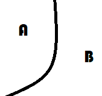

.. _l-lrvor-connection:

====================================================
Régression logistique, diagramme de Voronoï, k-Means
====================================================

.. index:: régression logistique, diagramme de Voronoï, Voronoï

Ce qui suit explore les liens entre une régression logistique,
les diagrammes de Voronoï pour construire un classifieur
qui allie la régression logistique et les clustering type
:ref:`l-k-means`. Le point de départ est une conjecture :
les régions créées par une régression logistique sont convexes.

Diagramme de Voronoï
====================

.. index:: diagramme de Voronoï

Un `diagramme de Voronoï <https://fr.wikipedia.org/wiki/Diagramme_de_Vorono%C3%AF>`_
est le diagramme issu des intersections des médiatrices entre :math:`n` points.

On définit un ensemble de points :math:`(X_1, ..., X_n)`.
La zone d'influence de chaque point est défini par
:math:`V(X_i) = \{ x | d(x, X_i) \leqslant d(x, X_j) \forall j\}`.
Si *d* est la distance euclidienne, la frontière entre deux
points :math:`X_i, X_j` est un segment sur la droite d'équation
:math:`d(x, X_i) = d(x, X_j)` :

.. math::

    \begin{array}{ll}
    &\norme{x-X_i}^2 - \norme{x-X_j}^2 = 0 \\
    \Longrightarrow & \norme{x}^2 - 2 \scal{x}{X_i} + \norme{X_i}^2 - (\norme{x}^2 - 2 \scal{x}{X_j} + \norme{X_j}^2) = 0 \\
    \Longrightarrow & 2 \scal{x}{X_j - X_i} + \norme{X_i}^2 - \norme{X_j}^2 = 0 \\
    \Longrightarrow & 2 \scal{x}{X_j - X_i} + \frac{1}{2} \scal{X_i + X_j}{X_i - X_j} = 0 \\
    \Longrightarrow & \scal{x - \frac{X_i + X_j}{2}}{X_i - X_j} = 0
    \end{array}

Ce système constitue :math:`\frac{n(n-1)}{2}` droites ou hyperplans si
l'espace vectoriel est en dimension plus que deux.
Le diagramme de Voronoï est formé par des segments de chacune
de ces droites. On peut retourner le problème. On suppose
qu'il existe :math:`\frac{n(n-1)}{2}` hyperplans,
existe-t-il *n* points de telle sorte que les hyperplans
initiaux sont les frontières du diagramme de Voronoï formé
par ces *n* points ? Les paragraphes qui suivent expliquent
explorent cette hypothèse.

Régression logistique et classification
=======================================

:epkg:`scikit-learn` a rendu populaire le jeu de données
`Iris <http://scikit-learn.org/stable/auto_examples/linear_model/plot_iris_logistic.html#sphx-glr-auto-examples-linear-model-plot-iris-logistic-py>`_
qui consiste à classer des fleurs en trois classes
en fonction des dimensions de leurs pétales.

.. image:: lrvor/iris.png

.. runpython::
    :showcode:
    :warningout: ImportWarning

    from sklearn.datasets import load_iris
    data = load_iris()
    X, y = data.data[:, :2], data.target

    from sklearn.linear_model import LogisticRegression
    clr = LogisticRegression()
    clr.fit(X, y)

    print("coef_", clr.coef_)
    print("intercept_", clr.intercept_)

La fonction de prédiction est assez simple :
:math:`f(x) = Ax + B`. La classe d'appartenance
du point *x* est déterminé par :math:`\max_i f(x)_i`.
La frontière entre deux classes *i, j* est définie
par les deux conditions :
:math:`\max_k f(x)_k = f(x)_i = f(x)_j`.
On retrouve bien :math:`\frac{n(n-1)}{2}` hyperplans.
On définit la matrice *A* comme une matrice
ligne :math:`(L_1, ..., L_n)` où *n* est le nombre
de classes. L'équation de l'hyperplan entre deux classes devient :

.. math::

    \begin{array}{ll}
    & L_i X + B_i = L_j X + B_j \\
    \Longleftrightarrow & \scal{L_i - L_j}{X} + B_i - B_j = 0 \\
    \Longleftrightarrow & \scal{L_i - L_j}{X} + B_i - B_j = 0 \\
    \Longleftrightarrow & \scal{L_i - L_j}{X - \frac{L_i + L_j}{2}} + \scal{L_i - L_j}{\frac{L_i + L_j}{2}} + B_i - B_j = 0 \\
    \Longleftrightarrow & \scal{L_i - L_j}{X - \frac{L_i + L_j}{2}} + \frac{1}{2}\norme{L_i}^2 - \frac{1}{2}\norme{L_j}^2 + B_i - B_j = 0 \\
    \Longleftrightarrow & \scal{L_i - L_j}{X - \frac{L_i + L_j}{2}} + \frac{1}{2}\norme{L_i}^2 + B_i - (\frac{1}{2}\norme{L_j}^2 + B_j) = 0
    \end{array}

Il y a peu de chance que cela fonctionne comme cela.
Avant de continuer, assurons-nous que les régions associées
aux classes sont convexes. C'est une condition nécessaire mais
pas suffisante pour avoir un diagramme de Voronoï.

Soit :math:`X_1` et :math:`X_2` appartenant à la classe *i*.
On sait que :math:`\forall k, L_i X_1 + B_i \geqslant L_k X_1 + B_k`
et :math:`\forall k, L_i X_2 + B_i \geqslant L_k X_2 + B_k`.
On considère un point :math:`X` sur le segment :math:`[X_1, X_2]`, donc il existe
:math:`\alpha, \beta \geqslant 0` tel que :math:`X = \alpha X_1 + \beta X_2` et
:math:`\alpha + \beta = 1`. On vérifie que :

.. math::

    \begin{array}{ll}
    & L_i X + B_i = L_i (\alpha X_1 + \beta X_2) + B_i = \alpha(L_i X_1 + B_i) + \beta(L_i X_2 + B_i) \\
    \geqslant & \alpha(L_k X_1 + B_k) + \beta(L_k X_2 + B_k) = L_k (\alpha X_1 + \beta X_2) + B_k \forall k
    \end{array}

Donc le point *X* appartient bien à classe *i* et celle-ci est convexe.
La régression logistique forme une partition convexe de l'espace
des features.

.. mathdef::
    :title: convexité des classes formées par une régression logistique
    :tag: Théorème
    :lid: th-thlogregpartconv

    On définit l'application :math:`\mathbb{R}^d \rightarrow \mathbb{N}`
    qui associe la plus grande coordonnée
    :math:`f(X) = \arg \max_k (AX + B)_k`.
    *A* est une matrice :math:`\mathcal{M}_{dc}`,
    *B* est un vecteur de :math:`\mathbb{R}^d`,
    *c* est le nombre de parties.
    L'application *f* définit une partition convexe
    de l'espace vectoriel :math:`\mathbb{R}^d`.

Revenons au cas de Voronoï. La classe prédite dépend de
:math:`\max_k (Ax + B)_k`. On veut trouver *n* points
:math:`(P_1, ..., P_n)` tels que chaque couple :math:`(P_i, P_j)`
soit équidistant de la frontière qui sépare leurs classes.
Il faut également les projections des deux points sur
la frontière se confondent et donc que les vecteurs
:math:`P_i - P_j` et :math:`L_i - L_j` sont colinéaires.

.. math::

    \begin{array}{ll}
    &\left\{\begin{array}{l}\scal{L_i - L_j}{P_i} + B_i - B_j = - \pa{ \scal{L_i - L_j}{P_j} + B_i - B_j } \\
    P_i-  P_j - \scal{P_i - P_j}{\frac{L_i-L_j}{\norm{L_i-L_j}}} \frac{L_i-L_j}{\norm{L_i-L_j}}=0 \end{array} \right.
    \\
    \Longleftrightarrow & \left\{\begin{array}{l}\scal{L_i - L_j}{P_i + P_j} + 2 (B_i - B_j) = 0 \\
    P_i-  P_j - \scal{P_i - P_j}{\frac{L_i-L_j}{\norm{L_i-L_j}}} \frac{L_i-L_j}{\norm{L_i-L_j}}=0 \end{array} \right.
    \end{array}

La seconde équation en cache en fait plusieurs puisqu'elle est valable
sur plusieurs dimensions mais elles sont redondantes.
Il suffit de choisir un vecteur :math:`u_{ij}` non perpendiculaire
à :math:`L_i - L_j` de sorte que
qu'il n'est pas perpendiculaire au vecteur :math:`L_i - L_j` et de
considérer la projection de cette équation sur ce vecteur.
C'est pourquoi on réduit le système au suivant qui est
équivalent au précédent si le vecteur :math:`u_{ij}` est bien choisi.

.. math::

    \begin{array}{ll}
    \Longrightarrow & \left\{\begin{array}{l}\scal{L_i - L_j}{P_i + P_j} + 2 (B_i - B_j) = 0 \\
    \scal{P_i-  P_j}{u_{ij}} - \scal{P_i - P_j}{\frac{L_i-L_j}{\norm{L_i-L_j}}} \scal{\frac{L_i-L_j}{\norm{L_i-L_j}}}{u_{ij}}=0
    \end{array} \right.
    \end{array}

Diagramme de Voronoï et partition convexe
=========================================

Faisons un peu de géométrie avant de résoudre ce problème car celui-ci
a dans la plupart des cas plus d'équations que d'inconnues.
Chaque frontière entre deux classes est la médiatrice d'un segment
:math:`[P_i, P_j]`. Le dessin suivant trace un diagramme de Voronoï à
trois points. L'intersection est le centre des médiatrices du triangle
formé par les points de Voronoï. Pour les trouver, on trace un cercle,
n'importe lequel, puis une droite perpendiculaire à l'une des médiatrice.
On obtient deux points. Le troisième est obtenu en traçant une seconde
perpendiculaire et par construsction, la troisième droite est perpendiculaire
à la troisième médiatrice. Et on nomme les angles.

.. image:: lrvor/vor2.png
    :width: 200

.. image:: lrvor/vor4.png
    :width: 300

Les triangles formés par les côtés jaunes sont isocèles. On en déduit que
:math:`a + b + c = 2\pi = 2(x + y + z)`. On en déduit aussi que :

.. math::

    \begin{array}{rcl}
    x + y &=& a \\
    y + z &=& c \\
    x + z &=& b
    \end{array}

On en conclut que :math:`a + b + c = 2\pi = 2(x + y + z) = 2(x + c)` et
:math:`x = \pi - c`. Il existe une infinité de triplets de 3 points
qui aboutissent à ce diagramme de Voronoï. Il suffit de changer
la taille du cercle. On montre aussi qu'en dimension 2 et 3 classes,
il existe toujours une solution au problème posé.
Maintenant, si on considère la configuration suivante avec des points
disposés de telle sorte que le diagramme de Voronoï est un maillage
hexagonal. :math:`a=b=c=\frac{2\pi}{3}` et :math:`x=y=z=\frac{\pi}{3}`.
Il n'existe qu'un ensemble de points qui peut produire ce maillage
comme diagramme de Voronoï. Mais si on ajoute une petite zone
(dans le cercle vert ci-dessous), il est impossible que ce diagramme
soit un diagramme de Voronoï bien que cela soit une partition convexe.

.. image:: lrvor/hexa2.png
    :width: 200

On revient à la détermination du diagramme de Voronoï associé à
une régression logistique. On a montré qu'il n'existe pas tout le temps
pour n'importe quelle partition convexe. Mais cela ne veut pas dire que
tel est le cas pour une régression logistique.

Régression logistique et partition convexe
==========================================

On a montré que la régression logistique réalise une
partition convexe de l'espace vectoriel des variables.
On note *L(n)* l'ensemble des partitions à *n* classes.
Le diagramme de Voronoï correspondent également à un
sous-ensemble *V(n)*. :math:`L(n) = V(n)`, that is the
question.

On peut se poser la question de savoir si *L(n)* un sous-ensemble
ou tout l'ensemble auquel cas la réponse à la question précédente
est triviale.
Considérons d'abord deux parties voisines d'une partition convexe formée
par une fonction telle que celle décrite par le théorème sur la
:ref:`convexité des classes formées par une régression logistique <th-thlogregpartconv>`.

L'image qui précède montre une partition qui n'est pas convexe.
La partie *A* l'est mais pas la partie *B*. En fait, il est facile
de montrer que la seule frontière admissible entre deux parties convexe
est un hyperplan. Si la partition contient *n* partie,
il y a au pire :math:`\frac{n(n-1)}{2}` frontières,
ce qui correspond également au nombre d'hyperplans définis
par la fonction de prédiction associée à la régression logistique.

L'image qui précède présente une classification en trois
zones (droites noires). On a choisi une droite bleue au hasard.
En prenant son symétrique par rapport à une des droites noires (*D*),
on a deux droites :math:`D_1`, :math:`D_2`. L'ensemble des points
:math:`\acc{x | d(x, D_1) = d(x, D_2)}` correspond à la droite noire.
Il doit être de même pour les trois droites bleues, autrement
dit, l'intersection des droites est le centre du cercle inscrit
dans le triangle bleu ce qui n'est visiblement pas le cas sur l'image.
Il paraît vraisemblable de dire que les régressions logisitiques ne permettent
pas de former toutes les partitions convexes. On pourrait le montrer mais
cela ne permettrait pas de répondre à la question initiale
:math:`L(n) = V(n)` ?

Voronoï et régression logistique
================================

On sait que :math:`L(2)=V(2)` quelque soit la dimension,
que :math:`L(3)=V(3)` en dimension 2. La matrice *L*
définit une régression logistique. Le diagramme de Voronoï qui
lui correspond est solution du système d'équations qui suit :

.. math::
    :label: eq-lrvor-system

    \begin{array}{rcl}
    & \Longrightarrow & \left\{\begin{array}{l}\scal{\frac{L_i-L_j}{\norm{L_i-L_j}}}{P_i + P_j} + 2 \frac{B_i - B_j}{\norm{L_i-L_j}} = 0 \\
    \scal{P_i-  P_j}{u_{ij}} - \scal{P_i - P_j}{\frac{L_i-L_j}{\norm{L_i-L_j}}} \scal{\frac{L_i-L_j}{\norm{L_i-L_j}}}{u_{ij}}=0
    \end{array} \right.
    \end{array}

Avec :math:`u_{ij}` choisi de telle sorte que les
vecteur :math:`L_i-L_j` et :math:`u_{ij}` ne soit pas
coliénaires. Ce système inclut des équations
entre classes ou régions qui ne sont pas voisines.
Il y a potentiellement :math:`\frac{n(n-1)}{2}`
équations pour *n* inconnues. Il n'est pas évident de dire
si ce système à une solution. Voyons plutôt l'ensemble des droites
formées par un diagramme de Voronoï. Un point appartient à un segment
s'il est à égale distance de deux points.

.. math::

    \begin{array}{ll}
    &\forall i<j, \, d(X, P_i) = d(X, P_j) \\
    \Longleftrightarrow & \forall i<j, \, \norm{X-P_i}^2 = \norm{X-P_j}^2 \\
    \Longleftrightarrow & \forall i<j, \, \scal{(X-P_i)+(X-P_j)}{(X-P_i)-(X-P_j)} \\
    \Longleftrightarrow & \forall i<j, \, \scal{X-\frac{P_i+P_j}{2}}{P_j-P_i}=0 \\
    \Longleftrightarrow & \forall i<j, \, \scal{X}{P_j-P_i} + \frac{\norm{P_i}^2}{2} - \frac{\norm{P_j}^2}{2}=0
    \end{array}

Pour une partition convexe formée à partir de droite,
comme c'est le cas d'une régression linéaire, un point
appartient à un segment s'il est à égale distance de deux
droites. L'ensemble de ces points correspond à deux droites,
les deux bissectrices.

Seule l'une de ces droites est la bonne.
L'équation d'une droite est donnée par
:math:`\scal{X}{L_i} +B_i=0`.

.. math::

    \scal{X}{\frac{L_i}{\norm{L_i}}} + \frac{B_i}{\norm{L_i}} = \scal{X}{\frac{L_j}{\norm{L_j}}} + \frac{B_j}{\norm{L_j}} \text{ ou }
    \scal{X}{\frac{L_i}{\norm{L_i}}} + \frac{B_i}{\norm{L_i}} = - \scal{X}{\frac{L_j}{\norm{L_j}}} - \frac{B_j}{\norm{L_j}}

On choisit l'une de ces droites.

.. math::

    \forall i<j, \, \scal{X}{\frac{L_j}{\norm{L_j}} -\frac{L_i}{\norm{L_i}}} + \frac{B_j}{\norm{L_j}} - \frac{B_i}{\norm{L_i}} = 0

On peut voir que si tous les points sont situés
sur la boule unité, à savoir :math:`\norm{P_i}=1`,
la régression logistique s'écrit simplement avec
:math:`L_i=P_i` et :math:`B_i=-\frac{1}{2}`.
On revient au système d'équations linéaires
:eq:`eq-lrvor-system` et on en cherche une solution
approchée un peu à la façon
`RANSAC <http://scikit-learn.org/stable/modules/generated/sklearn.linear_model.RANSACRegressor.html>`_
avec une régression linéaire et la norme *L1*.
Il n'existe pas toujours de diagramme de Voronoï équivalent
à la partition convexe réalisée par une regréssion logistique.
Il est facile de trouver un contre-exemple en essayant de résoudre
le système précédent. C'est ce que fait la fonction
:func:`voronoi_estimation_from_lr <mlstatpy.ml.voronoi.voronoi_estimation_from_lr>`.
La fonction essaye avec quelques approximations et heuristiques
de déterminer les points du diagramme de Voronoï. Si elle réussit
du premier coup, c'est qu'il y avait équivalence ce qui arrive peu souvent.
Il faudrait refaire les calculs à la main et non de façon approchée pour
valider un contre exemple. Une prochaine fois peut-être.
Ce qu'il faut retenir est que la régression logistique
réalise une partition convexe de l'espace des variables.

Notebooks
=========

.. index:: boule unité

Le notebook qui suit reprend les différents
éléments théoriques présentés ci-dessus. Il
continue l'étude d'une régression logistique
et donne une intuition de ce qui marche ou pas
avec un tel modèle. Notamment, le modèle est plus
performant si les classes sont réparties sur la boule
unité de l'espace des features.

.. toctree::
    :maxdepth: 1

    ../notebooks/ml/logreg_voronoi
