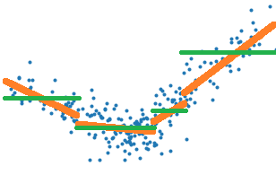
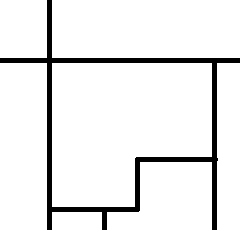

.. _l-reglin-piecewise-streaming:

================================
Régression linéaire par morceaux
================================

Le paragraphe :ref:`/notebooks/dsgarden/regression_lineaire.ipynb`
étudie le lien entre le coefficient :math:`R^2`
et la corrélation pour finalement illustrer
une façon de réaliser une régression linéaire par
morceaux. L'algorithme s'appuie sur un arbre
de régression pour découper en morceaux ce qui
n'est pas le plus satisfaisant car l'arbre
cherche à découper en segment en approximant
la variable à régresser *Y* par une constante sur chaque
morceaux et non une droite.
On peut se poser la question de comment faire
pour construire un algorithme qui découpe en approximant
*Y* par une droite et non une constante. Le plus dur
n'est pas de le faire mais de le faire efficacement.
Et pour comprendre là où je veux vous emmener, il faudra
un peu de mathématiques.

.. contents::
    :local:

Une implémentation de ce type de méthode est proposée
dans la pull request `Model trees (M5P and co)
<https://github.com/scikit-learn/scikit-learn/issues/13106>`_
qui répond à au problème posée dans
`Model trees (M5P) <https://github.com/scikit-learn/scikit-learn/pull/13732>`_
et originellement implémentée dans
`Building Model Trees <https://github.com/ankonzoid/LearningX/tree/master/advanced_ML/model_tree>`_.
Cette dernière implémentation réestime les modèles comme l'implémentation
décrite au paragraphe :ref:`l-decisiontree-reglin-piecewise-naive`
mais étendue à tout type de modèle.

Exploration
===========

Problème et regréssion linéaire dans un espace à une dimension
++++++++++++++++++++++++++++++++++++++++++++++++++++++++++++++

Tout d'abord, une petite
illustration du problème avec la classe `PiecewiseRegression
<http://www.xavierdupre.fr/app/mlinsights/helpsphinx/notebooks/piecewise_linear_regression.html>`_
implémentée selon l'API de :epkg:`scikit-learn`.

.. toctree::
    :maxdepth: 1

    ../notebooks/ml/piecewise_linear_regression

Cette régression par morceaux est obtenue grâce à un arbre
de décision. Celui-ci trie le nuage de points :math:`(X_i, Y_i)`
par ordre croissant selon les *X*, soit :math:`X_i \leqslant X_{i+1}`.
L'arbre coupe en deux lorsque la différence des erreurs quadratiques est
maximale, erreur quadratique obtenue en approximant *Y* par sa moyenne
sur l'intervalle considéré. On note l'erreur quadratique :

.. math::

    \begin{array}{rcl}
    C_(i,j) &=& \frac{1}{j - i + 1} \sum_{i \leqslant k \leqslant j} Y_i \\
    D_(i,j) &=& \frac{1}{j - i + 1} \sum_{i \leqslant k \leqslant j} Y^2_i \\
    E_(i,j) &=& \frac{1}{j - i + 1} \sum_{i \leqslant k \leqslant j} ( Y_i - C(i,j))^2 =
    \frac{1}{j - i + 1} \sum_{i \leqslant k \leqslant j} Y_i^2 - C(i,j)^2 = D(i,j) - C(i,j)^2
    \end{array}

La dernière ligne applique la formule :math:`\var{X} = \esp{X^2} - \esp{X}^2`
qui est facile à redémontrer.
L'algorithme de l'arbre de décision coupe un intervalle en
deux et détermine l'indice *k* qui minimise la différence :

.. math::

    \Delta_k = E(1, n) - (E(1, k) + E(k+1, n))

L'arbre de décision optimise la construction d'une fonction
en escalier qui représente au mieux le nuage de points,
les traits verts sur le graphe suivant, alors qu'il faudrait
choisir une erreur quadratique qui corresponde aux traits
oranges.

.. image:: piecewise/piecenaive2.png
    :width: 250

Il suffirait donc de remplacer l'erreur *E* par celle obtenue
par une régression linéaire. Mais si c'était aussi simple,
l'implémentation de :class:`sklearn.tree.DecisionTreeRegressor`
la proposerait. Alors pourquoi ?
La raison principale est que cela coûte trop cher en
temps de calcul. Pour trouver l'indice *k*, il faut calculer
toutes les erreurs :math:`E(1,k)` :math:`E(k+1,n)`, ce qui
coûte très cher lorsque cette erreur est celle d'une régression
linéaire parce qu'il est difficile de simplifier la différence :

.. math::

    \begin{array}{rcl}
    \Delta_{k} - \Delta_{k-1} &=&  - (E(1, k) + E(k+1, n)) + (E(1, k-1) + E(k, n)) \\
    &=&  E(1, k-1) - E(1, k) + E(k, n) - E(k+1, n)
    \end{array}

**Arbre de régression constante**

On s'intéresse au terme :math:`E(1, k-1) - E(1, k)` dans le cas
le nuage de points est représenté par une constante sur chaque segment.
C'est l'hypothèse faite par l'algorithme classique de construction
d'un arbre de régression (segments verts sur le premier dessin) :

.. math::

    \begin{array}{rcl}
    C_(1,k-1) - C_(1,k) &=& \frac{1}{k-1} \sum_{1 \leqslant i \leqslant k-1} Y_i
    - \frac{1}{k} \sum_{1 \leqslant i \leqslant k} Y_i \\
    &=& (\frac{1}{k-1} - \frac{1}{k}) \sum_{1 \leqslant i \leqslant k-1} Y_i - \frac{Y_k}{k} \\
    &=& \frac{1}{k(k-1)} \sum_{1 \leqslant i \leqslant k-1} Y_i- \frac{Y_k}{k} \\
    &=& \frac{1}{k} C(1,k-1) - \frac{Y_k}{k}
    \end{array}

On en déduit que :

.. math::

    \begin{array}{rcl}
    E(1, k-1) - E(1, k) &=& \frac{1}{k} D(1,k-1) - \frac{Y_k^2}{k} +
    (C_(1,k-1) - C_(1,k))(C_(1,k-1) + C_(1,k)) \\
    &=& \frac{1}{k} D(1,k-1) - \frac{Y_k^2}{k} + \pa{\frac{1}{k} C(1,k-1) - \frac{Y_k}{k}}
    \pa{\frac{Y_k}{k} - \frac{1}{k} C(1,k-1) + 2 C(1,k-1)}
    \end{array}

On voit que cette formule ne fait intervenir que :math:`C(1,k-1), D(1,k-1), Y_k`,
elle est donc très rapide à calculer et c'est pour cela qu'apprendre un arbre
de décision peut s'apprendre en un temps raisonnable. Cela repose sur la possibilité
de calculer le critère optimisé par récurrence. On voit également que ces formules
ne font pas intervenir *X*, elles sont donc généralisables au cas
multidimensionnel. Il suffira de trier les couples :math:`(X_i, Y_i)`
selon chaque dimension et déterminer le meilleur seuil de coupure
d'abord sur chacune des dimensions puis de prendre le meilleur
de ces seuils sur toutes les dimensions. Le problème est résolu.

Le notebook :epkg:`Custom Criterion for DecisionTreeRegressor`
implémente une version pas efficace du critère
`MSE <https://scikit-learn.org/stable/modules/generated/sklearn.metrics.mean_squared_error.html>`_
et compare la vitesse d'exécution avec l'implémentation de :epkg:`scikit-learn`.
Il implémente ensuite le calcul rapide de *scikit-learn* pour
montrer qu'on obtient un temps comparable.
Le résultat est sans équivoque. La version rapide n'implémente pas
:math:`\Delta_{k} - \Delta_{k-1}` mais plutôt les sommes
:math:`\sum_1^k w_i Y_i`, :math:`\sum_1^k w_i Y_i^2` dans un sens
et dans l'autre. En gros,
le code stocke les séries des numérateurs et des dénominateurs
pour les diviser au dernier moment.

**Arbre de régression linéaire**

Le cas d'une régression est plus complexe. Prenons d'abord le cas
où il n'y a qu'un seule dimension,
il faut d'abord optimiser le problème :

.. math::

    E(1, n) = \min_{a,b} = \sum_{k=1}^n (a X_k + b - Y_k)^2

On dérive pour aboutir au système d'équations suivant :

.. math::

    \begin{array}{rcl}
    \frac{\partial E(1,n)}{\partial a} &=& 0 = \sum_{k=1}^n X_k(a X_k + b - Y_k) \\
    \frac{\partial E(1,n)}{\partial b} &=& 0 = \sum_{k=1}^n a X_k + b - Y_k
    \end{array}

Ce qui aboutit à :

.. math::

    \begin{array}{rcl}
    a(1, n) &=& \frac{\sum_{k=1}^n X_kY_k - \pa{\sum_{k=1}^n X_k}\pa{\sum_{k=1}^n Y_k} }
    {\sum_{k=1}^n X_k^2 -\pa{\sum_{k=1}^n X_k}^2 } \\
    b(1, n) &=& \sum_{k=1}^n Y_k - a \pa{\sum_{k=1}^n X_k}
    \end{array}

Pour construire un algorithme rapide pour apprendre un arbre de décision
avec cette fonction de coût, il faut pouvoir calculer
:math:`a(1, k)` en fonction de :math:`a(1, k-1), b(1, k-1), X_k, Y_k`
ou d'autres quantités intermédiaires qui ne font pas intervenir
les valeurs :math:`X_{i<k} < Y_{i<k}`. D'après ce qui précède,
cela paraît tout-à-fait possible. Mais dans le
`cas multidimensionnel
<https://fr.wikipedia.org/wiki/R%C3%A9gression_lin%C3%A9aire#Estimateur_des_moindres_carr%C3%A9s>`_,
il faut déterminer le vecteur *A* qui minimise :math:`\sum_{k=1}^n \norme{Y - XA}^2`
ce qui donne :math:`A = (X'X)^{-1} X' Y`. Si on note :math:`M_{1..k}` la matrice
*M* tronquée pour ne garder que ses *k* premières lignes, il faudrait pouvoir
calculer rapidement :

.. math::

    A_{k-1} - A_k = (X_{1..k-1}'X_{1..k-1})^{-1} X'_{1..k-1} Y_{1..k-1} -
    (X_{1..k}'X_{1..k})^{-1} X'_{1..k} Y_{1..k}

La documentation de :class:`sklearn.tree.DecisionTreeRegressor`
ne mentionne que deux critères pour apprendre un arbre de décision
de régression, *MSE* pour
:func:`sklearn.metrics.mean_squared_error` et *MAE* pour
:func:`sklearn.metrics.mean_absolute_error`. Les autres critères n'ont
probablement pas été envisagés. L'article [Acharya2016]_ étudie la possibilité
de ne pas calculer la matrice :math:`A_k` pour tous les *k*.
Le paragraphe :ref:`l-piecewise-linear-regression` utilise
le fait que la matrice *A* est la solution d'un problème d'optimisation
quadratique et propose un algorithme de mise à jour de la matrice *A*
(cas unidimensionnel). Cet exposé va un peu plus loin
pour proposer une version qui ne calcule pas de matrices inverses.

.. _l-decisiontree-reglin-piecewise-naive:

Implémentation naïve d'une régression linéaire par morceaux
+++++++++++++++++++++++++++++++++++++++++++++++++++++++++++

On part du cas général qui écrit la solution d'une régression
linéaire comme étant la matrice :math:`A = (X'X)^{-1} X' Y`
et on adapte l'implémentation de :epkg:`scikit-learn` pour
optimiser l'erreur quadratique obtenue. Ce n'est pas simple mais
pas impossible. Il faut entrer dans du code :epkg:`cython` et, pour
éviter de réécrire une fonction qui multiplie et inverse une matrice,
on peut utiliser la librairie :epkg:`LAPACK`. Je ne vais pas plus loin
ici car cela serait un peu hors sujet mais ce n'était pas une partie
de plaisir. Cela donne :
`piecewise_tree_regression_criterion_linear.pyx
<https://github.com/sdpython/mlinsights/blob/master/mlinsights/mlmodel/piecewise_tree_regression_criterion_linear.pyx>`_
C'est illustré toujours par le notebook
:epkg:`DecisionTreeRegressor optimized for Linear Regression`.

Aparté sur la continuité de la régression linéaire par morceaux
+++++++++++++++++++++++++++++++++++++++++++++++++++++++++++++++

.. index:: optimisation sous contrainte, continuité

Approcher la fonction :math:`y=f(x) + \epsilon` quand *x* et *y*
sont réels est un problème facile, trop facile... A voir le dessin,
précédent, il est naturel de vouloir recoller les morceaux lorsqu'on
passe d'un segment à l'autre. Il s'agit d'une optimisation sous contrainte.
Il est possible également d'ajouter une contrainte de régularisation
qui tient compte de cela. On exprime cela comme suit avec une régression
linéaire à deux morceaux.

.. math::

    E = \sum_{X_i \leqslant t} (a_1 X_i + b_1 - y)^2 +
    \sum_{X_i \geqslant t} (a_2 X_i + b_2 - y)^2 +
    \lambda (a_1 t + b_1 - a_2 t - b)^2

Le cas multidimensionnel est loin d'être aussi simple. Avec une
dimension, chaque zone a deux voisines. En deux dimensions,
chaque zone peut en avoir plus de deux. La figure suivante
montre une division de l'espace dans laquelle la zone centrale
a cinq voisins.

Peut-on facilement approcher une fonction :math:`z = f(x,y) + \epsilon`
par un plan en trois dimensions ? A moins que tous les sommets soient
déjà dans le même plan, c'est impossible. La zone en question n'est
peut-être même pas convexe. Une régression linéaire par morceaux
et continue en plusieurs dimensions n'est pas un problème facile.
Cela n'empêche pas pour autant d'influencer la détermination de chaque
morceaux avec une contrainte du type de celle évoquée plus haut
mais pour écrire la contrainte lorsque les zones sont construites
à partir des feuilles d'un arbre de décision, il faut déterminer
quelles sont les feuilles voisines.
Et ça c'est un problème intéressant !

.. _l-reglin-nocoreel-solution:

Régression linéaire et corrélation
++++++++++++++++++++++++++++++++++

On reprend le calcul multidimensionnel mais on s'intéresse au
cas où la matrice :math:`X'X` est diagonale qui correspond au cas
où les variables :math:`X_1, ..., X_C` ne sont pas corrélées.
Si :math:`X'X = diag(\lambda_1, ..., \lambda_C) = diag(\sum_{k=1}^n X^2_{k1}, ..., \sum_{k=1}^n X^2_{kC})`,
la matrice :math:`A` s'exprime plus simplement :math:`A = D^{-1} X' Y`.
On en déduit que :

.. math::

    a_c = \frac{\sum_{k=1}^n X_{kc} Y_k}{\sum_{k=1}^n X^2_{kc}} =
    \frac{\sum_{k=1}^n X_{kc} Y_k}{\lambda_c}

Cette expression donne un indice sur la résolution d'une régression linéaire
pour laquelle les variables sont corrélées. Il suffit d'appliquer d'abord une
`ACP <https://fr.wikipedia.org/wiki/Analyse_en_composantes_principales>`_
(Analyse en Composantes Principales) et de calculer les coefficients
:math:`a_c` associés à des valeurs propres non nulles. On écrit alors
:math:`X'X = P'DP` où la matrice *P* vérifie :math:`P'P = I`.

Idée de l'algorithme
++++++++++++++++++++

On s'intéresser d'abord à la recherche d'un meilleur point de coupure.
Pour ce faire, les éléments :math:`(X_i, y_i)` sont triés le plus souvent
selon l'ordre défini par une dimension. On note *E* l'erreur de prédiction
sur cette échantillon :math:`E = \min_\beta \sum_k (X_k \beta - y_k)^2`.
On définit ensuite :math:`E(i, j) = \min_\beta \sum_{k=i}^j (X_k \beta - y_k)^2`.
D'après cette notation, :math:`E = E(1,n)`. La construction de l'arbre
de décision passe par la détermination de :math:`k^*` qui vérifie :

.. math::

    \begin{array}{rcl}
    E(1,k^*) + E(k^*+1, n) &=& \min_k E(1,k) + E(k+1, n) \\
    &=& \min_k \pa{ \min_{\beta_1} \sum_{l=1}^k (X_l \beta_1 - y_l)^2 +
    \min_{\beta_2} \sum_{l=k+1}^n (X_l \beta_2 - y_l)^2}
    \end{array}

Autrement dit, on cherche le point de coupure qui maximise la différence
entre la prédiction obtenue avec deux régressions linéaires plutôt qu'une.
On sait qu'il existe une matrice *P* qui vérifie :

.. math::

    PP' = 1 \text{ et } (XP)'(XP) = P'X'XP = D = Z'Z

Où :math:`D=diag(d_1, ..., d_C)` est une matrice
diagonale. On a posé :math:`Z = XP`,
donc :math:`d_a = <Z_a, Z_a>`.
On peut réécrire le problème
de régression comme ceci :

.. math::

    \beta^* = \arg\min_\beta \sum_i \norm{ y_i - X_i\beta} =
    \arg\min_\beta \norm{Y - X\beta}

Comme :math:`X = ZP'` :

.. math::

    \norm{Y - X\beta} = \norm{Y - X\beta} = \norm{Y - ZP'\beta} =
    \norm{Y - Z\gamma}

Avec :math:`\gamma = P'\beta`. C'est la même régression
après un changement de repère et on la résoud de la même manière :

.. math::

    \gamma^* = (Z'Z)^{-1}Z'Y = D^{-1}Z'Y

La notation :math:`M_i` désigne la ligne *i* et
:math:`M_{[k]}` désigne la colonne.
On en déduit que le coefficient de la régression
:math:`\gamma_k` est égal à :

.. math::

    \gamma_k = \frac{<Z_{[k]},Y>}{<Z_{[k]},Z_{[k]}>} =
    \frac{<(XP')_{[k]},Y>}{<(XP')_{[k]},(XP')_{[k]}>}

On en déduit que :

.. math::

    \norm{Y - X\beta} = \norm{Y - \sum_{k=1}^{C}Z_{[k]}\frac{<Z_{[k]},Y>}{<Z_{[k]},Z_{[k]}>}} =
    \norm{Y - \sum_{k=1}^{C}(XP')_{[k]}\frac{<(XP')_{[k]},Y>}{<(XP')_{[k]},(XP')_{[k]}>}}

.. mathdef::
    :title: Arbre de décision optimisé pour les régressions linéaires
    :tag: Algorithme
    :lid: algo_decision_tree_mselin

    On dipose qu'un nuage de points :math:`(X_i, y_i)` avec
    :math:`X_i \in \R^d` et :math:`y_i \in \R`. Les points sont
    triés selon une dimension. On note *X* la matrice composée
    des lignes :math:`X_1, ..., X_n` et le vecteur colonne
    :math:`y=(y_1, ..., y_n)`.
    Il existe une matrice :math:`P` telle que :math:`P'P = I`
    et :math:`X'X = P'DP` avec *D* une matrice diagonale.
    On note :math:`X_{a..b}` la matrice constituée des lignes
    *a* à *b*. On calcule :

    .. math::

        MSE(X, y, a, b) = \norm{Y - \sum_{k=1}^{C}(X_{a..b}P')_{[k]}
        \frac{<(X_{a..b}P')_{[k]},Y>}{<(X_{a..b}P')_{[k]},(X_{a..b}P')_{[k]}>}}^2

    Un noeud de l'arbre est construit en choisissant le point
    de coupure qui minimise :

    .. math::

        MSE(X, y, 1, t) + MSE(X, y, t+1, n)

Par la suite on verra que le fait que la matrice soit diagonale est l'élément
principal mais la matrice *P* ne doit pas nécessairement
vérifier :math:`P'P=I`.

Un peu plus en détail dans l'algorithme
+++++++++++++++++++++++++++++++++++++++

J'ai pensé à plein de choses pour aller plus loin car l'idée
est de quantifier à peu près combien on pert en précision en utilisant
des vecteurs propres estimés avec l'ensemble des données sur une partie
seulement. Je me suis demandé si les vecteurs propres d'une matrice
pouvait être construit à partir d'une fonction continue de la matrice
symétrique de départ. A peu près vrai mais je ne voyais pas une façon
de majorer cette continuité. Ensuite, je me suis dit que les vecteurs
propres de :math:`X'X` ne devaient pas être loin de ceux de :math:`X_\sigma'X_\sigma`
où :math:`\sigma` est un sous-échantillon aléatoire de l'ensemble
de départ. Donc comme il faut juste avoir une base de vecteurs
orthogonaux, je suis passé à l'`orthonormalisation de Gram-Schmidt
<https://fr.wikipedia.org/wiki/Algorithme_de_Gram-Schmidt>`_.
Il n'a pas non plus ce défaut de permuter les dimensions ce qui rend
l'observation de la continuité a little bit more complicated comme
le max dans l'`algorithme de Jacobi
<https://en.wikipedia.org/wiki/Jacobi_eigenvalue_algorithm>`_.
L'idée est se servir cette orthonormalisation pour construire
la matrice *P* de l'algortihme.

La matrice :math:`P \in \mathcal{M}_{CC}` est constituée de
*C* vecteurs ortonormaux :math:`(P_{[1]}, ..., P_{[C]})`.
Avec les notations que
j'ai utilisées jusqu'à présent :
:math:`X_{[k]} = (X_{1k}, ..., X_{nk})`.
On note la matrice identité :math:`I_C=I`.

.. math::

    \begin{array}{rcl}
    T_{[1]} &=& \frac{ X_{[1]} }{ \norme{X_{[1]}} } \\
    P_{[1]} &=& \frac{ I_{[1]} }{ \norme{X_{[1]}} } \\
    T_{[2]} &=& \frac{ X_{[2]} - <X_{[2]}, T_{[1]}> T_{[1]} }
    { \norme{X_{[2]} - <X_{[2]}, T_{[1]}> T_{[1]}} } \\
    P_{[2]} &=& \frac{ I_{[2]} - <X_{[2]}, T_{[1]}> T_{[1]} }
    { \norme{X_{[2]} - <X_{[2]}, T_{[1]}> T_{[1]}} } \\
    ... && \\
    T_{[k]} &=& \frac{ X_{[k]} - \sum_{i=1}^{k-1} <X_{[k]}, T_{[i]}> T_{[i]} }
    { \norme{ X_{[2]} - \sum_{i=1}^{k-1} <X_{[k]}, T_{[i]}> T_{[i]} } } \\
    P_{[k]} &=& \frac{ I_{[k]} - \sum_{i=1}^{k-1} <X_{[k]}, T_{[i]}> T_{[i]} }
    { \norme{ X_{[2]} - \sum_{i=1}^{k-1} <X_{[k]}, T_{[i]}> T_{[i]} } } \\
    \end{array}

La matrice *T* vérifie :math:`T'T=I` puisque les vecteurs sont
construits de façon à être orthonormés. Et on vérifie que
:math:`XP = T` et donc :math:`PXX'P' = I`.
C'est implémenté par la fonction
:func:`gram_schmidt <mlstatpy.ml.matrices.gram_schmidt>`.

.. runpython::
    :showcode:
    :warningout: RuntimeWarning

    import numpy
    from mlstatpy.ml.matrices import gram_schmidt

    X = numpy.array([[1, 0.5, 0], [0, 0.4, 2]], dtype=float).T
    U, P = gram_schmidt(X.T, change=True)
    U, P = U.T, P.T
    m = X @ P
    D = m.T @ m
    print(D)

Cela débouche sur une autre formulation du calcul
d'une régression linéaire à partir d'une orthornormalisation
de Gram-Schmidt qui est implémentée dans la fonction
:func:`linear_regression <mlstatpy.ml.matrices.linear_regression>`.

.. runpython::
    :showcode:

    import numpy
    from mlstatpy.ml.matrices import linear_regression

    X = numpy.array([[1, 0.5, 0], [0, 0.4, 2]], dtype=float).T
    y = numpy.array([1, 1.3, 3.9])
    beta = linear_regression(X, y, algo="gram")
    print(beta)

L'avantage est que cette formulation s'exprime
uniquement à partir de produits scalaires.
Voir le notebook svuiant :ref:`/notebooks/ml/regression_no_inversion.ipynb`.

.. _l-reglin-acp-svd:

Synthèse mathématique
=====================

.. mathdef::
    :title: Orthonormalisation de Gram-Schmidt
    :tag: Algorithme
    :lid: algo_gram_schmidt

    Soit une matrice :math:`X \in \mathcal{M}_{nd}` avec
    :math:`n \supegal d`. Il existe deux matrices telles que
    :math:`X P = T` ou :math:`P' X' = T'`.
    :math:`P \in \mathcal{M}_{dd}` et :math:`T \in \mathcal{M}_{nd}`.
    La matrice *T* est triangulaire supérieure
    et vérifie :math:`T'T = I_d` (:math:`I_d`
    est la matrice identité). L'algorithme se décrit
    comme suit :

    .. math::

        \begin{array}{ll}
        \forall i \in & range(1, d) \\
        & x_i = X_{[i]} - \sum_{j < i} <T_{[j]}, X_{[i]}> T_{[j]} \\
        & p_i = P_{[i]} - \sum_{j < i} <T_{[j]}, X_{[i]}> P_{[j]} \\
        & T_{[i]} = \frac{x_i}{\norme{x_i}} \\
        & P_{[i]} = \frac{p_i}{\norme{p_i}}
        \end{array}

.. mathdef::
    :title: Régression linéaire après Gram-Schmidt
    :tag: Théorème
    :lid: algo_gram_schmidt_reglin

    Soit une matrice :math:`X \in \mathcal{M}_{nd}` avec
    :math:`n \supegal d`. Et un vecteur :math:`y \in \R^n`.
    D'après l':ref:`algorithme de Gram-Schmidt <algo_gram_schmidt>`,
    il existe deux matrices telles que
    :math:`X P = T` ou :math:`P' X' = T'`.
    :math:`P \in \mathcal{M}_{dd}` et :math:`T \in \mathcal{M}_{nd}`.
    La matrice *T* est triangulaire supérieure
    et vérifie :math:`T'T = I_d` (:math:`I_d`
    est la matrice identité). Alors
    :math:`\beta = T' y P' = P' X' y P' = (X'X)^{-1}X'y`.
    :math:`\beta` est la solution du problème d'optimisation
    :math:`\min_\beta \norme{y - X\beta}^2`.

La démonstration est géométrique et reprend l'idée
du paragraphe précédent. La solution de la régression
peut être vu comme la projection du vecteur *y*
sur l'espace vectoriel engendré par les vecteurs
:math:`X_{[1]}, ..., X_{[d]}`.
Par construction, cet espace est le même que celui
engendré par :math:`T_{[1]}, ..., T_{[d]}`. Dans cette base,
la projection de *y* a pour coordoonées
:math:`<y, T_{[1]}>, ..., <y, T_{[d]}> = T' y`.
On en déduit que la projection de *y* s'exprimer comme :

.. math::

    \hat{y} = \sum_{k=1}^d <y, T_{[k]}> T_{[k]}

Il ne reste plus qu'à expremier cette projection
dans la base initial *X*. On sait que
:math:`T_{[k]} = X P_{[k]}`. On en déduit que ;

.. math::

    \begin{array}{rcl}
    \hat{y} &=& \sum_{k=1}^d <y, T_{[k]}> X P_{[k]} \\
    &=& \sum_{k=1}^d <y, T_{[k]}> \sum_{l=1}^d X_{[l]} P_{lk} \\
    &=& \sum_{l=1}^d X_{[l]} \sum_{k=1}^d <y, T_{[k]}>  P_{lk} \\
    &=& \sum_{l=1}^d X_{[l]} (T' y P_l) \\
    &=& \sum_{l=1}^d X_{[l]} \beta_l
    \end{array}

D'où :math:`\beta = T' y P'`.
L'implémentation suit :

.. runpython::
    :showcode:

    import numpy
    X = numpy.array([[1., 2., 3., 4.],
                     [5., 6., 6., 6.],
                     [5., 6., 7., 8.]]).T
    Xt = X.T
    Tt = numpy.empty(Xt.shape)
    Pt = numpy.identity(X.shape[1])
    for i in range(0, Xt.shape[0]):
        Tt[i, :] = Xt[i, :]
        for j in range(0, i):
            d = numpy.dot(Tt[j, :], Xt[i, :])
            Tt[i, :] -= Tt[j, :] * d
            Pt[i, :] -= Pt[j, :] * d
        d = numpy.dot(Tt[i, :], Tt[i, :])
        if d > 0:
            d **= 0.5
            Tt[i, :] /= d
            Pt[i, :] /= d

    print("X")
    print(X)
    print("T")
    print(Tt.T)
    print("X P")
    print(X @ Pt.T)
    print("T T'")
    print(Tt @ Tt.T)

    y = numpy.array([0.1, 0.2, 0.19, 0.29])
    beta1 = numpy.linalg.inv(Xt @ X) @ Xt @ y
    beta2 = Tt @ y @ Pt
    print("beta1")
    print(beta1)
    print("beta2")
    print(beta2)

La librairie implémente ces deux algorithmes de manière un peu
plus efficace dans les fonctions
:func:`gram_schmidt <mlstatpy.ml.matrices.gram_schmidt>` et
:func:`linear_regression <mlstatpy.ml.matrices.linear_regression>`.

Streaming
=========

.. _l-stream-gram-schmidt:

Streaming Gram-Schmidt
++++++++++++++++++++++

Je ne sais pas vraiment comment le dire en français,
peut-être *régression linéaire mouvante*. Même Google ou Bing
garde le mot *streaming* dans leur traduction...
C'est néanmoins l'idée qu'il faut
réussir à mettre en place d'une façon ou d'une autre car pour
choisir le bon point de coupure pour un arbre de décision.
On note :math:`X_{1..k}` la matrice composée
des lignes :math:`X_1, ..., X_k` et le vecteur colonne
:math:`y_{1..k}=(y_1, ..., y_k)`.
L'apprentissage de l'arbre de décision
faut calculer des régressions pour les problèmes
:math:`(X_{1..k}, y_{1..k}), (X_{1..k+1}, y_{1..k+1})...`.
L'idée que je propose n'est pas parfaite mais elle fonctionne
pour l'idée de l'algorithme avec :ref:`Gram-Schmidt
<algo_decision_tree_mselin>`.

Tout d'abord, il faut imaginer un algorithme
de Gram-Schmidt version streaming. Pour la matrice
:math:`X'_{1..k}`, celui-ci produit deux matrices
:math:`T_{1..k}` et :math:`P_{1..k}` telles que :
:math:`X'_{1..k}P_{1..k}=T_{1..k}`. On note *d* la dimension
des observations. Comment faire pour ajouter une observation
:math:`(X_{k+1}, y_{k+1})` ? L'idée d'un algorithme au format streaming
est que le coût de la mise à jour pour l'itération *k+1*
ne dépend pas de *k*.

On suppose donc que :math:`(T_k, P_k)` sont les deux matrices
retournées par l'algorithme de :ref:`Gram-Schmidt <algo_gram_schmidt>`.
On construit la matrice :math:`V_{k+1} = [ T_k, X_{k+1} P_k ]` :
on ajoute une ligne à la matrice :math:`T_k`. On applique
une itération de algorithme de :ref:`Gram-Schmidt <algo_gram_schmidt>`
pour obtenir :math:`(T_{k+1}, P)`. On en déduit que
:math:`(T_{k+1}, P_{k+1}) = (T_{k+1}, P_k P)`. L'expression
de la régression ne change pas mais il reste à l'expression
de telle sorte que les expressions ne dépendent pas de *k*.
Comme :math:`T_k = X_{[1..k]} P_k`, la seule matrice qui nous intéresse
véritablement est :math:`P_k`.

Maintenant, on considère la matrice :math:`T_{[1..k]}` qui vérifie
:math:`T_k'T_k = I_d` et on ajoute une ligne
:math:`X_{k+1} P_k` pour former
:math:`[ [T_k] [X_{k+1} P_k] ] = [ [X_{[1..k]} P_k] [X_{k+1} P_k] ]`.
La fonction :func:`streaming_gram_schmidt_update
<mlstatpy.ml.matrices.streaming_gram_schmidt_update>`
implémente la mise à jour. Le coût de la fonction est en
:math:`O(d^2)`.

.. runpython::
    :showcode:

    import numpy
    from mlstatpy.ml.matrices import streaming_gram_schmidt_update, gram_schmidt

    X = numpy.array([[1, 0.5, 10., 5., -2.],
                     [0, 0.4, 20, 4., 2.],
                     [0, 0.7, 20, 4., 2.]], dtype=float).T
    Xt = X.T

    Tk, Pk = gram_schmidt(X[:3].T, change=True)
    print("k={}".format(3))
    print(Pk)
    Tk = X[:3] @ Pk.T
    print(Tk.T @ Tk)

    k = 3
    while k < X.shape[0]:
        streaming_gram_schmidt_update(Xt[:, k], Pk)
        k += 1
        print("k={}".format(k))
        print(Pk)
        Tk = X[:k] @ Pk.T
        print(Tk.T @ Tk)

.. _l-piecewise-linear-regression:

Streaming Linear Regression
+++++++++++++++++++++++++++

Je reprends l'idée introduite dans l'article
`Efficient online linear regression
<https://stats.stackexchange.com/questions/6920/efficient-online-linear-regression>`_.
On cherche à minimiser :math:`L(\beta)=\norme{y - X\beta}^2` et le vecteur
solution annuler le gradient : :math:`\nabla(\beta) = -2X'(y - X\beta) = 0`.
On note le vecteur :math:`\beta_k` qui vérifie
:math:`\nabla(\beta_k) = -2X_{1..k}'(y_{1..k} - X_{1..k}\beta_k) = 0`.
Qu'en est-il de :math:`\beta_{k+1}` ?
On note :math:`\beta_{k+1} = \beta_k + d\beta`.

.. math::

    \begin{array}{rcl}
    \nabla(\beta_{k+1}) &=& -2X_{1..k+1}'(y_{1..k+1} - X_{1..k+1}(\beta_k + d\beta)) \\
    &=& -2 [ X_{1..k}' X_{k+1}' ] ( [ y_{1..k} y_{k+1} ] - [ X_{1..k} X_{k+1} ]'(\beta_k + d\beta)) \\
    &=& -2 X_{1..k}' ( y_{1..k} - X_{1..k} (\beta_k + d\beta))
    -2 X_{k+1}' ( y_{k+1} - X_{k+1} (\beta_k + d\beta)) \\
    &=& 2 X_{1..k}' X_{1..k} d\beta -2 X_{k+1}' ( y_{k+1} - X_{k+1} (\beta_k + d\beta)) \\
    &=& 2 (X_{1..k}' X_{1..k} + X_{k+1}' X_{k+1}) d\beta - 2 X_{k+1}' (y_{k+1} - X_{k+1} \beta_k)
    \end{array}

On en déduit la valeur :math:`d\beta` qui annule le gradient.
On peut décliner cette formule en version streaming.
C'est ce qu'implémente la fonction
:func:`streaming_linear_regression_update
<mlstatpy.ml.matrices.streaming_linear_regression_update>`.
Le coût de l'algorithme est en :math:`O(d^3)`.
L'inconvénient de cet algorithme est qu'il requiert des
matrices inversibles. C'est souvent le cas et la probabilité
que cela ne le soit pas décroît avec *k*. C'est un petit
inconvénient compte tenu de la simplicité de l'implémentation.
On vérifie que tout fonction bien sur un exemple.

.. runpython::
    :showcode:

    import numpy

    def linear_regression(X, y):
        inv = numpy.linalg.inv(X.T @ X)
        return inv @ (X.T @ y)

    def streaming_linear_regression_update(Xk, yk, XkXk, bk):
        Xk = Xk.reshape((1, XkXk.shape[0]))
        xxk = Xk.T @ Xk
        XkXk += xxk
        err = Xk.T * (yk - Xk @ bk)
        bk[:] += (numpy.linalg.inv(XkXk) @ err).flatten()

    def streaming_linear_regression(mat, y, start=None):
        if start is None:
            start = mat.shape[1]

        Xk = mat[:start]
        XkXk = Xk.T @ Xk
        bk = numpy.linalg.inv(XkXk) @ (Xk.T @ y[:start])
        yield bk

        k = start
        while k < mat.shape[0]:
            streaming_linear_regression_update(mat[k], y[k:k+1], XkXk, bk)
            yield bk
            k += 1

    X  = numpy.array([[1, 0.5, 10., 5., -2.],
                      [0, 0.4, 20, 4., 2.],
                      [0, 0.7, 20, 4., 3.]], dtype=float).T
    y  = numpy.array([1., 0.3, 10, 5.1, -3.])

    for i, bk in enumerate(streaming_linear_regression(X, y)):
        bk0 = linear_regression(X[:i+3], y[:i+3])
        print("iteration", i, bk, bk0)

.. _l-piecewise-linear-regression-gram_schmidt:

Streaming Linear Regression version Gram-Schmidt
++++++++++++++++++++++++++++++++++++++++++++++++

L'algorithme reprend le théorème
:ref:`Régression linéaire après Gram-Schmidt <algo_gram_schmidt_reglin>`
et l'algorithme :ref:`l-stream-gram-schmidt`. Tout tient dans cette formule :
:math:`\beta_k = P_k' X_{1..k}' y_{1..k} P_k'` qu'on écrit différemment
en considérent l'associativité de la multiplication des matrices :
:math:`\beta_k = P_k' (X_{1..k}' y_{1..k}) P_k'`. La matrice centrale
a pour dimension *d*. L'exemple suivant implémente cette idée.
Il s'appuie sur les fonctions :func:`streaming_gram_schmidt_update
<mlstatpy.ml.matrices.streaming_gram_schmidt_update>` et
:func:`gram_schmidt <mlstatpy.ml.matrices.gram_schmidt>`.

.. runpython::
    :showcode:

    import numpy
    from mlstatpy.ml.matrices import gram_schmidt, streaming_gram_schmidt_update

    def linear_regression(X, y):
        inv = numpy.linalg.inv(X.T @ X)
        return inv @ (X.T @ y)

    def streaming_linear_regression_gram_schmidt_update(Xk, yk, Xkyk, Pk, bk):
        Xk = Xk.T
        streaming_gram_schmidt_update(Xk, Pk)
        Xkyk += (Xk * yk).reshape(Xkyk.shape)
        bk[:] = Pk @ Xkyk @ Pk

    def streaming_linear_regression_gram_schmidt(mat, y, start=None):
        if start is None:
            start = mat.shape[1]

        Xk = mat[:start]
        xyk = Xk.T @ y[:start]
        _, Pk = gram_schmidt(Xk.T, change=True)
        bk = Pk @ xyk @ Pk
        yield bk

        k = start
        while k < mat.shape[0]:
            streaming_linear_regression_gram_schmidt_update(mat[k], y[k], xyk, Pk, bk)
            yield bk
            k += 1

    X  = numpy.array([[1, 0.5, 10., 5., -2.],
                      [0, 0.4, 20, 4., 2.],
                      [0, 0.7, 20, 4., 3.]], dtype=float).T
    y  = numpy.array([1., 0.3, 10, 5.1, -3.])

    for i, bk in enumerate(streaming_linear_regression_gram_schmidt(X, y)):
        bk0 = linear_regression(X[:i+3], y[:i+3])
        print("iteration", i, bk, bk0)

Ces deux fonctions sont implémentées dans le module par
:func:`streaming_linear_regression_gram_schmidt_update
<mlstatpy.ml.matrices.streaming_linear_regression_gram_schmidt_update>`
et :func:`streaming_linear_regression_gram_schmidt
<mlstatpy.ml.matrices.streaming_linear_regression_gram_schmidt>`.
Le coût de l'algorithme est en :math:`O(d^3)` mais n'inclut pas
d'inversion de matrices.

Digressions
===========

L'article `An Efficient Two Step Algorithm for High DimensionalChange Point Regression Models Without Grid Search
<http://jmlr.org/papers/volume20/18-460/18-460.pdf>`_ propose un cadre
théorique pour déterminer une frontière dans un nuage de données
qui délimite un changement de modèle linéaire.
Le suivant étudie des changements de paramètres
`Change Surfaces for Expressive MultidimensionalChangepoints and Counterfactual Prediction
<http://jmlr.org/papers/volume20/17-352/17-352.pdf>`_ d'une façon
plus générique.

Notebooks
=========

.. toctree::

    ../notebooks/ml/regression_no_inversion

Voir aussi [Cai2020]_, [Nie2016]_, [Preda2010]_.

Implémentations
===============

* :epkg:`PiecewiseTreeRegressor`

Bilbiographie
=============

.. [Acharya2016] `Fast Algorithms for Segmented Regression <https://arxiv.org/abs/1607.03990>`_,
    Jayadev Acharya, Ilias Diakonikolas, Jerry Li, Ludwig Schmidt, :epkg:`ICML 2016`

.. [Cai2020] `Online Sufficient Dimension Reduction Through Sliced Inverse Regression
    <http://www.jmlr.org/papers/volume21/18-567/18-567.pdf>`_,
    Zhanrui Cai, Runze Li, Liping Zhu

.. [Nie2016] `Online PCA with Optimal Regret <http://jmlr.org/papers/volume17/15-320/15-320.pdf>`_,
    Jiazhong Nie, Wojciech Kotlowski, Manfred K. Warmuth

.. [Preda2010] `The NIPALS Algorithm for Missing Functional Data <https://hal.archives-ouvertes.fr/hal-01125940/document>`_,
    Cristian Preda, Gilbert Saporta, Mohamed Hadj Mbarek,
    Revue roumaine de mathématiques pures et appliquées 2010, 55 (4), pp.315-326.

Voir aussi `The NIPALS algorithm
<https://cran.r-project.org/web/packages/nipals/vignettes/nipals_algorithm.html>`_.
