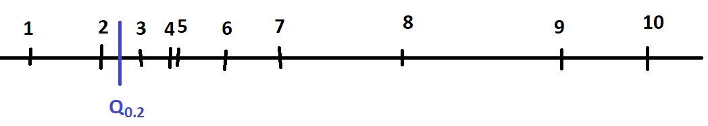

.. _l-reg-quantile:

====================================
Régression quantile ou régression L1
====================================

La régression quantile est moins sensible aux points aberrants.
Elle peut être définie comme une régression avec une norme
*L1* (une valeur absolue).

.. contents::
    :local:

.. _l-reg-quantile-demo:

Médiane et valeur absolue
=========================

On considère un ensemble de nombre réels
:math:`\acc{X_1,...,X_n}`. La médiane est le
nombre *M* qui vérifie :

.. math::

    \sum_i \indicatrice{X_i < M} = \sum_i \indicatrice{X_i > M}

Plus simplement, la médiane est obtenue en triant les éléments
:math:`\acc{X_1,...,X_n}` par ordre croissant. La médiane
est alors le nombre au milieu :math:`X_{\cro{\frac{n}{2}}}`.

.. mathdef::
    :title: Médiane et valeur absolue
    :tag: propriété
    :lid: l-th-med-abs

    La médiane *M* de l'ensemble :math:`\acc{X_1,...,X_n}`
    minimise la quantité :math:`E = \sum_i \abs{X_i - M}`.

Avant de démontrer la propriété, voyons ce qu'il
se passe entre deux réels. La médiane de :math:`\acc{A,B}`
peut être n'importe où sur le segment.

.. image:: qureg/mediane1.png
    :height: 100

De manière évidente, les distances
des deux côtés du point *M* sont égales :
:math:`a+b = c+d`. Mais si *M* n'est pas sur le segment,
on voit de manière évidente que la somme
des distances sera plus grande.

.. image:: qureg/mediane2.png
    :height: 100

N'importe quel point sur le segment *M* minimise
:math:`\abs{A - M} + \abs{B - M}`.
On revient aux *n* réels triés par ordre croissant
:math:`\acc{X_1,...,X_n}` et on considère les paires
:math:`(X_1, X_n)`, :math:`(X_2, X_{n-1})`, ...,
:math:`\pa{X_{\cro{\frac{n}{2}}}, X_{\cro{\frac{n}{2}+1}}}`.
L'intersection de tous ces intervalles est
:math:`\pa{X_{\cro{\frac{n}{2}}}, X_{\cro{\frac{n}{2}+1}}}`
et on sait d'après la petit exemple avec deux points
que n'importe quel point dans cet intervalle minimise
:math:`\abs{X_1 - M} + \abs{X_n - M} + \abs{X_2 - M} + \abs{X_{n-1} - M} + ... = E`.
La propriété est démontrée.

Régression et quantile
======================

Maintenant que la médiane est définie par un problème
de minimisation, il est possible de l'appliquer à un
problème de régression.

.. mathdef::
    :title: Régression quantile
    :tag: Définition

    On dispose d'un ensemble de *n* couples
    :math:`(X_i, Y_i)` avec :math:`X_i \in \R^d`
    et :math:`Y_i \in \R`. La régression quantile
    consiste à trouver :math:`\alpha, \beta` tels que la
    somme :math:`\sum_i \abs{\alpha + \beta X_i - Y_i}`
    est minimale.

Résolution d'une régression quantile
====================================

La première option consiste à utiliser une méthode
de descente de gradient puisque la fonction
:math:`E = \sum_i \abs{X_i - M}` est presque
partout dérivable. Une autre option consiste à
utiliser l'algorithme
`Iteratively reweighted least squares <https://en.wikipedia.org/wiki/Iteratively_reweighted_least_squares>`_.
L'implémentation est faite par la classe :epkg:`QuantileLinearRegression`.
L'algorithme est tiré de [Chen2014]_.

.. mathdef::
    :title: Iteratively reweighted least squares
    :tag: Algorithme
    :lid: iteratiive-least-square

    On souhaite trouver les paramètres :math:`\Omega`
    qui minimise :

    .. math::

        E = \sum_i \abs{Y_i - f(X_i, \Omega)}

    *Etape 1*

    On pose :math:`\forall i, \, w_i^t = 1`.

    *Etape 2*

    On calcule :math:`\Omega_t = \arg \min E(\Omega)` avec
    :math:`E_t(\Omega) = \sum_i w_i^t \pa{Y_i - f(X_i, \Omega)}^2`.

    *Etape 3*

    On met à jour les poids
    :math:`w_i^{t+1} = \frac{1}{\max\acc{\delta, \abs{Y_i - f(X_i, \Omega_t)}}}`.
    Puis on retourne à l'étape 2.

Le paramètre :math:`\delta` gère le cas où la prédiction est identique
à la valeur attendue pour un point :math:`X_i` donné.
Il y a plusieurs choses à démontrer. On suppose que l'algorithme
converge, ce qu'on n'a pas encore démontré. Dans ce cas,
:math:`\Omega_t = \Omega_{t+1}` et les coefficients
:math:`\Omega_t` optimise la quantité :

.. math::

    \sum_i w_i^t \pa{Y_i - f(X_i, \Omega)}^2 =
    \sum_i \frac{\pa{Y_i - f(X_i, \Omega)}^2}{\max{\delta, \abs{Y_i - f(X_i, \Omega_t)}}}
    \underset{\delta \rightarrow 0}{\longrightarrow} \sum_i \abs{Y_i - f(X_i, \Omega)}

On remarque également que :math:`E_t(\Omega_t)` est l'erreur *L1*
pour les paramètres :math:`\Omega`.
Donc si l'algorithme converge, celui-ci optimise bien
l'erreur de la régression quantile. Dans le cas d'une régression
linéaire, on sait exprimer la solution :

.. math::

    \begin{array}{rcl}
    \Omega_{t+1} &=& (X' W_t X)^{-1} X' W_t y = g(\Omega_t) \\
    \text{avec } W_t &=& diag( \frac{1}{\max\acc{\delta, \abs{y_i - \Omega_t X_i}}})
    \end{array}

D'après le théorème du
`point fixe <https://fr.wikipedia.org/wiki/Point_fixe>`_,
on sait que la suite converge si la fonction *g* est
`contractante <https://fr.wikipedia.org/wiki/Application_contractante>`_.

.. math::

    \forall x,y, \; \abs{f(x) - f(y)} \leqslant k \norm{x-y} \text{ avec } k < 1

Quantile et optimisation
========================

De la même manière que nous avons défini
la médiane comme la solution d'un problème
d'optimisation, nous pouvons définir n'importe quel
quantile comme tel.

.. mathdef::
    :title: Quantile et optimisation
    :tag: propriété

    Le quantile :math:`Q_p` de l'ensemble :math:`\acc{X_1,...,X_n}`
    est le nombre qui vérifie :

    .. math::

        \sum_{i=1}^n \indicatrice{X_i < Q_p} = np

    Ce nombre minimise la quantité :

    .. math::

        E = \sum_i p \abs{X_i - Q_p}^+ + (1-p) \abs{X_i - Q_p}^-

    Où :math:`\abs{a}^+ = \max\acc{a, 0}` et
    :math:`\abs{a}^- = \max\acc{-a, 0}`.

On vérifie qu'on retrouve bien ce qui était énoncé pour
la médiane avec :math:`p=\frac{1}{2}`. Il faut démontrer
que la solution de ce programme d'optimisation
atterrit dans l'intervalle souhaité.

On choisit un réel *P* à l'intérieur d'un intervale et on calcule :
:math:`E(P) = \sum_i p \abs{X_i - P}^+ + (1-p) \abs{X_i - P}^-`.
On note :math:`a(P) = \sum_{i=1}^n \indicatrice{X_i < P}` et
:math:`b(P) = \sum_{i=1}^n \indicatrice{X_i > P}`. Comme le point *P*
est à l'intérieur d'un intervalle, :math:`a+b = n`.
Soit *dx* un réel tel que :math:`P+dx` soit toujours dans l'intervalle :

.. math::

    \begin{array}{rcl}
    E(P+dx) &=& \sum_i p \abs{X_i - P - dx}^+ + (1-p) \abs{X_i - P - dx}^- \\
    &=& - b(P)pdx + a(P)(1-p)dx = (a(P) - a(P)p -b(P)p)dx = (a(P) - pn) dx
    \end{array}

On voit que si *P* est choisi de telle sorte que :math:`a(P) = np`, la fonction
:math:`E(P)` est constante sur cette intervalle et c'est précisément le cas
lorsque :math:`P=Q_p`. Comme la fonction *E* est une somme positive de fonctions
convexes, elle l'est aussi. Si on a trouvé un intervalle où la fonction est
constante alors celui-ci contient la solution. Sinon, il suffit juste de
trouver les intervalles :math:`(X_{i-1}, X_i)` et :math:`(X_i, X_{i+1})`
pour lesquelles la fonction *E* est respectivement décroissante et croissante.
On cherche donc le point *P* tel que :math:`a(P) < pn` si :math:`P < X_i`
et :math:`a(P) > pn` si :math:`P > X_i` et ce point correspond au quantile
:math:`Q_p`. Ceci conclut la démonstration.

Régression quantile pour un quantile p quelconque
=================================================

Comme pour la médiane, il est possible de définir la régression quantile
pour un quantile autre que la médiane.

.. mathdef::
    :title: Régression quantile
    :tag: Définition

    On dispose d'un ensemble de *n* couples
    :math:`(X_i, Y_i)` avec :math:`X_i \in \R^d`
    et :math:`Y_i \in \R`. La régression quantile
    consiste à trouver :math:`\alpha, \beta` tels que la
    somme :math:`\sum_i p \abs{\alpha + \beta X_i - Y_i}^+ + (1-p) \abs{\alpha + \beta X_i - Y_i}^-`
    est minimale.

Résolution d'une régression quantile pour un quantile p quelconque
==================================================================

La première option consiste encore à utiliser une méthode
de descente de gradient puisque la fonction
à minimiser est presque
partout dérivable. On peut aussi
adapter l'algorithme :ref:`Iteratively reweighted least squares <iteratiive-least-square>`.
L'implémentation est faite par la classe :epkg:`QuantileLinearRegression`
(voir [Koenker2017]_).

.. mathdef::
    :title: Iteratively reweighted least squares
    :tag: Algorithme

    On souhaite trouver les paramètres :math:`\Omega`
    qui minimise :

    .. math::

        E = \sum_i p \abs{Y_i - f(X_i, \Omega)}^+ + (1-p) \abs{Y_i - f(X_i, \Omega)}^-

    *Etape 1*

    On pose :math:`\forall i, \, w_i^t = 1`.

    *Etape 2*

    On calcule :math:`\Omega_t = \arg \min E(\Omega)` avec
    :math:`E_t(\Omega) = \sum_i w_i^t \pa{Y_i - f(X_i, \Omega)}^2`.

    *Etape 3*

    On met à jour les poids
    :math:`w_i^{t+1} = \frac{1}{\max\acc{\delta, \frac{1}{p} \abs{\alpha + \beta X_i - Y_i}^+ + \frac{1}{1-p} \abs{\alpha + \beta X_i - Y_i}^-}}`.
    Puis on retourne à l'étape 2.

On suppose que l'algorithme
converge, ce qu'on n'a pas encore démontré. Dans ce cas,
:math:`\Omega_t = \Omega_{t+1}` et les coefficients
:math:`\Omega_t` optimise la quantité :

.. math::

    \begin{array}{rcl}
    \sum_i w_i^t \pa{Y_i - f(X_i, \Omega)}^2 &=&
    \sum_i \frac{\pa{Y_i - f(X_i, \Omega)}^2}{\max\acc{\delta, \frac{1}{p} \abs{\alpha + \beta X_i - Y_i}^+ + \frac{1}{1-p} \abs{\alpha + \beta X_i - Y_i}^-}} \\
    &\underset{\delta \rightarrow 0}{\longrightarrow}& p \abs{Y_i - f(X_i, \Omega)}^+ + (1-p) \abs{Y_i - f(X_i, \Omega)}^-
    \end{array}

Notebook
========

.. toctree::

    ../notebooks/quantile_regression_example

Bilbiographie
=============

Des références sont disponibles sur la page de :epkg:`statsmodels` :
`QuantReg <http://www.statsmodels.org/stable/generated/statsmodels.regression.quantile_regression.QuantReg.html>`_ ou
là : `Régression quantile <https://www.xavierdupre.fr/app/ensae_teaching_cs/helpsphinx/ml2a/td2a_mlplus_regression_quantile.html>`_.

.. [Koenker2017] `Quantile Regression, 40 years on <http://www.econ.uiuc.edu/~roger/courses/NIPE/handouts/QR40.pdf>`_,
    Roger Koenker (2017)

.. [Chen2014] `Fast Iteratively Reweighted Least Squares Algorithms for Analysis-Based Sparsity Reconstruction <https://arxiv.org/abs/1411.5057>`_
    Chen Chen, Junzhou Huang, Lei He, Hongsheng Li
