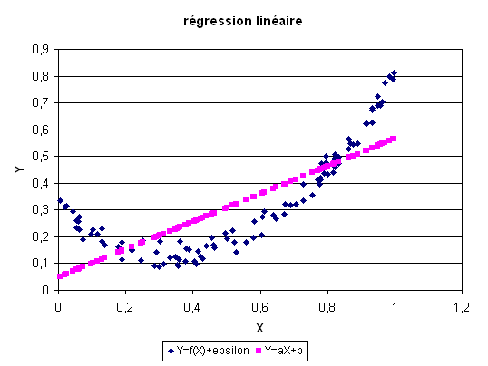
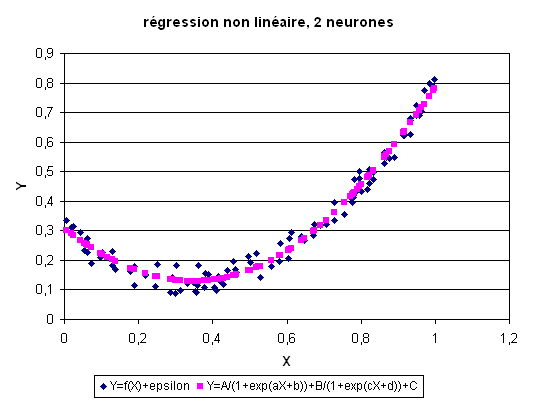
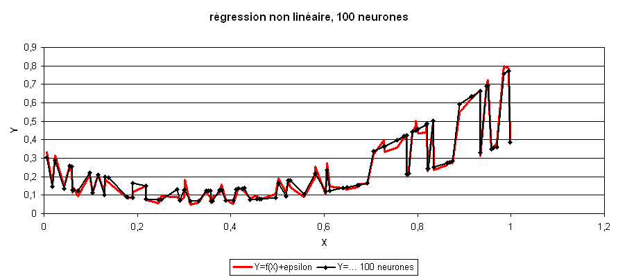

.. _rn_section_regression:

La régression
=============

Le bruit blanc est une variable aléatoire couramment utilisé
pour désigner le hasard ou la part qui ne peut être modélisée
dans une régression ou tout autre problème d'apprentissage.
On suppose parfois que ce bruit suive une loi normale.

.. mathdef::
    :title: bruit blanc
    :tag: Définition
    :lid: def-bruit-blanc

    Une suite de variables aléatoires réelles
    :math:`\pa{\epsilon_i}_{1 \infegal i \infegal N}`
    est un bruit blanc :

    * :math:`\exists \sigma > 0`, :math:`\forall i \in \intervalle{1}{N}, \; \epsilon_i \sim \loinormale{0}{\sigma}`
    * :math:`\forall \pa{i,j} \in \intervalle{1}{N}^2, \; i \neq j \Longrightarrow \epsilon_i \independant \epsilon_j`

Une régression consiste à résoudre le problème suivant :

.. mathdef::
    :title: Régression
    :tag: Problème
    :lid: problem-regression

    Soient deux variables aléatoires :math:`X` et :math:`Y`,
    l'objectif est d'approximer la fonction
    :math:`\esp\pa{Y | X} = f\pa{X}`.
    Les données du problème sont
    un échantillon de points :math:`\acc{ \pa{ X_{i},Y_{i} } | 1 \infegal i \infegal N }`
    et un modèle paramétré avec :math:\theta` :

    .. math::

            \forall i \in \intervalle{1}{N}, \; Y_{i} = f \pa{\theta,X_{i}} + \epsilon_{i}

    avec :math:`n \in \N`,
    :math:`\pa{\epsilon_{i}}_{1 \infegal i \infegal N}` :ref:`bruit blanc <def-bruit-blanc>`,
    :math:`f` est une fonction de paramètre :math:`\theta`.
        

La fonction :math:`f` peut être une fonction linéaire,
un polynôme, un réseau de neurones...
Lorsque le bruit blanc est normal, la théorie de l'estimateur
de vraisemblance (voir [Saporta1990]_) permet d'affirmer
que le meilleur paramètre :math:`\hat{\theta}`
minimisant l'erreur de prédiction est :

.. math::

    \hat{\theta} = \underset {\theta \in \R^p}{\arg \min} \; \esp \pa {\theta}
                 = \underset {\theta \in \R^p}{\arg \min}
                   \cro{ \sum_{i=1}^{N} \cro{Y_{i}-f \pa{\theta,X_{i}}}^{2}}

Le lien entre les variables :math:`X` et :math:`Y` dépend des hypothèses faites
sur :math:`f`. Généralement, cette fonction n'est supposée non linéaire
que lorsqu'une `régression linéaire <https://fr.wikipedia.org/wiki/R%C3%A9gression_lin%C3%A9aire>`_
donne de mauvais résultats.
Cette hypothèse est toujours testée car la résolution du problème dans
ce cas-là est déterministe et aboutit à la résolution d'un système
linéaire avec autant d'équations que d'inconnues.
Voici ce que ce la donne avec un nuage de points :math:`(X_i, Y_i)`
défini par :math:`Y_i = \frac{3}{2} X_i^{2} - X_i + \frac{1}{4} + \epsilon_i`.

Une fonction non linéaire permet de s'approcher un peu plus de la véritable
fonction. Premier cas : :math:`f` est un réseau avec un neurone sur la couche cachée.

Second cas : :math:`f` est un réseau avec deux neurones sur la couche cachée.

Troisième cas : :math:`f` est un réseau avec 100 neurones sur la couche cachée.

.. index:: overfitting

L'erreur de prédiction de ce réseau de neurones est très inférieure à celle des
modèles précédent, ce modèle a appris par c\oe ur
le nuage de points :math:`\pa{X_i,Y_i}` sans vraiment "comprendre" ce qu'il apprenait.
Dans le cas d'une régression à cent neurones,
le nombre de coefficients du réseau de neurones (301)
est largement supérieur au nombre de points (50).
Il en résulte que contrairement aux trois précédents cas,
la "richesse" du modèle choisi lui permet d'apprendre le "hasard".
Lorsque ce cas de figure se présente, on dit que le réseau
de neurones a appris coeur, son *pouvoir de généralisation* est mauvais ou
il fait de l'`overfitting <https://fr.wikipedia.org/wiki/Surapprentissage>`_
(voir aussi `Generalization Error <https://en.wikipedia.org/wiki/Generalization_error>`_).
L'erreur minime estimée sur ce nuage de points (ou *base d'apprentissage*)
sera considérablement accrue sur un autre nuage de points ou *base de test*
suivant la même loi.
Cet exemple montre que le choix du réseau de neurones le mieux adapté
au problème n'est pas évident. Il existe des méthodes permettant
d'approcher l'architecture optimale mais elles sont généralement
coûteuses en calcul.
