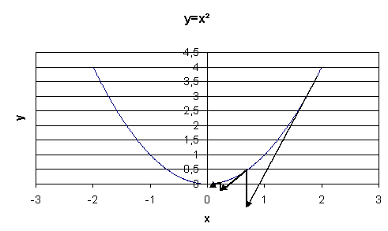

Descente de gradient
====================

.. contents::
    :local:

Lorsqu'un problème d'optimisation n'est pas soluble de manière déterministe,
il existe des algorithmes permettant de trouver une solution approchée
à condition toutefois que la fonction à maximiser ou minimiser soit dérivable,
ce qui est le cas des réseaux de neurones. Plusieurs variantes seront proposées
regroupées sous le terme de descente de gradient.
Quelques lectures :

* `An overview of gradient descent optimization algorithms <https://arxiv.org/abs/1609.04747>`_
* `Implementing a Neural Network from Scratch in Python – An Introduction <http://www.wildml.com/2015/09/implementing-a-neural-network-from-scratch/>`_

.. _optimisation_newton:

Algorithme et convergence
+++++++++++++++++++++++++

Soit :math:`g : \mathbb{R} \dans \mathbb{R}` une fonction dérivable dont il faut trouver
:math:`\overset{*}{x} = \underset{x \in \mathbb{R}}{\arg \min} \; g\pa{x}`,
le schéma suivant illustre la méthode de descente de gradient
dans le cas où :math:`g \pa{x} = x^2`.

On note :math:`x_{t}` l'abscisse à l'itération :math:`t`.
On note :math:`\dfrac{\partial g\left(  x_{t}\right)  }{\partial x}` le
gradient de :math:`g\left(  x\right)  =x^{2}`.
L'abscisse à l'itération :math:`t+1` sera
:math:`x_{t+1}=x_{t}-\varepsilon_{t}\left[  \dfrac{\partial g\left(  x_{t}\right)}{\partial x}\right]`.
:math:`\varepsilon_{t}` est le pas de gradient à l'itération :math:`t`.

On suppose maintenant que :math:`g` est une fonction dérivable
:math:`g : \mathbb{R}^q \dans \mathbb{R}` dont il faut trouver le minimum, le théorème suivant démontre
la convergence de l'algorithme de descente de gradient à condition
que certaines hypothèses soient vérifiées. Une généralisation de ce théorème est présentée dans
[Driancourt1996]_.

.. mathdef::
    :title: convergence de la méthode de Newton
    :tag: Théorème
    :lid: theoreme_convergence

    [Bottou1991]_

    Soit une fonction continue :math:`g : W \in \mathbb{R}^M \dans \mathbb{R}`
    de classe :math:`C^{1}`.
    On suppose les hypothèses suivantes vérifiées :

    * **H1** : :math:`\underset{W\in \mathbb{R}^q}{\arg\min} \;
      g\left(  W\right) =\left\{  W^{\ast}\right\}`
      est un singleton
    * **H2** : :math:`\forall\varepsilon>0, \; \underset{\left|  W-W^{\ast}\right|
      >\varepsilon}{\inf}\left[  \left(  W-W^{\ast}\right)  ^{\prime}.\nabla
      g\left(  W\right)  \right]  >0`
    * **H3** : :math:`\exists\left(  A,B\right)  \in \mathbb{R}^2` tels que :math:`\forall W\in\mathbb{R}^p,\; \left\|
      \nabla g\left( W\right) \right\| ^{2}\leqslant A^{2}+B^{2}\left\|  W-W^{\ast}\right\|  ^{2}`
    * **H4** : la suite :math:`\left(  \varepsilon_{t}\right)_{t\geqslant0}` vérifie,
      :math:`\forall t>0, \; \varepsilon_{t}\in \mathbb{R}_{+}^{\ast}`
      et :math:`\sum_{t\geqslant 0}\varepsilon_{t}=+\infty`,
      :math:`\sum_{t\geqslant 0}\varepsilon_{t}^{2}<+\infty`

    Alors la suite :math:`\left(  W_{t}\right)  _{t\geqslant 0}` construite de la manière suivante
    :math:`W_{0} \in \mathbb{R}^M`, :math:`\forall t\geqslant0` :
    :math:`W_{t+1}=W_{t}-\varepsilon_{t}\,\nabla g\left(  W_{t}\right)`
    vérifie :math:`\lim_{ t \dans+\infty}W_{t}=W^{\ast}`.

L'hypothèse **H1** implique que le minimum de la fonction :math:`g`
est unique et l'hypothèse **H2** implique que le demi-espace défini par
l'opposé du gradient contienne toujours le minimum de la fonction :math:`g`.
L'hypothèse **H3** est vérifiée pour une fonction sigmoïde, elle l'est donc aussi pour toute somme finie
de fonctions sigmoïdes que sont les réseaux de neurones à une couche cachée.

**Démonstration du théorème**

*Partie 1*

Soit la suite :math:`u_{t}=\ln\left(  1+\varepsilon_{t}^{2}x^{2}\right)`
avec :math:`x\in\mathbb{R}`, comme :math:`\sum_{t\geqslant 0} \varepsilon_{t}^{2} < +\infty, \;
u_{t}\thicksim\varepsilon_{t}^{2}x^{2}`, on a :math:`\sum_{t\geqslant 0} u_{t} < +\infty`.

Par conséquent, si :math:`v_{t}=e^{u_{t}}` alors :math:`\prod_{t=1}^T v_{t}\overset{T \rightarrow \infty}{\longrightarrow}D \in \mathbb{R}`.

*Partie 2*

On pose :math:`h_{t}=\left\|  W_{t}-W^{\ast}\right\|  ^{2}`.
Donc :

.. math::
    :nowrap:
    :label: equation_convergence_un

    \begin{eqnarray}
    h_{t+1} -h_{t} &=&\left\|  W_{t}-\varepsilon_{t}\,\nabla g\left( W_{t}\right) -W^{\ast }\right\|
                  ^{2}-\left\|W_{t}-W^{\ast}\right\| ^{2}
    \end{eqnarray}

Par conséquent :

.. math::

    h_{t+1}-h_{t}=-2\varepsilon_{t}\underset{>0} {\underbrace{\left(  W_{t}-W^{\ast}\right)
     ^{\prime}\,\nabla g\left( W_{t}\right)
    }}+\varepsilon_{t}^{2}\,\left\|  \,\nabla C\left( W_{t}\right) \right\|
    ^{2}\leqslant\varepsilon_{t}^{2}\,\left\|  \,\nabla g\left( W_{t}\right)
    \right\|  ^{2}\leqslant\varepsilon_{t}^{2}\,\left(  A^{2}  +B^{2}h_{t}\right)

D'où :

.. math::

    h_{t+1}-h_{t}\left(  1+\varepsilon_{t}^{2}B^{2}\right) \leqslant\varepsilon_{t}^{2}\,A^{2}

On pose :math:`\pi_{t}= \prod_{k=1}^t \left(  1+\varepsilon_{k}^{2}B^{2}\right)  ^{-1}`
alors en multipliant des deux côtés par :math:`\pi_{t+1}`, on obtient :

.. math::

    \begin{array}{rcl}
    \pi_{t+1}h_{t+1}-\pi_{t}h_{t} &\leqslant& \varepsilon_{t}^{2}\,A^{2}\pi_{t+1}\\
    \text{d'où }\pi_{q+1}h_{q+1}-\pi_{p}h_{p} &\leqslant&
                    \sum_{t=p}^q \varepsilon_{t}^{2}\,A^{2}\pi_{t+1} \leqslant
    \sum_{t=p}^{q} \varepsilon_{t}^{2} \, A^{2}\Pi  \leqslant \sum_{t=p}^{q} \varepsilon_{t}^{2}\,A^{2}\Pi
                 \underset{t \longrightarrow
    \infty}{\longrightarrow} 0
    \end{array}

Comme la série :math:`\sum_t \pa{\pi_{t+1}h_{t+1}-\pi_{t}h_{t}}` vérifie le critère de Cauchy, elle est convergente. Par conséquent :

.. math::

    \underset{q\rightarrow\infty}{\lim}\pi_{q+1}h_{q+1}=0=\underset{q\rightarrow \infty}{\lim}\Pi h_{q+1}

D'où :math:`\underset{q\rightarrow\infty}{\lim}h_{q}=0`.

*Partie 3*

La série :math:`\sum_t\pa{h_{t+1}-h_{t}}` est convergente car :math:`\Pi h_t \sim \pi_t h_t`.
:math:`\sum_{t\geqslant0}\varepsilon_{t}^{2}\,\left\| \,\nabla g\left( W_{t}\right) \right\|  ^{2}`
l'est aussi (d'après **H3**).

D'après :eq:`equation_convergence_un`,
la série :math:`\sum_{t\geqslant 0}\varepsilon_{t}\left( W_{t}-W^{\ast }\right) ^{\prime} \,
\nabla g\left( W_{t}\right)` est donc convergente.
Or d'après les hypothèses **H2**, **H4**, elle ne peut l'être que si :

.. math::
    :nowrap:

    \begin{eqnarray}
    \underset{t\rightarrow\infty}{\lim}W_{t}&=&W^{\ast}
    \end{eqnarray}

Si ce théorème prouve la convergence
de la méthode de Newton, il ne précise pas à quelle vitesse cette convergence
s'effectue et celle-ci peut parfois être très lente. Plusieurs variantes
ont été développées regroupées sous le terme de méthodes de quasi-Newton dans le but
d'améliorer la vitesse de convergence.

Ce théorème peut être étendu dans le cas où la fonction :math:`g`
n'a plus un seul minimum global mais plusieurs minima locaux ([Bottou1991]_),
dans ce cas, la suite :math:`\pa{W_{t}}` converge vers un mimimum local.
Dans le cas des réseaux de neurones, la fonction à optimiser est :

.. math::
    :nowrap:
    :label: equation_fonction_erreur_g

    \begin{eqnarray}
    G\pa{W}   &=&   \sum_{i=1}^{N} e\pa {Y_{i}, \widehat{Y_{i}^W}}
                      =   \sum_{i=1}^{N} e\pa {Y_{i}, f \pa{W,X_{i}}} \nonumber
    \end{eqnarray}

Dès que les fonctions de transfert ne sont pas linéaires,
il existe une multitude de minima locaux, ce nombre croissant avec celui des coefficients.

Calcul du gradient ou *rétropropagation*
++++++++++++++++++++++++++++++++++++++++

Afin de minimiser la fonction :math:`G` décrite en :eq:`equation_fonction_erreur_g`,
l'algorithme de descente du gradient nécessite de calculer le gradient de
cette fonction :math:`G` qui est la somme des gradients :math:`\partialfrac{e}{W}`
pour chaque couple :math:`\pa{X_i,Y_i}` :

.. math::
    :nowrap:
    :label: algo_retro_1

    \begin{eqnarray}
    \partialfrac{G}{W}\pa{W} &=& \sum_{i=1}^{N} \partialfrac{e\pa {Y_{i}, f \pa{W,X_{i}}}}{W} \nonumber\\
                             &=& \sum_{i=1}^{N} \sum_{k=1}^{C_C}
                                    \partialfrac{e\pa {Y_{i}, f \pa{W,X_{i}}}}{z_{C,k}}
                                    \partialfrac{z_{C,k}}{W} \nonumber
    \end{eqnarray}

Les notations utilisées sont celles de la figure du :ref:`perceptron <figure_peceptron-fig>`.
Les résultats qui suivent sont pour :math:`X_i=X` donné appartenant à la suite
:math:`\pa{X_i}`. On remarque tout d'abord que :

.. math::
    :nowrap:
    :label: algo_retro_3

    \begin{eqnarray}
    \partialfrac{e}{w_{c,i,j}} \pa{W,X} &=&  z_{c-1,j} \partialfrac{e}{y_{c,i}} \pa{W,X} \nonumber \\
    \partialfrac{e}{b_{c,i}} \pa{W,X}   &=& \partialfrac{e}{y_{c,i}} \pa{W,X} \nonumber
    \end{eqnarray}

La rétropropagation du gradient consiste donc à calculer les termes :
:math:`\partialfrac{e}{y_{.,.}}\pa{W,X}`
puisque le gradient s'en déduit facilement. La dernière couche du réseau de neurones nous permet d'obtenir :

.. math::
    :nowrap:
    :label: algo_retro_4

    \begin{eqnarray}
    \partialfrac{e}{y_{C,i}} \pa{W,X} &=& \sum_{k=1}^{C_{C}} \partialfrac{e}{z_{C,k}} \pa{W,X} \partialfrac{z_{C,k}}{y_{C,i}}
                                            \pa{W,X} \nonumber\\
                                      &=& \partialfrac{e}{z_{C,i}} \pa{W,X} f'_{c,i}\pa{y_{C,i}} \nonumber
    \end{eqnarray}

Pour les autres couches :math:`c` telles que :math:`1 \infegal c \infegal C-1`, on a :

.. math::
    :nowrap:
    :label: retro_eq_nn_3

    \begin{eqnarray}
    \partialfrac{e}{y_{c,i}}    &=& \sum_{l=1}^{C_{c+1}}              \partialfrac {e}{y_{c+1,l}}
                                                                \partialfrac{y_{c+1,l}}{y_{c,i}} \nonumber \\
                                &=& \sum_{l=1}^{C_{c+1}}              \partialfrac {e}{y_{c+1,l}}
                                    \cro { \sum_{l=1}^{C_{c}}   \partialfrac {y_{c+1,l}}{z_{c,l}}
                                                                    \underset{=0\,si\,l\neq i}{\underbrace{\partialfrac{z_{c,l}}{y_{c,i}}}} } \nonumber \\
                                &=& \sum_{l=1}^{C_{c+1}}              \partialfrac{e}{y_{c+1,l}}
                                                                    \partialfrac{y_{c+1,l}}{z_{c,i}}
                                                                    \partialfrac{z_{c,i}}{y_{c,i}}
                                                                    \nonumber
    \end{eqnarray}

Par conséquent :

.. math::
    :nowrap:
    :label: algo_retro_5

    \begin{eqnarray}
    \partialfrac{e}{y_{c,i}} &=&    \cro{ \sum_{l=1}^{C_{c+1}} \partialfrac{e}{y_{c+1,l}}w_{c+1,l,i} } \,
                                    f_{c,i}^{\prime} \pa{y_{c,i}}  \nonumber
    \end{eqnarray}

.. index:: rétroprogagation

Cette dernière formule permet d'obtenir par récurrence les dérivées
:math:`\partialfrac{e}{y_{.,.}}` de la dernière couche :math:`C` à la première et ce,
quel que soit le nombre de couches. Cette récurrence inverse de la propagation est appelée *rétropropagation*.
Cet algorithme se déduit des équations :eq:`algo_retro_1`, :eq:`algo_retro_3`, :eq:`algo_retro_4` et :eq:`algo_retro_5` :

.. mathdef::
    :title: rétropropagation
    :lid: algo_retropropagation
    :tag: Théorème

    Cet algorithme s'applique à un réseau de neurones vérifiant la définition du :ref:`perceptron <rn_definition_perpception_1>`.
    Il s'agit de calculer sa dérivée par rapport aux poids. Il se déduit des formules
    :eq:`algo_retro_1`, :eq:`algo_retro_3`, :eq:`algo_retro_4` et :eq:`algo_retro_5`
    et suppose que l'algorithme de :ref:`propagation <algo_propagation>` a été préalablement exécuté.
    On note :math:`y'_{c,i} = \partialfrac{e}{y_{c,i}}`, :math:`w'_{c,i,j} = \partialfrac{e}{w_{c,i,j}}` et
    :math:`b'_{c,i} = \partialfrac{e}{b_{c,i}}`.

    *Initialisation*

    | for i in :math:`1..C_C`
    |   :math:`y'_{C,i} \longleftarrow \partialfrac{e}{z_{C,i}} \pa{W,X} f'_{c,i}\pa{y_{C,i}}`

    *Récurrence*

    | for c in :math:`1..C-1`
    |   for i in :math:`1..C_c`
    |       :math:`y'_{c,i} \longleftarrow 0`
    |       for j in :math:`1..C_{c+1}`
    |           :math:`y'_{c,i} \longleftarrow y'_{c,i} + y'_{c+1,j} \; w_{c+1,j,i}`
    |       :math:`y'_{c,i} \longleftarrow y'_{c,i} \; f'_{c,i}\pa{y'_{c,i}}`

    *Terminaison*

    | for c in :math:`1..C`
    |   for i in :math:`1..C_c`
    |       for j in :math:`1..C_{c-1}`
    |           :math:`w'_{c,i,j} \longleftarrow z_{c-1,j} \; y'_{c,i}`
    |           :math:`b'_{c,i,j} \longleftarrow y'_{c,i}`

Ces formules sont assez indigestes pour comprendre comment
la rétropropagation fonctionne. La figure suivante illustre
comme le gradient se propage d'un neurone au précédente de façon
récursive. Je la trouve plus simple à exploiter lorsqu'on dévie
du perceptron classique pour faire des choses hors des clous.
Je la laisse comme ça sans trop d'explications.

.. image:: rnimg/neurone2.jpg

L'idée de la rétropropagation : en supposant connu le gradient de l'erreur
par rapport à la sortie, comment en déduir le gradient par rapport
aux coefficients du réseau puis comment le propager à chaque entrée
de sorte qu'il puisse être transmis aux neurones de la couche inférieure.

.. image:: rnimg/backp.png
