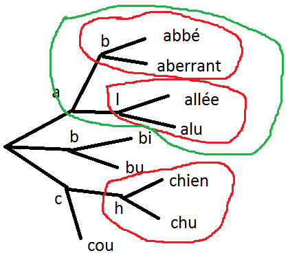

Fausses idées reçues
====================

.. contents::
    :local:

Il faut trier les complétions par fréquence décroissante
++++++++++++++++++++++++++++++++++++++++++++++++++++++++

En pratique, cela marche plutôt bien. En théorie, cette assertion est fausse.
Prenons les quatre complétions suivantes :

====== ========= ======
q      fréquence ordre
====== ========= ======
a      4         1
ab     3         2
abc    2         3
abcd   1         4
====== ========= ======

Dans cet exemple, si l'utilisateur tape ``ab``, il verra les complétions :

::

    abc
    abcd

Dans tous les cas, :math:`K(q, k, S) = l(q) - k`. Cela veut dire
que l'utilisateur ne gagnera rien. En revanche, avec l'ordre suivant :

====== ======
q      ordre
====== ======
a      4
ab     2
abc    3
abcd   1
====== ======

Si l'utilisateur tape ``ab``, il verra les complétions :

::

    abcd
    abc

Le nombre de caractères économisés sera :

====== ========= ====== ======================
q      fréquence ordre  :math:`M(q, S)`
====== ========= ====== ======================
a      4         4      1
ab     3         2      2
abc    2         3      3
abcd   1         1      1 = :math:`K(q, 0, S)`
====== ========= ====== ======================

D'où un gain total de :math:`G(S)=3`.

Il faut placer les complétions courtes avant
++++++++++++++++++++++++++++++++++++++++++++

Le cas précédent est déjà un contre exemple.
Mais d'un point de vue utilisateur, il n'est pas facile de lire
des complétions de longueurs différentes. Cela veut peut-être dire aussi
que la métrique considérée pour choisir le meilleur système de complétion
est faux. Cela sera discuté à la prochaine section.

.. _l-nlp-comp-montre:

Il faut montrer toutes les complétions
++++++++++++++++++++++++++++++++++++++

.. index:: requête complète, complétion

Le premier exemple offre aussi un contre exemple.
Dans cet exemple, l'ensemble :math:`Q=(q_i)` des
requêtes utilisateurs et l'ensemble :math:`S=(s_i)`
des **complétions** ou **requêtes complètes** est le même.
Il suffit de la modifier un peu. On enlève
la requête *ab* de :math:`S`.

====== ========= ============== ================
q      fréquence ordre          :math:`M(q, S)`
====== ========= ============== ================
a      4         1              1
ab     3         :math:`\infty` 2
abc    2         2              2
abcd   1         3              3
====== ========= ============== ================

D'où un gain total de :math:`G(S)=2`. En conclusion,
si j'enlève une petite complétion pour laquelle le gain est nul,
il est possible que le gain pour les suivantes soit positif.
On en retient qu'il ne faut pas montrer trop de complétions
qui se distinguent d'un caractère. Plus généralement,
il ne sert à rien de montrer des complétions plus longue que le préfixe d'un caractère.
Par extension, si une complétion est plus longue que
le préfixe de :math:`d` caractères, il faut la montrer à une position
inférieure à :math:`d`.

Et si le poids de chaque complétion est uniforme
++++++++++++++++++++++++++++++++++++++++++++++++

On suppose que les complétions ont toutes le même poids :math:`w_i=1`.
Dans quel ordre faut-il ranger les complétions pour économiser le
plus de caractères. On aurait tendance à dire la plus longue d'abord
ce qu'on peut vérifier dans le notebook :ref:`completiontrierst`.

====== ========= ============== ================
q      fréquence ordre          :math:`M(q, S)`
====== ========= ============== ================
a      1         4              1
ab     1         3              2
abc    1         2              2
abcd   1         1              1
====== ========= ============== ================

Ajouter deux autres complétions disjointes *edf*, *edfh*.
Le gain maximum est 6 et il y a plusieurs ordres :

::

    'edf', 'edfh', 'abc', 'abcd', 'a', 'ab'
    'abcd', 'abc', 'edfh', 'edf', 'ab', 'a'
    ...

On a presque l'impression qu'on peut traiter chaque bloc
séparément *a, ab, abc, abcd* d'un côté et *edf, edfh* de l'autre.
A l'intérieur des blocs, les règles seront les mêmes.

En résumé, si on connaît le meilleur ordre pour toutes les mots sur les noeuds
terminaux dans les bulles rouges, dans la bulle verte, le meilleur ordre
sera une fusion des deux listes ordonnées.

Quelques essais sur le notebook ont tendance à montrer que l'ordre
a peu d'impact sur le résultat final lorsque les complétions ont le même poids.
Avec quatre mots, la somme des gains est identique quelque soit l'ordre.

::

    p=poids g=gain

    20.0 - actuellement p=1.0 g=11.0 | acte p=1.0 g=2.0 | actes p=1.0 g=2.0 | actualité p=1.0 g=5.0
    20.0 - acte p=1.0 g=3.0 | actuellement p=1.0 g=10.0 | actualité p=1.0 g=6.0 | actes p=1.0 g=1.0
    20.0 - acte p=1.0 g=3.0 | actes p=1.0 g=3.0 | actualité p=1.0 g=6.0 | actuellement p=1.0 g=8.0

Mais si on change le poids de l'une d'elles, elle se retrouve en première position.

::

    19.2 - actes p=2.0 g=4.0 | actuellement p=1.0 g=10.0 | acte p=1.0 g=1.0 | actualité p=1.0 g=5.0
    19.2 - actes p=2.0 g=4.0 | actuellement p=1.0 g=10.0 | actualité p=1.0 g=6.0 | acte p=1.0 g=0.0
