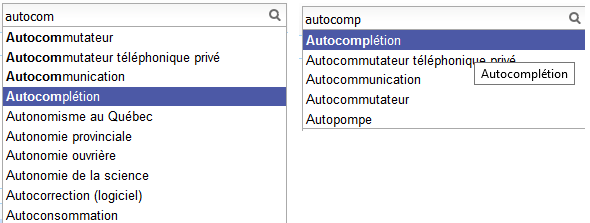

Formalisation
=============

.. _l-completion-optim:

Problème d'optimisation
+++++++++++++++++++++++

Je me réfère pour cela à l'article [Sevenster2013]_
(voir aussi [Bampoulidis2017]_)
qui introduit différentes façons de construire
un système d'autocompétion et qui les compare à l'usage. Et s'il existe plusieurs façons de faire, il
faut d'abord mettre au point une façon de les comparer.
Je me place dans le cadre d'un moteur de recherche car c'est l'usage principal,
que celui-ci soit un moteur de recherche ou une recherche incluse sur un site de vente.
A la fin de la journée, on sait quelles sont les requêtes saisies par les utilisateurs
et le nombre de fois qu'elles ont été saisies : :math:`(q_i, w_i)` pour
:math:`i \in [[1, N]]`.

.. index:: caractère saisi, keystroke

Sans système de complétion, les utilisateurs saisissent donc :math:`K=\sum_{i=1}^N l(q_i) w_i`
où :math:`l(q_i)` est la longueur de la complétion :math:`q_i`. Avec le système de complétion,
les utilisateurs saisissent moins de caractères, c'est ce chiffre là qu'on cherche à minimiser.
L'unité est le charactère saisi ou *keystroke* en anglais.

Même avec le même système de complétion,
il n'est pas dit que tous les utilisateurs saisissent la même requête de la même
façon. Pour simplifier, on va supposer que si malgré tout et ne considérer que la façon
minimale de saisir une requête.

L'exemple précédent illustrent deux façons de saisir le terme *autocomplétion* (sur Wikipédia),
*autocom* + 4 touches vers le bas ou *autocomp* + 1 touche vers le bas, soit 7+4=11 touches
dans le premier cas ou 8+1=9 touches dans le second cas.

.. mathdef::
    :title: Minimum Keystroke
    :tag: Définition
    :lid: def-mks

    On définit la façon optimale de saisir une requête sachant un système de complétion
    :math:`S` comme étant le minimum obtenu :

    .. math::
        :label: completion-metric1

        M(q,S) = \min_{0 \leqslant k \leqslant l(q)}  k + K(q, k, S)

    La quantité :math:`K(q, k, S)` représente le nombre de touche vers le bas qu'il faut taper pour
    obtenir la chaîne :math:`q` avec le système de complétion :math:`S` et les :math:`k`
    premières lettres de :math:`q`.

De façon évidente, :math:`K(q, l(q), S)=0` et :math:`M(q,S) \leqslant l(q)`
et :math:`K(q, k, S) > 0` si :math:`k < l(q)`. On prend également
comme convention :math:`\forall q \notin S, \; K(q, k, S) = \infty`
et :math:`\forall q \notin S, \; M(q, S) = l(q)`.
Certains systèmes proposent des requêtes avant de saisir quoique ce soit,
c'est pourquoi on inclut la valeur :math:`M(q, 0)` qui représente ce cas.
Construire un système de complétion revient à minimiser la quantité :

.. math::

    M(S) = \sum_{i=1}^N M(q_i,S) w_i

Ensemble des complétions
++++++++++++++++++++++++

Il n'y a pas de restriction sur la fonction :math:`K(q, k, S)` mais on se limitera
dans un premier temps à une fonction simple. On suppose que le système d'autocomplétion
dispose d'un ensemble de requêtes ordonnées :math:`S = (s_i)` et la fonction :

.. math::

    K(q, k, S) = position(q, S(q[1..k]))

Où :math:`S(q[1..k])` est le sous-ensemble ordonné de :math:`S` des complétions
qui commencent par les :math:`k` premières lettres de :math:`q` et de longueur supérieure strictement à :math:`k`.
:math:`position(q, S(q[1..k]))` est la position de :math:`q` dans cet ensemble ordonné
ou :math:`\infty` si elle n'y est pas. Cette position est strictement positive
:math:`K(q, k, S) \supegal 1` sauf si :math:`k=l(q)` auquel cas, elle est nulle.
Cela signifie que l'utilisateur doit descendre d'au moins un cran
pour sélectionner une complétion.
On note :math:`\sigma(q)` la position de la complétion :math:`q` dans l'ensemble :math:`S`.
Par construction, :math:`s_ \neq s_2 \Longrightarrow \sigma(s_1) \neq \sigma(s_2)`.

.. math::
    :label: nlp-comp-k

    K(q, k, S) = \#\acc{ i | s_i \succ q[1..k], s_i \in S, \sigma(s_i) < \sigma(q)  }

:math:`\#` désigne le cardinal de l'ensemble.
Trouver le meilleur système de complétion :math:`S` revient à trouver la meilleure
fonction :math:`K(q, k, S)` et dans le cas restreint l'ordre sur :math:`S` qui minimise
cette fonction. Le plus souvent, on se contente de trier les complétions par ordre
décroissant de popularité. On considérera par la suite qu'on est dans ce cas.

Gain
++++

On définit le gain en keystroke comme étant le nombre de caractères saisis en moins :

.. math::

    G(q, S) = l(s) - M(q,S)

Minimier :math:`M(S)` ou maximiser :math:`G(S) = \sum_{i=1}^N G(q_i, S) w_i`
revient au même.

.. math::

    G(S) = \sum_{i=1}^N w_i (l(s) - M(q,S)) = \sum_{i=1}^N w_i l(s) - \sum_{i=1}^N w_i  M(q,S))  = K - M(S)

Où :math:`K=\sum_{i=1}^N l(q_i) w_i` l'ensemble des caractères tapés par les utilisateurs.
:math:`\frac{G(S)}{K}` est en quelque sorte le ratio de caractères économisés
par le système de complétion.

.. [Bampoulidis2017] Does Online Evaluation Correspond to Offline Evaluation in Query Auto Completion? (2017)
    Alexandros Bampoulidis, João PalottiMihai LupuJon BrasseyAllan Hanbury
    *ECIR 2017: Advances in Information Retrieval*

.. [Sevenster2013] Algorithmic and user study of an autocompletion algorithm on a large
    medical vocabulary (2013),
    Merlijn Sevenster, Rob van Ommering, Yuechen Qian
    *Journal of Biomedical Informatics* 45, pages 107-119
