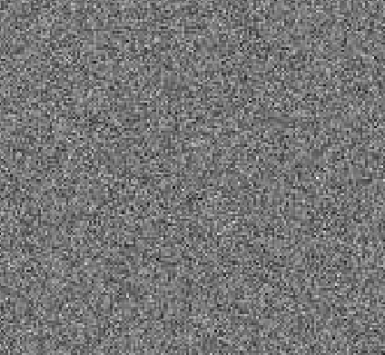
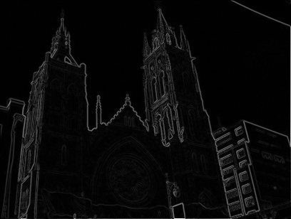
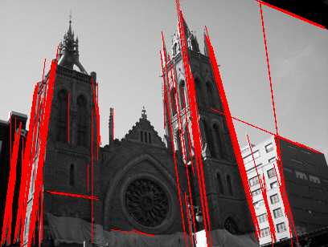

.. _l-k-algo-gest:

=====================
Détection de segments
=====================

.. contents::
    :local:

L'idée
======

Une image aléatoire ressemble à la mire en un temps
où la télévision ne rediffusait pas les programmes diurne
la nuit.

Dans ce brouillard aléatoire, la probabilité d'avoir des
points alignés est très faible, si faible que le simple
fait d'en voir est un événement extraordinaire. Trois points
alignés ne sont pas rares, quatre un peu plus, cinq encore plus.
A partir d'un certain seuil, on peut considérer que trop de
points alignés forme une droite et un événement trop rare
pour être ignoré. On cherche à détecter les arêtes dans une
image comme la suivante.

On calcule le gradient d'une image en noir et blanc.

Puis on extrait les segments en les considérant comme
des anomalies par rapport à un champ de pixels aléatoire.

Suite :

* `Détection des images dans les images digitales <https://github.com/sdpython/mlstatpy/blob/master/_todo/segment_detection/presentation.pdf>`_
* :func:`detect_segments <mlstatpy.image.detection_segment.detection_segment.detect_segments>`
