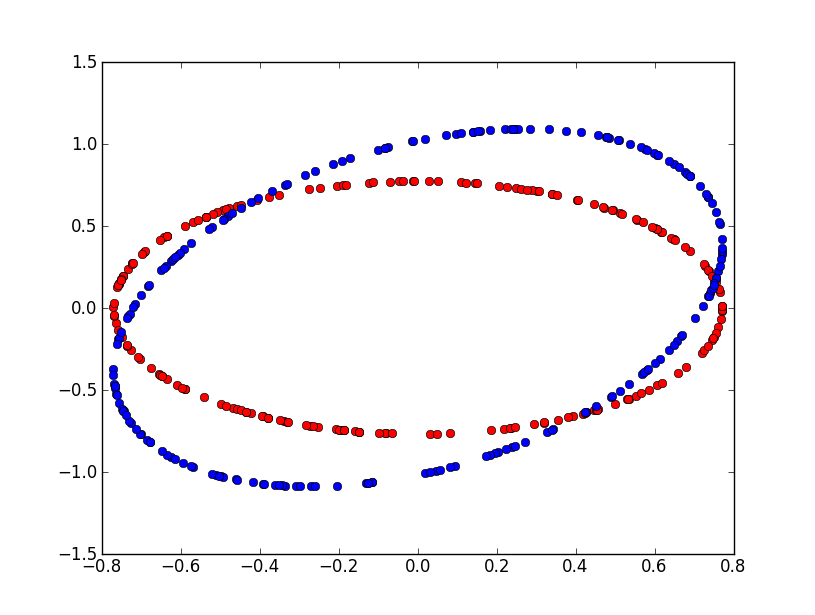

===============================
Confidence Interval and p-Value
===============================

.. contents::
    :local:

.. index:: p-value, intervalle de confiance

This document explains the relationship between p-value and confidence intervals.
It goes on with the specific case of a binamial law. Assuming we want to determine
whether or not two binomial laws are significantly different, how many observations
we need to get the p-value under a given threshold.

Introduction
============

The term `p-value <https://fr.wikipedia.org/wiki/Valeur_p>`_ is very popular
in the world of search engines. I usually prefer confidence interval 95%,
I think it is easier to understand. Plus, because p-Value are real values,
we could be tempted to compare them and it is usually wrong. On the other hand,
it is more difficult to compare confidence intervals, especially if they are
related to complete different variables. Their nature prevents you from doing that.
Howerver p-Values and confidence interval are similar: they tell you whether
or not a metric difference is significant.

Usually, it starts from a set of identically distributed random variables
:math:`(X_i)_{1 \infegal i \infegal N}`. We then estimate the average
:math:`\widehat{\theta}_N = \frac{1}{N} \sum_{i=1}^{N} X_i` and we ask
the question is :math:`\widehat{\theta}_N` null? In others terms, we
want to know if the average is significantly different from zero. If
the random variable :math:`X` follows a random law which has a standard
deviation, we can use the `central limit theorem <https://en.wikipedia.org/wiki/Central_limit_theorem>`_
which tells us:

.. math::
    :nowrap:

    \begin{eqnarray*}
    \sqrt{N} \widehat{\theta}_N \underset{N \rightarrow \infty}{\longrightarrow}   \loinormale{0}{\sigma}
    \end{eqnarray*}

Not all of them have a standard deviation. For example, if :math:`X` follows a
`Cauchy law <https://en.wikipedia.org/wiki/Cauchy_distribution>`_,
:math:`\esp{X^2} \sim \int \frac{x^2}{1+x^2}dx` which does not exist.
This remark also concerns every distribution known as heavy tail distribution.

If :math:`Y \sim \loinormale{0}{\sigma}`, then we have
:math:`\pr{\abs{Y} \infegal 1.96} = 0.95`. That is why we can say:

.. math::
    :nowrap:

    \begin{eqnarray*}
    \widehat{\theta}_N \text{ is not null with 95\% confidence if } \sqrt{N} \frac{|\widehat{\theta}_N|}{\sigma} > 1.96
    \end{eqnarray*}

And the confidence intervalle at 95% would be:

.. math::
    :nowrap:

    \begin{eqnarray*}
    \cro{ %\widehat{\theta}_N
                - \frac{1.96 \sigma}{\sqrt{N}},
                %\widehat{\theta}_N +
                \frac{1.96 \sigma}{\sqrt{N}}}
    \end{eqnarray*}

When :math:`\esp{ \widehat{\theta}_N } = \theta_0 \neq 0`, it becomes:

.. math::
    :nowrap:

    \begin{eqnarray*}
    \sqrt{N} \cro{ \widehat{\theta}_N - \theta_0} \underset{N \rightarrow \infty}{\longrightarrow}   \loinormale{0}{\sigma}
    \end{eqnarray*}

We usually want to check if the mean is equal to a specific value using a statistical test:

.. math::
    :nowrap:

    \begin{eqnarray*}
    H0: && \widehat{\theta}_N = \theta_0 \\
    H1: && \widehat{\theta}_N \neq  \theta_0
    \end{eqnarray*}

We validate :math:`H0` if:

.. math::
    :nowrap:

    \begin{eqnarray*}
    \widehat{\theta}_N \in \cro{ \theta_0 - \frac{1.96 \sigma}{\sqrt{N}}, \theta_0 + \frac{1.96 \sigma}{\sqrt{N}}}
    \end{eqnarray*}

p-value
=======

With confidence intervals, you first choose a confidence level and then you
get an interval. You then check if your value is inside or outside your interval.
Inside, the gain is not significant, outside, it is.

With a p-value, we consider the problem the other way, given
:math:`\widehat{\theta}_N`, what is the probability that the
difference :math:`\abs{\widehat{\theta}_N - \theta_0}` is significant?
Let's consider :math:`Y` following a normal law :math:`\loinormale{0}{1}`.
We are looking for:

.. math::
    :nowrap:

    \begin{eqnarray*}
    \pr{ \abs{Y} >  \sqrt{N} \frac{|\widehat{\theta}_N|}{\sigma} }  = \alpha
    \end{eqnarray*}

:math:`\alpha` is the p-value.

.. math::
    :nowrap:
    :label: p_value_expression

    \begin{eqnarray*}
    \alpha &=& 1-\int_{-\beta_N}^{\beta_N} \frac{1}{\sqrt{2\pi}} e^{\frac{-x^2}{2}} dx =
                                2 \int_{\beta_N}^{\infty} \frac{1}{\sqrt{2\pi}} e^{\frac{-x^2}{2}} dx \\
    \text{where } \beta_N &=& \sqrt{N} \frac{|\widehat{\theta}_N|}{\sigma}
    \end{eqnarray*}

At this point, we should not forget that we use a theorem which tells us that
:math:`\sqrt{N} \frac{|\widehat{\theta}_N|}{\sigma} \sim \loinormale{0}{1}`
when :math:`N \rightarrow \infty`, which means everything we said is true
when :math:`N` is great enough.

Significant difference between samples mean
===========================================

Usually, we do not want to test if an average is null but if the difference
between two averages is null. We consider two random samples having the same
size, each of them described by :math:`(X_i)` and :math:`(Y_i)`.
All variables are independant. :math:`(X_i)` are distributed according the
same law, we assume the same for :math:`(Y_i)`. We expect the following
difference to be null.

.. math::
    :nowrap:
    :label: pvalues_exp2

    \begin{eqnarray*}
    \widehat{\eta}_N &=& \frac{1}{N} \sum_{i=1}^{N} X_i - \frac{1}{N} \sum_{i=1}^{N} Y_i
                                 = \frac{1}{N} \cro{ \sum_{i=1}^{N} X_i -  Y_i }
    \end{eqnarray*}

Considering expression :eq:`pvalues_exp2`, we can applying the central limit theorem
on variable :math:`Z=X-Y`, we get (:math:`\eta_0=0`):

.. math::
    :nowrap:

    \begin{eqnarray*}
    \sqrt{N} \widehat{\eta}_N \underset{N \rightarrow \infty}{\longrightarrow}
    \loinormale{\eta_0}{\sqrt{ \frac{\var{Z} }{N  } }}
    \end{eqnarray*}

If both samples do not have the same number of observations, this expression becomes:

.. math::
    :nowrap:

    \begin{eqnarray*}
    \sqrt{N} \widehat{\eta}_N \underset{ \begin{subarray}{c} N_1 \rightarrow \infty \\
                             N_2 \rightarrow \infty \\
                             \frac{N_1}{N_2} \rightarrow x \end{subarray}
     }{\longrightarrow}   \loinormale{\eta_0}{\sqrt{ \frac{\var{X}}{N_1}+\frac{\var{Y}}{N_2} }}
    \end{eqnarray*}

.. _l-section_pvalues_table:

Application on binomial variables
=================================

A binomial variable :math:`X \sim \loibinomialea{p}` is defined by:

.. math::
    :nowrap:

    \begin{eqnarray*}
    \pr{X=0} &=& 1-p \\
    \pr{X=1} &=& p
    \end{eqnarray*}

Let's consider two series of observations :math:`(X_i) \sim \loibinomialea{p}`
and :math:`(Y_i) \sim \loibinomialea{q}`. We assume :math:`p \neq q` and we want
to determine how many observations we need to get a p-value below 5%.
We know that :math:`\variance{X_i}=p(1-p)` and :math:`\variance{Y_i}=q(1-q)`.
Next table shows the values. First column contains values for :math:`p`,
first row contains values for :math:`q-p`. We also assume we have the same number
:math:`N` of random observations for each variable. The statistical
test cen be defined like following:

.. math::
    :nowrap:

    \begin{eqnarray*}
    H0: && p = q = p_0 \\
    H1: && p \neq q
    \end{eqnarray*}

If H0 is true, then:

.. math::
    :nowrap:

    \begin{eqnarray}
    \sqrt{N} \widehat{\theta}_N \underset{N \rightarrow \infty}{\longrightarrow}   \loinormale{0}{\sqrt{p_0(1-p_0)}
    \sqrt{ \frac{1}{N_1}+\frac{1}{N_2} }}
    \end{eqnarray}

.. math::
    :nowrap:

    \begin{tabular}{r|r|r|r|r|r|r|r|r|r|r|r|r}
    $p/d$&\textbf{-0.200}&\textbf{-0.100}&\textbf{-0.020}&\textbf{-0.010}&\textbf{-0.002}&\textbf{-0.001}&\textbf{0.001}&\textbf{0.002}&\textbf{0.010}&\textbf{0.020}&\textbf{0.100}&\textbf{0.200}\\\hline
    \textbf{0.05}&&&913&3650&91235&364939&364939&91235&3650&913&37&10\\\hline
    \textbf{0.10}&&70&1729&6915&172866&691463&691463&172866&6915&1729&70&18\\\hline
    \textbf{0.15}&&98&2449&9796&244893&979572&979572&244893&9796&2449&98&25\\\hline
    \textbf{0.20}&31&123&3074&12293&307317&1229267&1229267&307317&12293&3074&123&31\\\hline
    \textbf{0.25}&37&145&3602&14406&360137&1440548&1440548&360137&14406&3602&145&37\\\hline
    \textbf{0.30}&41&162&4034&16135&403354&1613413&1613413&403354&16135&4034&162&41\\\hline
    \textbf{0.35}&44&175&4370&17479&436966&1747864&1747864&436966&17479&4370&175&44\\\hline
    \textbf{0.40}&47&185&4610&18440&460976&1843901&1843901&460976&18440&4610&185&47\\\hline
    \textbf{0.45}&48&191&4754&19016&475381&1901523&1901523&475381&19016&4754&191&48\\\hline
    \textbf{0.50}&49&193&4802&19208&480183&1920730&1920730&480183&19208&4802&193&49\\\hline
    \textbf{0.55}&48&191&4754&19016&475381&1901523&1901523&475381&19016&4754&191&48\\\hline
    \textbf{0.60}&47&185&4610&18440&460976&1843901&1843901&460976&18440&4610&185&47\\\hline
    \textbf{0.65}&44&175&4370&17479&436966&1747864&1747864&436966&17479&4370&175&44\\\hline
    \textbf{0.70}&41&162&4034&16135&403354&1613413&1613413&403354&16135&4034&162&41\\\hline
    \textbf{0.75}&37&145&3602&14406&360137&1440548&1440548&360137&14406&3602&145&37\\\hline
    \textbf{0.80}&31&123&3074&12293&307317&1229267&1229267&307317&12293&3074&123&31\\\hline
    \textbf{0.85}&25&98&2449&9796&244893&979572&979572&244893&9796&2449&98&\\\hline
    \textbf{0.90}&18&70&1729&6915&172866&691463&691463&172866&6915&1729&70&\\\hline
    \textbf{0.95}&10&37&913&3650&91235&364939&364939&91235&3650&913&&\\\hline
    \end{tabular}

Given a binomial law with parameter :math:`p` and a difference
:math:`d`, this table gives the number of
observations needed on both sides to get a significant difference
assuming :math:`p` is the expected pourcentage

Estimate a p-value by using the distribution function
=====================================================

Expression :eq:`p_value_expression` gives a way to estimate the p-value.
Computing the integral is not always possible but there is a way to do it
using `Monte Carlo method <https://en.wikipedia.org/wiki/Monte_Carlo_method>`_.
Let's assume :math:`X \sim \loinormale{0}{1}`. We denote :math:`f_X` as the
density function of :math:`X`. We also consider an interval
:math:`I=\cro{-a,a}`. Then we have :math:`f(a)=f(-a)` and:

.. math::
    :nowrap:

    \begin{eqnarray*}
    \pr{X \in I} = \pr{ \abs{X} \infegal a } = \pr{ f(X) \supegal f(a)}
    \end{eqnarray*}

This is true because :math:`f` is decreasing for :math:`x>0`.
The p-value :math:`\alpha` for a estimator :math:`\beta` using Monte Carlo method is:

.. math::
    :nowrap:

    \begin{eqnarray}
    \frac{1}{N}\sum_{i=1}^{N} \indicatrice{ f(X_i) < f(\beta)} \longrightarrow \alpha
    \end{eqnarray}

Assuming every :math:`(X_i)_i` follows a normal law :math:`\loinormale{0}{1}`.

Correlated variables
====================

Let's assume we now have a vector a correlated variables :math:`X=(X_1,...X_d)`
drawn following a law :math:`\loinormale{\theta_0}{\Sigma}`.

The central limit theorem is still valid:

.. math::
    :nowrap:

    \begin{eqnarray*}
    \sqrt{N} \widehat{\theta}_N \underset{N \rightarrow \infty}{\longrightarrow}   \loinormale{\theta_0}{\Sigma}
    \end{eqnarray*}

We know estimators for the average and the covariance matrix defined as follows:

.. math::
    :nowrap:

    \begin{eqnarray*}
    \widehat{\theta_N} &=& \frac{1}{n} \sum_{i=1}^{N} X_i \\
    \widehat{\Sigma_N} &=& \frac{1}{n} \sum_{i=1}^{N} (X_i - \widehat{\theta_N})(X_i - \widehat{\theta_N})'
    \end{eqnarray*}

We usually want to check if:

.. math::
    :nowrap:

    \begin{eqnarray*}
    H0: && \widehat{\theta}_N = \theta_0 \\
    H1: && \widehat{\theta}_N \neq  \theta_0
    \end{eqnarray*}

If :math:`\Lambda` is diagonal matrix of :math:`\Sigma` (diagonal matrix with eigen values).
All eigen values are real and positive, we then define:

.. math::
    :nowrap:

    \begin{eqnarray*}
    \Sigma &=& P \Lambda P' \text { and } \Sigma^{\frac{1}{2}} =  P \Lambda^{\frac{1}{2}} P'
    \end{eqnarray*}

We consider :math:`Z_i = (X_i - \widehat{\theta_N}) \Sigma^{-\frac{1}{2}}`.
We then have :math:`\esp{Z_i} = 0` and :math:`\var{Z_i} = I_2` where
:math:`I_2` is the identity matrix. We could now consider each
dimension of :math:`Z_i` independently as illustrated in next figure:
it shows the difference on an example if we consider the correlation of
two variables correlated such as
:math:`\Sigma=\pa{\begin{array}{cc} 0.1 & 0.05 \\ 0.05 &  0.2 \end{array}}`.

.. image:: images/pvaluescor.png

We assume we observe two `Bernouilli <https://en.wikipedia.org/wiki/Bernoulli_distribution>`_
variables correlated. Red points represents the area
for which we would accept hypothesis *H0* in case both variables are independant.
Blue area represents the same but with the correlation.
But that would not be the best way to do it. The confidence interval for a couple
of indenpendant gaussian :math:`(N_1,N_2)` variables is an ellipse.
Two independent normal variables :math:`N_1^2+N_2^2` with a null mean
and standard deviation equal to one follows a :math:`\chi_2` law. Based on that,
we can deduce a boundary for the confidence zone at 95%.
Next figure shows this zone for a non-correlated couple and a correlated couple
(:math:`\Sigma=\pa{\begin{array}{cc} 0.1 & 0.05 \\ 0.05 &  0.2 \end{array}}`).

We assume we observe two Bernouilli variables correlated. Red points represents the area
for which we would accept hypothesis *H0* in case both variables are independant.
Blue area represents the same but with the correlation.

Multiple comparisons problem
============================

The problem of `Multiple comparisons <https://en.wikipedia.org/wiki/Multiple_comparisons_problem>`_
happens when dealing with many metrics measyring a change.
That's allways the case when two version of the sam websire are compared
in a test `A/B <https://fr.wikipedia.org/wiki/Test_A/B>`_.
The metrics are correlated but it is unlikely that all metrics
differences will be significant or not.
The `Holm–Bonferroni method <https://en.wikipedia.org/wiki/Holm%E2%80%93Bonferroni_method>`_
proposes a way to define an hypthesis on the top of the existing ones.

.. _l-section_pvalues_table_em:

Algorithm Expectation-Maximization
==================================

We here assume there are two populations mixed defined by random variable :math:`C`.
Let's :math:`X` be a mixture of two binomial laws of parameters :math:`p`
and :math:`q`. It is for example the case for a series draws coming from two different coins.

.. math::
    :nowrap:

    \begin{eqnarray*}
    \pr{X} &=&  \pr{ X | C = a} \pr{C=a} + \pr{X | X =b} \pr{C = b}
    \end{eqnarray*}

The likelihood of a random sample :math:`(X_1,...X_n)`,
the class we do not observe are :math:`(C_1,...C_n)`:

.. math::
    :nowrap:

    \begin{eqnarray}
    L(\theta) = \prod_i \cro{ p^{X_i}(1-p)^{(1-X_i)} \pi }^{1-C_i} \cro{q^{X_i}(1-q)^{(1-X_i)}  (1-\pi)  }^{C_i}
    \end{eqnarray}

The parameters are :math:`\theta=(\pi,p,q)`. We use an algorithm
`Expectation-Maximization (EM) <https://en.wikipedia.org/wiki/Expectation%E2%80%93maximization_algorithm>`_
to determine the parameters.
We define at iteration :math:`t`:

.. math::
    :nowrap:

    \begin{eqnarray*}
    w_i &=& \espf{C_i | X_i, \theta_t }{X_i}  \\
        &=& \frac{ p_t^{X_i} (1-p_t)^{1-X_i} \pi_t }
                   { p_t^{X_i}(1-p_t)^{1-X_i} \pi_t + q_t^{X_i} (1-q_t)^{1-X_i} (1-\pi_t) }
    \end{eqnarray*}

We then update the parameters:

.. math::
    :nowrap:

    \begin{eqnarray*}
    \widehat{\pi} &=&  \frac{1}{n} \sum_{i = 1}^n w_i \\
    \widehat{p} 	&=&  \frac{  \sum_{i = 1}^n w_i X_i }{  \sum_{i = 1}^n w_i} \\
    \widehat{q} 	&=&  \frac{  \sum_{i = 1}^n (1-w_i) X_i }{  \sum_{i = 1}^n (1-w_i)}
    \end{eqnarray*}

See also `Applying the EM Algorithm: Binomial Mixtures <http://statisticalrecipes.blogspot.fr/2012/04/applying-em-algorithm-binomial-mixtures.html>`_.

Notebooks
=========

The following notebook produces the figures displayed in this document.

.. toctree::

    ../notebooks/pvalues_examples

Bibliographie
=============

* `p-Value and Statistical Practice <http://www.stat.columbia.edu/~gelman/research/published/pvalues3.pdf>`_
* `An investigation of the false discovery rate and the misinterpretation of p-values <http://rsos.royalsocietypublishing.org/content/royopensci/1/3/140216.full.pdf>`_
* `Holm–Bonferroni method <https://en.wikipedia.org/wiki/Holm%E2%80%93Bonferroni_method>`_
