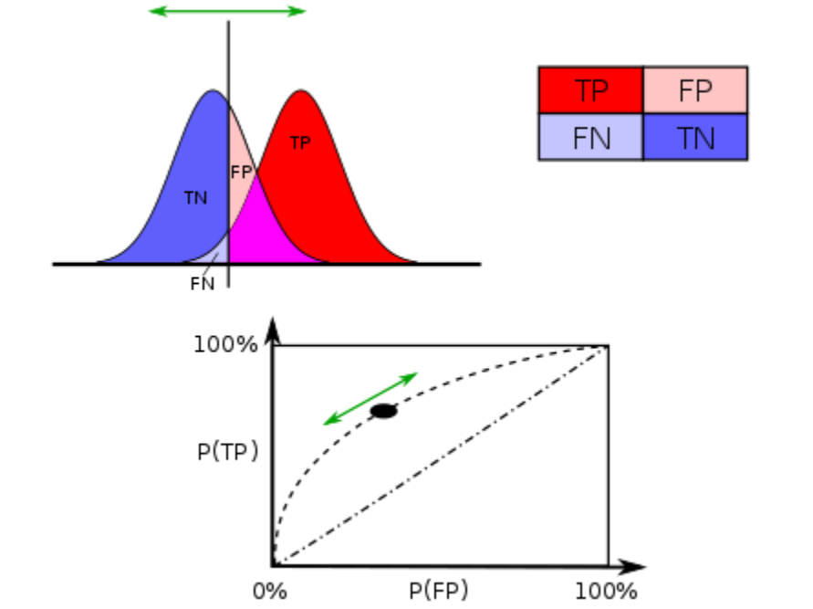

==========
Courbe ROC
==========

.. contents::
    :local:

.. index:: ROC

Ce document introduit la `courbe ROC <https://en.wikipedia.org/wiki/Receiver_operating_characteristic>`_
(Receiving Operator Characteristic) qui est communément utilisée pour mesurer
la performance d'un classifieur. Il introduit aussi des termes comme précision,
rappel, `AUC <https://en.wikipedia.org/wiki/Receiver_operating_characteristic#Area_under_the_curve>`_,
qui sont présents dans la plupart des articles qui traitent de machine learning.
Le module :mod:`roc <mlstatpy.ml.roc>` implémente les calculs ci-dessous
qu'on peut tester avec le notebook :ref:`rocexamplerst`.

Définitions
===========

Supposons que nous avons un classifieur qui classe des observations en un ensemble de
classes. De plus, il donne cette réponse accompagnée d'un score de pertinence.
Deux cas sont possibles : soit la réponse est bonne (1), soit la réponse est fausse (0).
Pour chaque observation, on associe un couple :math:`(r,x)` où :math:`r` est égal à 0 ou 1.
:math:`x` est le score de pertinence. On cherche à déterminer à partir de quel
seuil de pertinence, la réponse du classifieuur est fiable.
En faisant varier :math:`x`, on obtient une courbe
(source : `wikipedia <http://en.wikipedia.org/wiki/File:Roccurves.png>`_) :

.. image:: rocimg/Roccurves.png
    :width: 300

Cette courbe sert également à comparer différents classifieurs.
Plus une courbe a des valeurs élevées, plus l'aire sous la courbe
est grande, moins le classifieur fait d'erreur.

D'une manière simplifiée, le classifieur retourne une réponse qui est soit
mauvaise (-) soit bonne (+). On peut l'évaluer car pour construire
un classifier on dispose toujours d'une base contenant les réponses attendues.
En fonction du score :math:`x` et d'un seuil :math:`s`, on définit quatre cas :

======================= =============================== ================================
cas                     réponse prédite est bonne (+)   réponse prédite est mauvaise (-)
======================= =============================== ================================
:math:`x \supegal s`    TP: vrai (true) positif         FP: faux positif
:math:`x < s`           TN: vrai (true) négatif         FN: faux négatif
======================= =============================== ================================

Ces résultats sont souvent présentés selon une matrice confusion :

=================== =================== ================
                    réponse prédite
réponse attendue    0                   1
=================== =================== ================
0                   TN                  FP
1                   FN                  TP
=================== =================== ================

.. index:: rappel, précision

A partir de ces définitions, on définit :

* la `précision <https://en.wikipedia.org/wiki/Information_retrieval#Precision>`_ : :math:`\frac{ TP }{ TP + FP }`
* le `rappel ou recall <https://en.wikipedia.org/wiki/Information_retrieval#Recall>`_ : :math:`\frac{ TP }{ TP + TN }`

En choisissant un seuil relatif au score de pertinence :math:`x`,
au-dessus, on valide la réponse du classifieur, en-dessous,
on ne la valide pas. On peut toujours calculer la précision et le
rappel pour toutes les réponses dont le score est au-dessus d'un seuil :math:`s`.
La courbe ROC s'obtient en faisant varier :math:`s`.

.. mathdef::
    :title: Courbe ROC
    :lid: def_roc_2
    :tag: Définition

    On suppose que :math:`Y` est la variable aléatoire des scores des expériences qui ont réussi.
    :math:`X` est celle des scores des expériences qui ont échoué.
    On suppose également que tous les scores sont indépendants.
    On note :math:`F_X` et :math:`F_Y` les fonctions de répartition de ces variables.
    On définit en fonction d'un seuil :math:`s \in \R` :

    * :math:`R(s) = 1 - F_Y(s)`
    * :math:`E(s) = 1 - F_X(s)`

    La courbe ROC est le graphe :math:`\pa{E(s),R(s)}` lorsque :math:`s` varie dans :math:`\R`.		

:math:`TP(s)` désigne les true positifs au-dessus du seuil :math:`s`,
avec les notations *TP*, *FP*, *FN*, *TN*, cela revient à :

.. math::
    :nowrap:

    \begin{eqnarray*}
    E(s) &=& 1 - \frac{ TP(s) } { TP(s) + TN(s) } \\
    R(s) &=& 1 - \frac{ FN(s) } { FP(s) + FN(s) }
    \end{eqnarray*}

On remarque que :math:`\forall s, \; TP(s) + TN(s)` est constant.
De même pour :math:`FP(s) + FN(s)`.

On remarque que les fonctions :math:`s \longrightarrow E(s)` et :math:`s \longrightarrow R(s)`
sont décroissantes toutes deux. Elles sont donc inversibles.
Dans le cas où la variable aléatoire :math:`\theta` est indépendante de
la variable :math:`X`, la courbe ROC est une droite reliant les points
:math:`(0,0)` et :math:`(1-p,p)` où :math:`p = \pr{\theta=1}`.
Ceci signifie que la connaissance du score :math:`X`
n'apporte pas d'information quant à la réussite de l'expérience.

Il peut paraître complexe de distinguer la réponse et le score du classifieur.
C'est pourtant nécessaire dans le cas où le classifieur retourne un entier
qui désigne une classe parmi :math:`n`. Un cas positif est lorsque la
classe prédite est égale à la classe attendue, il est négatif dans le
cas contraire. La courbe peut être adaptée pour d'autres problèmes
tels que le ranking (voir [Agarwal2005]_).

.. index:: AUC

Aire sous la courbe
===================

Expression
++++++++++

L'aire sous la courbe (AUC) correspond à l'intégrale de la fonction ROC.
Elle se calcule à partir du théorème suivant :

.. mathdef::
    :tag: Théorème
    :title: Aire sous la courbe (AUC)

    On utilise les notations de la définition de la :ref:`Courbe ROC <def_roc_2>`.
    L'aire sous la courbe ROC est égale à :math:`\pr{ Y > X}`.

**Rappel**

Soit :math:`X` une variable aléatoire de densité :math:`f` et
de fonction de répartition :math:`F`. Si :math:`U = F(X)`, alors :

.. math::

    \pr{ U \infegal t} = \pr{ F(X) \infegal t} = \pr{ X \infegal F^{-1}(t)} = F \pa{ F^{-1}(t) } = t

La variable :math:`U` est de loi uniforme sur :math:`\cro{0,1}`.
De plus, soit :math:`g` une fonction intégrable quelconque, on pose :math:`u = F(x)` et :

.. math::

    \int_{\R} g(x) \, f(x) \,dx = \int_{\cro{0,1}} g(F^{-1}(u)) \, du

**Démonstration**

On note :math:`f_X` la densité de la variable :math:`X` et :math:`f_Y`
celle de la variable :math:`Y`. On peut alors définir la probabilité
:math:`\pr{ Y > X}` par une intégrale :

.. math::
    :nowrap:

    \begin{eqnarray*}
    P \pa{Y>X} &=& \int_x \int_y f_X(x) \; f_Y(y) \; \indicatrice{y > x} dx dy
    \end{eqnarray*}
	
On note :math:`F_X` la fonction de répartition de
:math:`X` soit :math:`F_X(x) = \int_{-\infty}^x f_X(u)du`.
On pose comme changement de variable : :math:`u = F_X(x)`.
On en déduit que :math:`du = f_X(x) dx`. La variable aléatoire :math:`U = F_X(X)`
est uniforme et comprise dans :math:`\cro{0,1}`.

.. math::
    :nowrap:

    \begin{eqnarray*}
    P \pa{Y>X} &=& \int_x f_X(x) dx \int_y  \; f_Y(y) \; \indicatrice{y > x} dy  \\
                         &=& \int_u du \int_y  \; f_Y(y) \; \indicatrice{y > F_X^{-1}(u)} dy   \\
                         &=& \int_u du \; \pr{Y > F_X^{-1}(u)} \nonumber
    \end{eqnarray*}

Or si :math:`u = F_X(s) = E(s)`, alors :math:`F_X^{-1}(u) = s`
et :math:`\pr{Y > F_X^{-1}(u)} = R'(s)`. Par conséquent :
	
.. math::

    P \pa{Y>X} = \int_u du \; \pr{Y > F_X^{-1}(u)} = \int_u du \; R'(F_X^{-1}(u))
		
.. index:: U-statistique, Mann-Whitney

Cette dernière expression est l'aire recherchée.
Ce théorème nous permet de définir un estimateur pour l'aire sous
la courbe ROC à l'aide des `U-statistiques <https://en.wikipedia.org/wiki/U-statistic>`_
de `Mann-Whitney <https://fr.wikipedia.org/wiki/Test_de_Wilcoxon-Mann-Whitney>`_ (voir [Saporta1990]_).

.. mathdef::
    :tag: Corollaire
    :title: Estimateur de l'aire sous la courbe ROC
    :lid: corollaire_roc_2

    On dispose des scores :math:`\vecteur{Y_1}{Y_n}` des expériences qui ont réussi
    et :math:`\vecteur{X_1}{X_m}` les scores des expériences qui ont échoué.
    On suppose également que tous les scores sont indépendants.
    Les scores :math:`(Y_i)` sont identiquement distribués,
    il en est de même pour les scores :math:`(X_i)`.
    Un estimateur de l'aire :math:`A` sous la courbe ROC' est :

    .. math::
        :label: estimateur_roc

        \hat{A} = \frac{1}{nm} \; \sum_{i=1}^{m}\sum_{j=1}^{n} \pa{\indicatrice{ Y_j > X_i} + \frac{1}{2} \indicatrice{ Y_j = X_i}}

**Démonstration**

La démonstration est évidente :

.. math::

    \esp\pa{\hat{A}} = \frac{1}{nm} \; \sum_{i=1}^{m}\sum_{j=1}^{n}
                    \pa{\pr{ Y_j > X_i} + \frac{1}{2} \pr{X_i=Y_j}} = \pr{ Y > X} + \frac{1}{2}\pr{ Y = X}

Dans le cas où :math:`X` ou :math:`Y` sont continues, :math:`\pr{X=Y} = 0`.

Intervalles de confiance
++++++++++++++++++++++++

Il est possible de déterminer un intervalle de confiance pour cet estimateur.
Le théorème central limite nous permet de dire que cet estimateur tend vers
une loi normale lorsque :math:`n` et :math:`m` tendent vers l'infini.

.. mathdef::
    :title: Variance de l'estimateur AUC
    :tag: Corollaire

    On note :math:`P_X = \pr{ X < \min\acc{Y_i,Y_j }}` et :math:`P_Y = \pr { \max\acc{X_i,X_j} < Y}`.
    :math:`X_i` et :math:`X_j` sont de même loi que :math:`X`, :math:`Y_i`, :math:`Y_j` sont de même loi que :math:`Y`.
    La variance de l'estimateur :math:`\hat{A}` définie par :eq:`estimateur_roc` est :

    .. math::

        \var{\hat{A}} = \frac{ \hat{A} (1-\hat{A})}{nm} \; \cro{
                                                            1 + (n-1) \frac { P_Y  - \hat{A}^2 } { \hat{A} (1-\hat{A}) } +
                                                            (m-1) \frac { P_X - \hat{A}^2 } { \hat{A} (1-\hat{A}) }
                                                        }

**Démonstration**

Cette démonstration n'est vraie que dans le cas continu.
Par conséquent, :math:`\pr{X=Y} = 0`. On calcule tout d'abord :math:`\esp{\hat{A}^2}`
et on utilise le fait que :math:`\var{\hat{A}} = \esp\pa{\hat{A}^2} - \hat{A}^2`.

.. math::

    \hat{A}^2 = \frac{1}{n^2 m^2}  \cro{ \sum_{i=1}^{m}\sum_{j=1}^{n} \indicatrice{ X_i < Y_j} } ^2
    = \frac{1}{n^2 m^2} \sum_{i=1}^{m}\sum_{j=1}^{n}\sum_{k=1}^{m}\sum_{l=1}^{n}
    \indicatrice{ X_i < Y_j}  \indicatrice{ X_k < Y_l}

.. math::

    \begin{array}{rcl}
    \hat{A}^2 &=& \frac{1}{n^2 m^2} \sum_{i=1}^{m}\sum_{j=1}^{n} \indicatrice{ X_i < Y_j} \\
    && + \frac{1}{n^2 m^2}  \sum_{i=1}^{m}\sum_{j=1}^{n}\sum_{k \neq i} \indicatrice{ X_i < Y_j}  \indicatrice{ X_k < Y_j} \\
    && + \frac{1}{n^2  m^2} \sum_{i=1}^{m}\sum_{j=1}^{n}\sum_{l \neq j} \indicatrice{ X_i < Y_j}  \indicatrice{ X_i < Y_l}  \\
    && +\frac{1}{n^2  m^2} \sum_{i=1}^{m}\sum_{j=1}^{n}\sum_{k \neq i}\sum_{l \neq j} \indicatrice{ X_i < Y_j}  \indicatrice{ X_k < Y_l}
    \end{array}
		
On en déduit que :

.. math::
    :nowrap:

    \begin{eqnarray*}
    \esp{\hat{A}^2} &=&	\frac{\hat{A}}{nm} + \frac{n-1 }{nm} \; \pr{ \max\acc{X_i,X_k} < Y_j}  + \nonumber \\ &&
                                        \frac{m-1 }{nm} \;  \pr{ X_i < \min\acc{Y_j,Y_l}} +  \frac{nm-n-m-1 }{n m} \;  \hat{A}^2 \\
    \var{\hat{A}^2} &=&	\frac{1}{nm} \cro{ \hat{A} + (n-1) P_Y + (m-1) P_X - (n+m+1) \hat{A}^2 } \nonumber \\
                                &=&	\frac{1}{nm} \cro{ \hat{A} + (n-1) \pa{P_Y - \hat{A}^2}+ (m-1) \pa{P_X - \hat{A}^2} + \hat{A}^2 }
    \end{eqnarray*}

On retrouve l'expression cherchée.		
		
		

.. _roc_confiance_inter:

Intervalles de confiance sur la courbe
======================================

Les systèmes de reconnaissance sont souvent ajustés de telle manière
que le taux d'erreur soit constant, par exemple 1%. C'est la proportion de documents
reconnus qui détermine la performance de ce système. L'objectif ce paragraphe
est de déterminer un intervalle de confiance du taux de reconnaissance
pour un taux d'erreur fixé.

Construction de la courbe ROC
+++++++++++++++++++++++++++++

Ce premier paragraphe détaille la manière dont
est construite une courbe ROC (voir :ref:`Courbe ROC <def_roc_2>`).

.. mathdef::
    :title: Courbe ROC
    :tag: Algorithme
    :lid: algo_courb_ROC

    On suppose qu'on dispose d'un ensemble de points :math:`\pa{X_i,\theta_i}
    \in \R \times \acc{0,1}` pour :math:`i \in \ensemble{1}{n}`.
    `X_i` est le score obtenu pour l'expérience :math:`i`,
    `\theta_i` vaut 1 si elle a réussi et 0 si elle a échoué.
    On suppose également que cette liste est triée par ordre croissant :
    `\forall i, \; X_i \infegal X_{i+1}`.
    On souhaite également tracer :math:`k` points sur la courbe, on détermine pour cela :math:`k` seuils
    `\ensemble{s_1}{s_k}` définis par : :math:`\forall j, s_k = X_{\frac{j \, k}{n}}`.

    On construit ensuite les points :math:`\pa{R_j,E_j}` définis par :

    .. math::
        :nowrap:

        \begin{eqnarray*}
        R_j &=& \frac{1}{n}\,  \sum_{i=1}^{n} \theta_i \indicatrice{X_i \supegal s_j} \text{ et }
        E_j = \frac{1}{n}  \, \sum_{i=1}^{n} \pa{1-\theta_i} \; \indicatrice{X_i \supegal s_j}
        \end{eqnarray*}

    La courbe ROC est composée de l'ensemble :math:`R_{OC} = \acc{ \pa{E_j,R_j} | 1 \infegal j \infegal k}`.
		
Les deux suites :math:`(R_j)_j` et :math:`(E_j)_j` sont toutes les deux décroissantes
d'après leur définition. La courbe peut être rendue continue par interpolation.

.. mathdef::
    :title: taux de classification à erreur fixe
    :tag: Définition
    :lid: algo_courb_taux_lin

    On cherche un taux de reconnaissance pour un taux d'erreur donné.
    On dispose pour cela d'une courbe ROC obtenue par
    l'algorithme de la :ref:`courbe ROC <algo_courb_ROC>` et définie par les points
    :math:`R_{OC} = \acc{ \pa{e_j,r_j} | 1 \infegal j \infegal k}`.
    On suppose ici que :math:`\pa{e_1,r_1} = \pa{1,1}` et :math:`\pa{e_k,r_k} = \pa{0,}`.
    Si ce n'est pas le cas, on
    ajoute ces valeurs à l'ensemble :math:`R_{OC}`.

    Pour un taux d'erreur donné :math:`e^*`, on cherche :math:`j^*` tel que :

    .. math::

        e_{j^*+1} \infegal e^* \infegal e_{j^*}

    Le taux de reconnaissance :math:`\rho` cherché est donné par :

    .. math::

        \rho =  \frac{e^* - x_{j^*}} { x_{j^*+1} - x_{j^*} } \; \cro{ r_{j^*+1} - r_{j^*} } + r_{j^*}
		

Il ne reste plus qu'à détailler la méthode *bootstrap*.

Méthode boostrap
++++++++++++++++

.. index:: bootstrap

Une seule courbe ROC ne permet d'obtenir qu'un seul taux. On cherche ici à
construire plusieurs courbes ROC à partir de la même expérience de façon à
obtenir plusieurs taux de reconnaissance pour le même taux d'erreur.
De cette manière, il sera possible de déterminer un intervalle de confiance.
On s'inspire pour cela des méthodes de `bootstrap <https://fr.wikipedia.org/wiki/Bootstrap_(statistiques)>`_.

.. mathdef::
    :title: Courbe ROC, méthode boostrap
    :tag: Algorithme
    :lid: roc_boostrap_algo

    On dispose toujours du nuage de points
    :math:`E = \pa{X_i,\theta_i} \in \R \times \acc{0,1}` avec :math:`i \in \ensemble{1}{n}`.
    On choisit :math:`C \in \N` le nombre de courbes ROC qu'on désire tracer.
    Pour chaque courbe :math:`c \in \ensemble{1}{C}` :

    * On construit un nouvel ensemble :math:`\pa{X'_i,\theta'_i}_{1 \infegal i \infegal n}`
      construit par un tirage aléatoire dans l'ensemble :math:`E` avec remise.
    * L'algorithme de la :ref:`courbe ROC <algo_courb_ROC>` permet de constuire la courbe :math:`R_{OC}^k`.
    * L'algorithme de :ref:`taux de classification à erreur fixe <algo_courb_taux_lin>` permet ensuite de déterminer
      un taux de reconnaissance :math:`\rho_k` pour le taux d'erreur :math:`e^*`.

    La liste :math:`\vecteur{\rho_1}{\rho_C}` est triée par ordre croissant.
    Les quantiles sont ensuite utilisés pour
    déterminer l'intervalle de confiance :math:`\cro{\rho_1,\rho_2}`
    du taux de reconnaissance  pour le taux d'erreur :math:`e^*` de telle sorte que :

    .. math::

        \pr{ \rho \in \cro{ \rho_1, \rho_2 } } = 1 - \alpha

    On prend généralement :math:`\alpha = 0.05`.

Cet algorithme aboutit aux résultats suivants :

+-------------------------------+-------------------------------+---------------------------------+
| .. image:: rocimg/roc_1.png   | .. image:: rocimg/roc_3.png   | .. image:: rocimg/roc_100.png   |
|     :width: 300               |     :width: 300               |     :width: 300                 |
+-------------------------------+-------------------------------+---------------------------------+

La première image est celle d'une courbe ROC (l'axe des abscisses est inversé),
la seconde représente toutes celles obtenues par la
méthode bootstrap pour trois courbes. La troisième image superpose cent courbes.
Moins il y a de points pour estimer une partie de la courbe,
plus les courbes sont espacées. Ces courbes ont été construites avec 12000 points.
Le taux de lecture pour 1% d'erreur est égal à 68,09%.
L'intervalle de confiance à 95% est
[66,10%; 70,16%] (construit avec 500 courbes).
Moyenne (68,25) et médiane (68,12) sont sensiblement égales au taux calculé sur la première courbe
construite sans tirage aléatoire. L'écart-type est :math:`1,10`, cela donne un intervalle de confiance
équivalent au précédent si on considère que la moyenne des taux suit asymptotiquement une loi normale.
Cette expérience a été reproduite plusieurs fois
et ces bornes sont assez stables contrairement (`\pm 0,05 \%`) aux extremas
(`\pm 1\%`).

Aire sous la courbe
+++++++++++++++++++

La méthode bootstrap peut elle aussi être appliquée pour
calculer un intervalle de confiance pour l'aire sous la courbe (AUC).

.. image:: rocimg/roc_p100.png
    :width: 300

Courbe ROC (l'axe des abscisse est inversé) obtenue pour 100 tirages aléatoires.
L'aire sous la courbe est égale à 0.80 et l'intervalle de confiance à 95%
mesurée par la méthode bootsrap
est : :math:`\cro{0.79 , \; 0.80}`.
Les extremas sont presque identiques à ces chiffres.

Distribution des scores mauvais et bons
=======================================

On appelle un mauvais score un score associé à un mauvais résultat,
de même, un bon score est le score d'un bon résultat. Si le score est une probabilité,
on s'attend à trouver les bons scores regroupés autour de la valeur 1. Si
le score est un mauvais score, il devrait être plus proche de zéro. La figure  qui suit
montre des distributions obtenues pour deux problèmes différents.
Dans les deux cas, le but recherché est la détermination d'un seuil séparant
le score d'un bon résultat de celui d'un mauvais résultat. Lorsque ceci n'est pas
possible, le score ne peut correspondre à un quelconque critère confiance.

+--------------------------------------+--------------------------------------+
| .. image:: rocimg/score_dist_1.png   | .. image:: rocimg/score_dist_2.png   |
|     :width: 400                      |     :width: 400                      |
+--------------------------------------+--------------------------------------+

La première courbe montre deux distributions
qui se chevauchent même si les bons scores semblent plus concentrés autour des grandes valeurs.
Le seconde courbe montre un problème mieux séparable. L'existence d'un seuil
entre un bon et un mauvais score est plus plausible.

Variantes
=========

Taux de lecture ou de reconnaissance
++++++++++++++++++++++++++++++++++++

Il n'existe pas une grande différence lorsque le taux d'erreur
est faible. Le taux de lecture est simplement la proportion de
documents pour lesquels le score est aussi d'un seuil :math:`s`
que la réponse du classifieur soit bonne ou mauvaise. Par exemple,
pour un taux de *substitution* de 1%, si on a 70% en taux de lecture,
cela signifie que sur 100 documents, le système va en accepter 70 et
parmi ces 70, 1% seront mal traités. Le taux de substitution est un
taux d'erreur rapporté à un taux de lecture donné. L'inconvénient du taux de
lecture rapporté au taux de substitution est que la méthode développée au
paragraphe :ref:`roc_confiance_inter` ne s'applique plus aussi bien car
pour un taux de substitution donné, il peut exister plusieurs taux
de lecture.

+-------------------------------------------+--------------------------------------------+
| .. image:: rocimg/lecture_5_curve.png     | .. image:: rocimg/lecture_intervalle.png   |
|     :width: 400                           |     :width: 400                            |
+-------------------------------------------+--------------------------------------------+

La première image montre 5 courbes taux de lecture / taux de substitutions.
Les courbes ne sont pas monotones et montre qu'il existe parfois plusieurs taux de
lecture pour un même taux de substitution. Comme le calcul des intervalles de confiance
fait intervenir une interpolation linéaire, lorsque les courbes sont trop cahotiques,
le calcul retourne des valeurs fausses.
    		
On peut démontrer que la courbe taux de lecture / taux de substitution
n'est pas une courbe ni monotone ni inversible. Pour cela on dispose d'une
suite de couple :math:`\pa{X_i, \theta_i}` croissante selon les
:math:`X_i`. :math:`\theta_i` vaut 1 si l'expérience a réussi, 0 sinon.
Pour un seuil donné :math:`s`, on note :math:`E'(s)` le taux de substitution et
:math:`R'(s)` le taux de lecture, on obtient :

.. math::
    :nowrap:

    \begin{eqnarray*}
    R'(s) &=& \frac{1}{n} \sum_{i=1}^{n} \indicatrice{X_i \supegal s} \\
    E'(s) &=& \frac{1}{n \, R'(s)} \sum_{i=1}^{n} \pa{1 - \theta_i} \, \indicatrice{X_i \supegal s}
    \end{eqnarray*}

On écrit différemment ces expressions en supposant que :math:`X_{i(s_1)-1} < s_1 \infegal X_{i(s_1)} :math:` :

.. math::
    :nowrap:

    \begin{eqnarray*}
    R'(s_1) &=& \frac{n-i(s_1)}{n} \\
    E'(s_1) &=& \frac{1}{n - i(s_1)} \sum_{i=i(s_1)}^{n} \pa{1 - \theta_i}
    \end{eqnarray*}
		
On suppose maintenant que :math:`X_{i(s_2)-1} < s_2 \infegal X_{i(s_2)} :math:`
et :math:`i(s_1) +1 = i(s_2)` :
		
.. math::
    :nowrap:

    \begin{eqnarray*}
    R'(s_2) &=& \frac{n-i(s_2)}{n} < R'(s_1) \\
    E'(s_2) &=& \frac{1}{n - i(s_2)} \sum_{i=i(s_2)}^{n} \pa{1 - \theta_i} =
                            \frac{1}{n - i(s_2)} \frac{n - i(s_1)}{n - i(s_1)}
                            \pa{ - \pa{1 - \theta_{i(s_1)}} + \sum_{i=i(s_1)}^{n} \pa{1 - \theta_i} } \\
                    &=& - \frac{ \pa{1 - \theta_{i(s_1)}} } { n - i(s_2) } +
                                    \frac{  \sum_{i=i(s_1)}^{n} \pa{1 - \theta_i} } { n - i(s_1)} \frac{ n - i(s_1) } {n - i(s_2) }
                            = - \frac{ \pa{1 - \theta_{i(s_1)}} } { n - i(s_2) } + E'(s_1) \frac{ n - i(s_1) } {n - i(s_2) }
    \end{eqnarray*}

Si on suppose que :math:`\theta_{i(s_1)}=1`,
autrement dit, l'expérience :math:`s_1` a réussi, on en déduit que :

.. math::
    :nowrap:

    \begin{eqnarray*}
    E'(s_2) &=& E'(s_1) \frac{ n - i(s_1) } {n - i(s_2) } = E'(s_1) \frac{ n - i(s_2) + 1 } {n - i(s_2) } > E'(s_1)
    \end{eqnarray*}
		
En revanche si :math:`\theta_i = 0` :

.. math::
    :nowrap:

    \begin{eqnarray*}
    E'(s_2) &=&  E'(s_1) \pa{ 1 +  \frac{ 1 } {n - i(s_2) } } - \frac{1}{n - i(s_2)} =
                                E'(s_1) + \frac{ E(s_1) -1}{n - i(s_2) } < E'(s_1)
    \end{eqnarray*}

Il n'existe donc pas toujours une fonction :math:`f` reliant :math:`R'(s)` à :math:`E'(s)`
à moins de construire cette courbe de telle sorte qu'elle soit monotone en
ne choisissant qu'une sous-suite :math:`\pa{E'(X_i), R'(X_i)}_i` qui vérifie cette hypothèse.

Classification multi-classe
===========================

Une courbe ROC se construit avec deux informations : une réponse binaire
et un score. Que signifie cette réponse binaire ? Elle peut être :

#. Le fait que le prédicteur ait bien prédit une classe en particulier.
   Le score associé est celui que le prédicteur donne pour cette classe.
#. Le fait que le prédicteur ait bien prédit,
   c'est-à-dire que la réponse binaire signifie que la classe prédite
   est la classe attendue, le score associé est celui de la classe prédite,
   c'est-à-dire le score maximum obtenu pour l'une des classes.

Plus formellement, le prédicteur retourne un vecteur :math:`S_i` qui contient
les probabilités d'appartenance à toutes les classes aussi appelées
plus généralement score de confiance ou juste score.
:math:`S_i(c)` est la probabilité de prédire la classe :math:`c`.
La classe attendue est notée :math:`y_i`, c'est celle que le prédicteur doit prédire.
Dans le premier cas, on construit le couple :math:`(b_i, s_i)` de telle sorte que :

.. math::

    \begin{array}{l} b_i = 1 \; si \; y_i = c \; sinon \; 0 \\ s_i = S_i(c) \end{array}

Dans le second cas :

.. math::

    \begin{array}{l} b_i = 1 \; si \; \max S_i = S_i(y_i) \; sinon \; 0 \\ s_i = \max S_i \end{array}

Le premier cas correspond par exemple à des problèmes de
`détection de fraude <https://en.wikipedia.org/wiki/Predictive_analytics#Fraud_detection>`_.
Le second cas correspond à taux de classification global. La courbe ROC
pour ce cas est en règle général moins bonne que la plupart des
courbes ROC obtenues pour chacune des classes prise séparément
(voir `Régression logistique <http://www.xavierdupre.fr/app/papierstat/helpsphinx/notebooks/wines_color.html>`_).

Exemple
=======

Voir `ROC <http://www.xavierdupre.fr/app/ensae_teaching_cs/helpsphinx3/antiseches/ml_basic/plot_regression.html#sphx-glr-antiseches-ml-basic-plot-roc-py>`_.

.. [Agarwal2005] Generalization Bounds for the Area Under the ROC Curve (2005),
   Shivani Agarwal, Thore Graepel, Ralf Herbich, Sariel Har-Peled, Dan Roth
   *Journal of Machine Learning Research, volume 6, pages 393-425*

.. [Saporta1990] Probabilités, analyse des données et statistique (1990),
   Gilbert Saporta, *Editions Technip*
