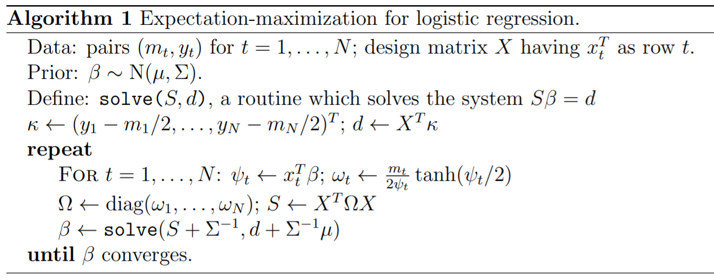

.. _l-lr-trees-nn:

===========================================
Régression logistique et arbres de décision
===========================================

.. index:: régression logistique, arbre de décision, réseaux de neurones

Ce qui suit explore une façon fantaisiste de construire des régressions
logistiques à mi-chemin entre les arbres de décisions
et les réseaux de neurones. Dans un premier temps, on s'intéresse
uniquement à une classification binaire.

.. contents::
    :local:

Parallèle entre un neurone et une régression logistique
=======================================================

Les paragraphes :ref:`rn-classification` et
:ref:`nn-classification` présente le problème de la classification
qui consiste à trouver une fonction *f* qui maximise la vraisemblance
du nuage de points :math:`(X_i, y_i)_i` où :math:`X_i \in \R^d`
et :math:`y_i \in \acc{0, 1}`.

.. math::

    \ln L(\Theta, X, y) = \sum_{i=1}^n y_i \ln f(\Theta, X_i) + (1-y_i) \ln (1-f(\Theta, X_i))

Dans le cas de la régression logistique, la fonction *f* est définie comme suit :

.. math::

    f(\Theta, X_i) = \frac{1}{1 + e^{-\sum_{k=1}^d \theta_k x_{ik}}}

Cela ressemble beaucoup à la définition d'un :ref:`neurone <l-rn-neurone>`
où la fonction d'activation :math:`f(x) = \frac{1}{1 + e^{-x}}` est une
fonction sigmoïde.

.. _l-lr-log-likelihood:

Principe d'un arbre de décision
===============================

Un arbre de décision se construit peu à peu en répétant toujours
la même optimisation sur des sous-ensemble de plus en plus petit.
Il faut d'abord un critère qui permette d'évaluer la pertinence
de la division effectuée par un noeud de l'arbre.
Pour un ensemble :math:`(X_i, y_i)_{1 \infegal i \infegal n}`, on
peut estimer la probabilité
:math:`p(y_1, ..., y_n) = p(Y) = \frac{1}{n}\sum{i=1}^n y_i`.
Le critère de Gini *G* qui évalue la pertinence d'une classification est
défini par :math:`G(Y) = p(Y) (1 - p(Y))`.
Un autre critère est le gain d'information ou entropie *H* :
:math:`H(Y) = - p(Y) \ln p(Y) - (1-p(Y)) \ln (1 - p(Y))`.

On note :math:`Y_S` l'ensemble des :math:`\acc{y_i | i \in S}`
où *S* est un sous-ensemble. :math:`S^C` est noté le complémentaire.

Pour le premier noeud de l'arbre de décision, on calcule pour
toutes les variables et toutes les observations la diminution
du critère choisi :

.. math::

    \begin{array}{rcl}
    S_{ik} &=& \acc{ m | x_{mk} \infegal x_{ik}} \\
    \Delta_{ik} &=& H(Y) - ( H(Y_{S_{ik}}) + H(Y_{S_{ik}^C} )
    \end{array}

On choisit alors la variable *k* et le seuil :math:`x_{ik}` qui
maximise le gain. Dans le cas d'une régression logistique,
la vraisemblance correspond à :

.. math::

    \ln L(\Theta, X, y) = \sum_{i=1}^n y_i \ln f(\Theta, X_i) + (1-y_i) \ln (1-f(\Theta, X_i))

Si on suppose que la fonction *f* retourne une constante *c*,
cette expression devient :

.. math::

    \ln L(\Theta, X, y) = \sum_{i=1}^n y_i \ln c + (1-y_i) \ln (1-c) = p(Y) \ln c + (1-p(Y)) \ln (1-c)

Or cette expression admet un maximum pour :math:`c=p(Y)` puisque la dérivée
s'annule de façon évidente pour cette valeur :

.. math::

    \frac{\partial \ln L(\Theta, X, y)}{\partial c} = \frac{p(Y)}{c} - \frac{1-p(Y)}{1-c}

On remarque que l'optimisation d'un noeud d'un arbre de décision
correspond à l'optimisation de la vraisemblance par une
fonction constante. Une régression logistique calculée sur une
seule variable est en quelque sorte une généralisation de ce modèle.
On apprend un arbre de décision qu'on exporte au format :epkg:`dot`.

.. runpython::
    :showcode:
    :warningout: RuntimeWarning

    from sklearn.datasets import load_iris
    from sklearn.tree import DecisionTreeClassifier, export_graphviz
    ds = load_iris()
    X, y = ds.data, ds.target
    y = y % 2
    dt = DecisionTreeClassifier(max_depth=3, criterion='entropy')
    dt.fit(X, y)
    print(dt)
    # export_graphviz(dt)

Ce qui donne :

.. gdot::
    :format: png

    digraph Tree {
        node [shape=box] ;
        0 [label="X[3] <= 0.8\nentropy = 0.918\nsamples = 150\nvalue = [100, 50]"] ;
        1 [label="entropy = 0.0\nsamples = 50\nvalue = [50, 0]"] ;
        0 -> 1 [labeldistance=2.5, labelangle=45, headlabel="True"] ;
        2 [label="X[3] <= 1.75\nentropy = 1.0\nsamples = 100\nvalue = [50, 50]"] ;
        0 -> 2 [labeldistance=2.5, labelangle=-45, headlabel="False"] ;
        3 [label="X[2] <= 4.95\nentropy = 0.445\nsamples = 54\nvalue = [5, 49]"] ;
        2 -> 3 ;
        4 [label="entropy = 0.146\nsamples = 48\nvalue = [1, 47]"] ;
        3 -> 4 ;
        5 [label="entropy = 0.918\nsamples = 6\nvalue = [4, 2]"] ;
        3 -> 5 ;
        6 [label="X[2] <= 4.85\nentropy = 0.151\nsamples = 46\nvalue = [45, 1]"] ;
        2 -> 6 ;
        7 [label="entropy = 0.918\nsamples = 3\nvalue = [2, 1]"] ;
        6 -> 7 ;
        8 [label="entropy = 0.0\nsamples = 43\nvalue = [43, 0]"] ;
        6 -> 8 ;
    }

Construction d'un pseudo arbre
==============================

Et si on remplaçait chaque noeud par une régression logistique
appris sur les exemples passant par ce noeud... Plutôt que de prendre
une décision basée sur une variable donnée et de retourner une probabilité
constante, on estime une régression logistique et on retourne
la probabilité retournée par la régression.

S'il n'y a théoriquement aucun obstacle, en pratique, certains cas
posent quelques problèmes comme le montre l'exemple
:ref:`l-example-logistic-decision` et repris ci-dessous.

.. plot::

    import matplotlib.pyplot as plt
    from mlstatpy.ml.logreg import criteria, random_set_1d, plot_ds

    X1, y1 = random_set_1d(1000, False)
    X2, y2 = random_set_1d(1000, True)
    df1 = criteria(X1, y1)
    df2 = criteria(X2, y2)

    fig, ax = plt.subplots(1, 2, figsize=(12, 6), sharey=True)
    plot_ds(X1, y1, ax=ax[0], title="easy")
    plot_ds(X2, y2, ax=ax[1], title="difficult")
    df1.plot(x='X', y=['Gini', 'Gain', 'LL-10', 'p1', 'p2'], ax=ax[0], lw=5.)
    df2.plot(x='X', y=['Gini', 'Gain', 'LL-10', 'p1', 'p2'], ax=ax[1], lw=5.)
    plt.show()

Le seuil de coupure est évident dans le premier cas et
quasiment impossible à trouver de façon numérique dans le second
avec les algorithmes tels qu'ils sont implémentés.
Les arbres de décision contournent
ce problème en imposant que le seuil de coupure laisse au moins
quelques exemples de chaque côté ce que la régression logistique
ne fait pas.

Aparté mathématique
+++++++++++++++++++

La log-vraisemblance d'une régression logistique pour
un jeu de données :math:`(X_i, y_i)` s'exprime comme
suit pour une régression logistique de paramètre
:math:`\beta`.

.. math::

    \begin{array}{rcl}
    L(\beta, X, y) &=& \sum_{i=1}^n y_i \ln f(\beta, X_i) + (1-y_i) \ln (1-f(\beta, X_i)) \\
    \text{avec } f(\beta, X_i) &=& \frac{1}{1 + \exp(- (\beta_0 + \sum_{k=1}^d x_{ik} \beta_k))}
    \end{array}

On remarque que :

.. math::

    \begin{array}{rcl}
    f(x) &=& \frac{1}{1 + e^{-x}} \\
    \Rightarrow f(-x) &=& \frac{1}{1 + e^{x}} = \frac{e^{-x}}{1 + e^{-x}} \\
    \Rightarrow f(x) + f(-x) &=& \frac{1}{1 + e^{-x}} + \frac{e^{-x}}{1 + e^{-x}} = 1
    \end{array}

Cela explique pour on utilise souvent cette fonction pour transformer
une distance en probabilité pour un classifieur binaire.
L'apprentissage d'un arbre de décision
:epkg:`sklearn:tree:DecisionTreeClassifier` propose le
paramètre ``min_samples_leaf``. On se propose dans le cadre
de la régression logistique de chercher le paramètre
:math:`\beta_0` qui permet de vérifier la contrainte
fixée par ``min_samples_leaf``. Cela revient à trounver
un classifieur linéaire parallèle au premier qui vérifie
les contraintes.

Approche EM et régression logistique
====================================

L'article [Scott2013]_ explicite un algorithme d'apprentissage EM
pour une régression logistique.

Lien vers les réseaux de neurones
=================================

Interprétabilité
================

Bibliographie
=============

[Scott2013] `Expectation-maximization for logistic regression
    <https://arxiv.org/pdf/1306.0040.pdf>`_, James G. Scott, Liang Sun
