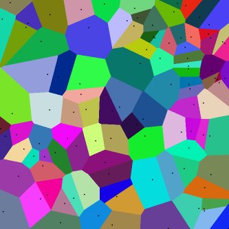
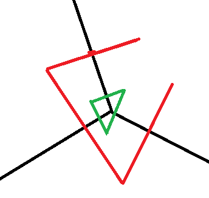

====================================================
Régression logistique, diagramme de Voronoï, k-Means
====================================================

Ce qui suit explore les liens entre une régression logistique,
les diagrammes de Voronoï pour construire un classifieur
qui allient la régression logistique et les clustering type k-means.
Le point de départ est une conjecture : les régions
créées par une régression logisitique sont convexes.

.. contents::
    :local:

Diagramme de Voronoï
====================

.. index:: diagramme de Voronoï

Un `diagramme de Voronoï <https://fr.wikipedia.org/wiki/Diagramme_de_Vorono%C3%AF>`_
est le diagramme issu des intersections des médiatrices entre :math:`n` points.

On définit un ensemble de points :math:`(X_1, ..., X_n)`.
La zone d'influence de chaque point est défini par
:math:`V(X_i) = \{ x | d(x, X_i) \leqslant d(x, X_j) \forall j\}`.
Si *d* est la distance euclidienne, la frontière entre deux
points :math:`X_i, X_j` est un segment sur la droite d'équation
:math:`d(x, X_i) = d(x, X_j)` :

.. math::

    \begin{array}{ll}
    &\norme{x-X_i}^2 - \norme{x-X_j}^2 = 0 \\
    \Longrightarrow & \norme{x}^2 - 2 \scal{x}{X_i} + \norme{X_i}^2 - (\norme{x}^2 - 2 \scal{x}{X_j} + \norme{X_j}^2) = 0 \\
    \Longrightarrow & 2 \scal{x}{X_j - X_i} + \norme{X_i}^2 - \norme{X_j}^2 = 0 \\
    \Longrightarrow & 2 \scal{x}{X_j - X_i} + \frac{1}{2} \scal{X_i + X_j}{X_i - X_j} = 0 \\
    \Longrightarrow & \scal{x - \frac{X_i + X_j}{2}}{X_i - X_j} = 0
    \end{array}

Ce système constitue :math:`\frac{n(n-1)}{2}` droites ou hyperplans si
l'espace vectoriel est en dimension plus que deux.
Le diagramme de Voronoï est formé par des segments de chacune
de ces droites. On peut retourner le problème. On suppose
qu'il existe :math:`\frac{n(n-1)}{2}` hyperplans,
existe-t-il *n* points de telle sorte que les hyperplans
initiaux sont les frontières du diagramme de Voronoï formé
par ces *n* points ?

**à compléter**

Régression logistique
=====================

:epkg:`scikit-learn` a rendu populaire le jeu de données
`Iris <http://scikit-learn.org/stable/auto_examples/linear_model/plot_iris_logistic.html#sphx-glr-auto-examples-linear-model-plot-iris-logistic-py>`_
qui consiste à classer des fleurs en trois classes
en fonction des dimensions de leurs pétales.

.. image:: lrvor/iris.png

.. runpython::
    :showcode:
    :warningout: ImportWarning

    from sklearn.datasets import load_iris
    data = load_iris()
    X, y = data.data[:, :2], data.target

    from sklearn.linear_model import LogisticRegression
    clr = LogisticRegression()
    clr.fit(X, y)

    print(clr.coef_)
    print(clr.intercept_)

La fonction de prédiction est assez simple :
:math:`f(x) = Ax + B`. La classe d'appartenance
du point *x* est déterminé par :math:`\max_i f(x)_i`.
La frontière entre deux classes *i, j* est définie
par les deux conditions :
:math:`\max_k f(x)_k = f(x)_i = f(x)_j`.
On retrouve bien :math:`\frac{n(n-1)}{2}` hyperplans.
On définit la matrice *A* comme une matrice
ligne :math:`(L_1, ..., L_n)` où *n* est le nombre
de classes. L'équation de l'hyperplan entre deux classes devient :

.. math::

    \begin{array}{ll}
    & L_i X + B_i = L_j X + B_j \\
    \Longleftrightarrow & (L_i - L_j) X + B_i - B_j = 0 \\
    \Longleftrightarrow & \scal{L_i - L_j}{X} + B_i - B_j = 0 \\
    \Longleftrightarrow & \scal{L_i - L_j}{X - \frac{L_i + L_j}{2}} + \scal{L_i - L_j}{\frac{L_i + L_j}{2}} + B_i - B_j = 0 \\
    \Longleftrightarrow & \scal{L_i - L_j}{X - \frac{L_i + L_j}{2}} + \frac{1}{2}\norme{L_i}^2 - \frac{1}{2}\norme{L_j}^2 + B_i - B_j = 0 \\
    \Longleftrightarrow & \scal{L_i - L_j}{X - \frac{L_i + L_j}{2}} + \frac{1}{2}\norme{L_i}^2 + B_i - (\frac{1}{2}\norme{L_j}^2 + B_j) = 0
    \end{array}

Il y a peu de chance que cela fonctionne comme cela.
Avant de continuer, assurons-nous que les régions associées
aux classes sont convexes. C'est une condition nécessaire mais
pas suffisante pour avoir un diagramme de Voronoï.

Soit :math:`X_1` et :math:`X_2` appartenant à la classe *i*.
On sait que que :math:`\forall k, L_i X_1 + B_i \geqslant L_k X_1 + B_k`
et :math:`\forall k, L_i X_2 + B_i \geqslant L_k X_2 + B_k`.
On considère un point :math:`X` sur le segment :math:`[X_1, X_2]`, donc il existe
:math:`\alpha, \beta \geqslant 0` tel que :math:`X = \alpha X_1 + \beta X_2` et
:math:`\alpha + \beta = 1`. On vérifie que :

.. math::

    \begin{array}{ll}
    & L_i X + B_i = L_i (\alpha X_1 + \beta X_2) + B_i = \alpha(L_i X_1 + B_i) + \beta(L_i X_2 + B_i) \\
    \geqslant & \alpha(L_k X_1 + B_k) + \beta(L_k X_2 + B_k) = L_k (\alpha X_1 + \beta X_2) + B_k \forall k
    \end{array}

Donc le point *X* appartient bien à classe *i* et celle-ci est convexe.
La régression logistique forme une partition convexe de l'espace
des features.

.. mathdef::
    :title: convexité des classes formées par une régression logistique
    :tag: Théorème

    On définit l'application :math:`\mathbb{R}^d \rightarrow \mathbb{N}`
    qui associe la plus grande coordonnées
    :math:`f(X) = \arg \max_k (AX + B)_k`.
    *A* est une matrice :math:`\mathcal{M}_{dc}`,
    *B* est un vecteur de :math:`\mathbb{R}^d`,
    *c* est le nombre de parties.
    L'application *f* définit une partition convexe
    de l'espace vectoriel :math:`\mathbb{R}^d`.

Revenons au cas de Voronoï. La classe prédite dépend de :math:`\max_k (Ax + B)_k`,
on peut aussi considérer que la classe prédite dépend de :math:`\min_k -(Ax + B)_k`.
On peut également déplacer les points et considérer que la classe dépend de
:math:`\min_k -\left(A(x-G\right) + B)_k` où *G* est un point de l'espace
des variables. Il faut trouver *n* points tels que la partition décrite
par le diagramme de Voronoï de ces points correspondent à la partition
convexe définie par la régression logistique. Autrement dit,
il faut trouver *n* points :math:`(P_1, ..., P_n)` tels que les
:math:`\frac{n(n-1)}{2}` droites soient équivalentes :

.. math::

    \begin{array}{ll}
    & \scal{x - \frac{P_i + P_j}{2}}{P_i - P_j} = 0  \\
    \Longleftrightarrow & \scal{x - \frac{L_i + L_j}{2}}{L_i - L_j} + \frac{1}{2}\norme{L_i}^2 + B_i - (\frac{1}{2}\norme{L_j}^2 + B_j) = 0
    \end{array}

On essaye de trouver des points :math:`P_i=L_i + G` où *G*
est un vecteur constant. On vérifie que :math:`P_i - P_j = L_i - L_j`.

.. math::

    \begin{array}{ll}
    & \scal{x - \frac{L_i + L_j}{2}}{L_i - L_j} + \frac{1}{2}\norme{L_i}^2 + B_i - (\frac{1}{2}\norme{L_j}^2 + B_j) = 0 \\
    \Longleftrightarrow & \scal{x - \frac{P_i + P_j}{2} + G}{L_i - L_j} + \frac{1}{2}\norme{L_i}^2 + B_i - (\frac{1}{2}\norme{L_j}^2 + B_j) = 0 \\
    \Longleftrightarrow & \scal{x - \frac{P_i + P_j}{2}}{P_i - P_j} + \scal{G}{L_i} +  \frac{1}{2}\norme{L_i}^2 + B_i - (\frac{1}{2}\norme{L_j}^2 + B_j + \scal{G}{L_j}) = 0
    \end{array}

Il faudrait pouvoir choisir *G* de telle sorte que :

.. math::

    \forall i, \scal{G}{L_i} +  \frac{1}{2}\norme{L_i}^2 + B_i = 0 \Longleftrightarrow \forall i,  \scal{L_i}{G}  + B_i= - \frac{1}{2}\norme{L_i}^2

Autrement dit, le point *G* vérifie : :math:`AG + B = -\frac{1}{2}N` avec :math:`N=(n_i)_i`
et :math:`n_i = \norme{L_i}^2 = \scal{L_i}{L_i}`. La matrice *A* n'est pas nécessairement
carrée mais s'il y a autant de classes que de dimensions et que la matrice *A* est
inversible alors il existe une solution. Nous ne traiterons pas le cas
où le nombre de classes est plus petit que le nombre de dimensions car la solution
existe aussi. Nous considérons le cas où le nombre de classes *c* est plus grand
que le nombre de dimension *d*. Dans ce cas, :math:`rang(A)=d`.
On décompose *A* en `valeurs singulières <https://fr.wikipedia.org/wiki/D%C3%A9composition_en_valeurs_singuli%C3%A8res>`_ :
:math:`A = U \Sigma V'` où :math:`\Sigma` est une matrice diagonale de dimension :math:`c \times d`
*U* est une matrice :math:`c \times c` et *V* est une matrice :math:`d \times d`.

.. math::

    AG = - B -\frac{1}{2}N \Longleftrightarrow U \Sigma V' G = - B -\frac{1}{2}N \Longleftrightarrow \Sigma V' G = - U^{-1}(B + \frac{1}{2}N)

Ce système n'a pas de solution puisqu'il y a *c* équations pour
*d < c* inconnues sauf s'il existe :math:`c-d` classes pour lesquelles
:math:`B_i + \frac{1}{2}\norme{L_i}^2`. Rien n'empêche de chercher
*G* comme solution du problème de minimisation
:math:`\min_G \norme{AG + B + \frac{1}{2}N}^2`
mais cela n'aurait pas réellement de signification mathématique.
Il faut revenir à la définition initiale : trouver
*n* points :math:`(P_1, ..., P_n)` tels que chaque couple :math:`(P_i, P_j)`
soit équidistant de la frontière qui sépare leurs classes :

.. math::

    \begin{array}{ll}
    & \forall j > i, \, (L_i - L_j) P_i + B_i - B_j = - \pa{ (L_i - L_j) P_j + B_i - B_j } \\
    \Longleftrightarrow & \forall j > i, \, (L_i - L_j) (P_i + P_j) + 2 (B_i - B_j) = 0 \\
    \Longleftrightarrow & \forall j > i, \, \scal{L_i - L_j}{\frac{P_i + P_j}{2} - \frac{L_i + L_j}{2}} + \frac{1}{2}\norme{L_i}^2 + B_i - (\frac{1}{2}\norme{L_j}^2 + B_j) = 0
    \end{array}

Chaque frontière entre deux classes est la médiatrice d'un segment
:math:`[P_i, P_j]`. Comment retrouvez les points qui auraient permis
de retrouver ces frontières ?

Notebooks
=========

Quelques errances.

.. toctree::
    :maxdepth: 1

    ../notebooks/logreg_voronoi
