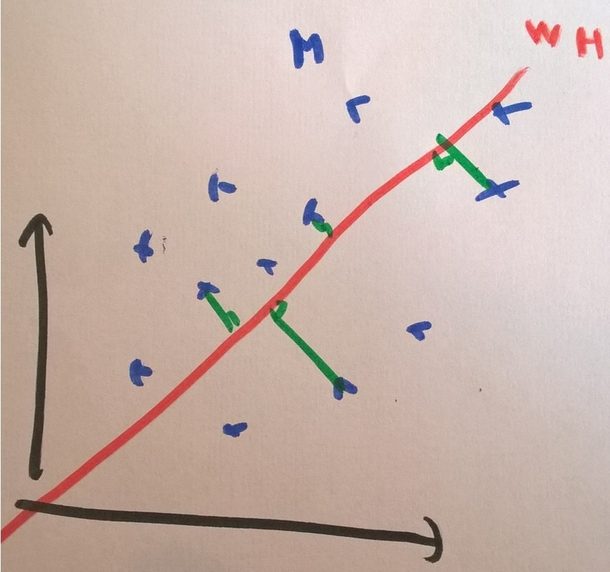

===================================================
Liens entre factorisation de matrices, ACP, k-means
===================================================

.. index:: NMF, factorisation de matrices

La `factorisation de matrice non négative <https://en.wikipedia.org/wiki/Non-negative_matrix_factorization>`_.
Cette méthode est utilisée dans le cadre de la recommandation de produits
à des utilisateurs.
Lire également [Acara2011]_, [Gupta2010]_.

.. contents::
    :local:

Factorisation de matrices et rang
=================================

La `factorisation d'une matrice <https://en.wikipedia.org/wiki/Non-negative_matrix_factorization>`_
est un problème d'optimisation qui consiste à trouver pour une matrice
:math:`M \in \mathcal{M}_{pq}` à coefficients positifs ou nuls :

.. math::

    M = WH

Où :math:`W` et :math:`H` sont de rang :math:`k` et de dimension
:math:`W \in \mathcal{M}_{pk}` et :math:`H \in \mathcal{M}_{kq}`.
*On s'intéresse ici au cas où les coefficients ne sont pas nécessairement positifs.*
Si :math:`k < rang(M)`, le produit :math:`WH` ne peut être égal à :math:`M`.
Dans ce cas, on cherchera les matrices qui minimise :

.. mathdef::
    :title: Factorisation de matrices positifs
    :tag: Problème

    Soit :math:`M \in \mathcal{M}_{pq}`, on cherche les matrices à coefficients positifs
    :math:`W \in \mathcal{M}_{pk}` et :math:`H \in \mathcal{M}_{kq}` qui sont solution
    du problème d'optimisation :

    .. math::

        \min_{W,h}\acc{\norme{M-WH}^2} = \min_{W,H} \sum_{ij} (m_{ij} - \sum_k w_{ik} h_{kj})^2

Quelques cas simples
====================

Le notebook :ref:`valeursmanquantesmfrst` montre la décroissante de l'erreur
en fonction du rang et l'impact de la corrélation sur cette même erreur.
Le dernier paragraphe montre qu'il n'existe pas de solution unique à un problème donné.
L'exemple suivant s'intéresse à une matrice 3x3.
Les trois points forment un triangle dans un plan.

.. plot::
    :include-source:

    import numpy
    W = numpy.array([[0.5, 0.5, 0], [0, 0, 1]]).T
    H = numpy.array([[1, 1, 0], [0.0, 0.0, 1.0]])

    ax = plt.add_subplot(111, projection='3d')
    wh = W @ H
    ax.scatter(M[:,0], M[:,1], M[:,2], c='b', marker='o', s=20)
    ax.scatter(wh[:,0], wh[:,1], wh[:,2], c='r', marker='^')
    plt.show()

On peut voir la matrice :math:`M` comme un ensemble de :math:`n=3` points dans un espace vectoriel.
La matrice :math:`W` est un ensemble de :math:`k < n` points dans le même espace.
La matrice :math:`WH`, de rang :math:`k` est une approximation de cet ensemble
dans le même espace, c'est aussi :math:`n` combinaisons linéaires de :math:`k`
points de façon à former :math:`n` points les plus proches proches de
:math:`n` points de la matrice :math:`M`.

Intuition géométrique
=====================

.. index:: ACP

L'exemple précédente suggère une interprétation géométrique d'une factorisation
de matrice. Sans valeur manquante, ce problème est équivalent à une
`Analyse en Composantes Principales (ACP) <https://fr.wikipedia.org/wiki/Analyse_en_composantes_principales>`_
(voir aussi [Boutsidis2008]_ (décomposition en valeurs singulières comme algorithme d'initialisation).
Nous allons le montrer grâce à quelques lemmes et théorèmes.

.. mathdef::
    :title: Rang k
    :tag: Lemme
    :lid: lemme_mf_0

    On note :math:`M=(m_{ij})`,
    :math:`W^k=(w^k_{il})`, :math:`H^k=(h^k_{lj})` avec
    :math:`1 \infegal i \infegal p`, :math:`1 \infegal j \infegal q`,
    et :math:`1 \infegal l \infegal k` avec :math:`k < \min(p,q)`.
    On suppose que les matrices
    sont solution du problème d'optimisation
    :math:`\min_{W,H} \norm{ M - WH }^2`.
    On suppose que :math:`rang(M) \supegal k`.
    Alors les les matrices :math:`W^k` et :math:`H^k`
    sont de rang :math:`k`.

On procède par récurrence. Ce lemme est nécessairement vrai pour
:math:`k=1` car la matrice :math:`M` n'est pas nulle.
De manière évidente,
:math:`\norm{ M - W^{k-1}H^{k-1} }^2 \supegal \norm{ M - W^kH^k }^2`.
Comme :math:`rang(M) \supegal k`, il existe un vecteur colonne :math:`V` de la matrice
:math:`M` qui ne fait pas partie de l'espace vectoriel engendré par les
:math:`k-1` vecteurs de la matrice :math:`W^{k-1}`. On construit la matrice
:math:`Y^k= [W^{k-1}, V]`. Par construction, :math:`rang(Y) = k`. De même,
on construit :math:`G^k` à partir de :math:`H^{k-1}` en remplaçant la dernière colonne et
en ajoutant une ligne :

.. math::

    G^k=\cro{\begin{array}{cc} H^{k-1}[1..p-1] & 0 \\ 0 & 1 \end{array}}

Par construction, le dernier vecteur est de la matrice produit est identique
à celui de la matrice :math:`M`.

.. math::

    \norme{M - Y^{k-1}G^{k-1}}^2 = \norme{M - W^{k-1}H^{k-1}}^2 - \sum_i (m_{iq} - w^{k-1}_{ik} h^{k-1}_{kq})^2

Nous avons fabriqué une matrice de rang *k* qui fait décroître l'erreur
du problème d'optimisation.
On procède par l'absurde pour dire que si
:math:`rang(W) = k-1`, on peut construire une matrice de rang *k*
qui fait décroître l'erreur ce qui est impossible. Le lemme est donc vrai.

Ce lemme fait également apparaître la construction de *q* points
dans un espace vectoriel engendré par les *k* vecteurs colonnes
de la matrice :math:`W_k`. Il est donc possible de choisir
n'importe quel base :math:`W'_{k}` de cet espace et d'exprimer
les *q* points de :math:`W_kH_k` avec cette nouvelle base.
Cela signifie qu'on peut écrire la matrice :math:`W_k` dans une base
:math:`B_k` comme :math:`W_k = B_k C_k` et :math:`W_k H_k = B_k C_k C_k^{-1} G_k`.

.. mathdef::
    :title: Projection
    :tag: Lemme
    :lid: lemme_mf_1

    On note :math:`M=(m_{ij})`,
    :math:`W^k=(w^k_{il})`, :math:`H^k=(h^k_{lj})` avec
    :math:`1 \infegal i \infegal p`, :math:`1 \infegal j \infegal q`,
    et :math:`1 \infegal l \infegal k` avec :math:`k < \min(p,q)`.
    On suppose que les matrices
    sont solution du problème d'optimisation
    :math:`\min_{W,H} \norm{ M - WH }^2`.
    On considère que la matrice :math:`M` est un ensemble de :math:`q`
    points dans dans un espace vectoriel de dimension :math:`p`.
    La matrice :math:`WH` représente des projections de ces points
    dans l'espace vectoriel engendré par les :math:`k` vecteurs colonnes
    de la matrice :math:`W`.

La figure suivante illustre ce lemme.
:math:`\norm{ M - WH }^2` s'écrit comme la somme des distances entre
*q* points :

.. math::

    \norm{ M - WH }^2 = \sum_{j=1}^q \norme{M[j] - W_kH_k[j]}^2

Or on sait que si :math:`W_k` est fixé, les *q* points de la matrice
:math:`W_kH_k` évolue sur un hyperplan de dimension :math:`k`.
Le point de ce plan le plus du vecteur :math:`M[j]` est sa projection
sur ce plan.

.. mathdef::
    :title: La factorisation de matrice est équivalente à une analyse en composantes principales
    :tag: Théorème
    :lid: th_mf_1

    On note :math:`M=(m_{ij})`,
    :math:`W^k=(w^k_{il})`, :math:`H^k=(h^k_{lj})` avec
    :math:`1 \infegal i \infegal p`, :math:`1 \infegal j \infegal q`,
    et :math:`1 \infegal l \infegal k` avec :math:`k < \min(p,q)`.
    On suppose que les matrices
    sont solution du problème d'optimisation
    :math:`\min_{W,H} \norm{ M - WH }^2`.
    On considère que la matrice :math:`M` est un ensemble de :math:`q`
    points dans dans un espace vectoriel de dimension :math:`p`.
    On suppose :math:`p < q`.
    La matrice :math:`W_k` définit un hyperplan identique à celui défini
    par les :math:`k` vecteurs propres associés aux :math:`k`
    plus grande valeurs propres de la matrice
    :math:`MM'` où :math:`M'` est la transposée de :math:`M`.

Une analyse en composante principale consiste à trouver
l'hyperplan qui maximise l'inertie de la projection d'un nuage
sur ce plan.
Le théorème :ref:`résolution de l'ACP <theorem_acp_resolution>`
a montré que :

.. math::
    :nowrap:
    :label: rn_acp_contrainte_rep

    \begin{eqnarray*}
    S =
    \underset{ \begin{subarray}{c} W \in M_{p,d}\pa{\R} \\ W'W = I_d \end{subarray} } { \arg \max } \;
                        \cro { \sum_{i=1}^{N} \norm{W'X_i}^2 } &=&
    \underset{ W \in M_{p,d}\pa{\R} } { \arg \min } \;  \cro { \sum_{i=1}^{N} \norm{WW'X_i - X_i}^2 }
    \end{eqnarray*}

Dans notre cas, chaque ligne de la matrice :math:`M` est un vecteur :math:`X_i`.
La matrice :math:`W_k` est identique à celle cherchée lors du problème de factorisation
de matrices. Les colonnes de la matrice :math:`H_k` sont égales à :math:`W'X_i`.
Il reste à montrer que le minimum trouvé dans les deux problèmes est le même.
Le notebook :ref:`mfacprst` montre que cela fonctionne sur un exemple.
La démonstration du théorème montre également que :math:`W'W = I_d`
et dans ce cas précis, :math:`WW'X_i` représente les coordonnées de la projection
du point :math:`X_i` sur le plan défini par les vecteurs :math:`W`.
C'est aussi ce que montre :ref:`second lemmme <lemme_mf_1>`.
S'il s'agit du même plan, cela signifie que les deux formulations, ACP et factorisation
de matrices, aboutissent au même minimum. Comme l'algorithme de l'ACP détermine le meilleur
plan projecteur, nécessairement, il correspond à celui trouvé par la factorisation de matrice.

k-means
=======

On peut construire deux matrices :math:`W` et :math:`H` à partir des résultats d'un
:ref:`l-k-means`. Celui-ci détermine :math:`k` centres auxquels on effecte les points
du nuage de départ. Dans ce cas-ci, la matrice :math:`W` est constituée des coordonnées
de ces centres. On note :math:`C_l` le cluster :math:`l`,
la matrice :math:`H^k=(h^k_{lj})` est définie comme suit :

.. math::

    h^k_{lj} = \indicatrice{X_j \in C_l}

Les coefficients sont soit 0 ou 1.
On peut alors essayer de forcer la factorisation de matrice vers une matrice
:math:`H` avec pas de un 1 sur chaque colonne et des zéros partout ailleurs.
Le résultat sera assez proche d'un clustering.

Quelques résultats
==================

Le notebook :ref:`mfacprst` illustre le lien entre ACP et
factorisation de matrice en deux dimensions.

Prolongements
=============

Tous les résultats montrés ici ne sont valables que si la norme math:`L_2`
est utilisée. Cela permet de mieux comprendre
les références proposées dans la documentation de
`Non-negative matrix factorization (NMF or NNMF) <http://scikit-learn.org/stable/modules/decomposition.html#nmf>`.
Si l'ACP et la factorisation de matrices sont équivalentes, les algorithmes pour
trouver le minimum diffèrent et sont plus ou moins appropriés dans
certaines configurations.
Lire [Gilles2014]_.

Prédiction
++++++++++

Prédire revient à supposer que la matrice :math:`M` est composée de vecteurs
colonnes :math:`X_1, ..., X_q`. La matrice :math:`W` reste inchangée et la prédiction
revient à déterminer les coordonnées de la projection d'un nouveau point :math:`X_{q+1}`
dans le plan définit par :math:`W`.

Factorisation non-négative
++++++++++++++++++++++++++

Le problème le plus souvent évoqué est celui de la factorisation
non-négative : `NMF <https://www.math.univ-toulouse.fr/~besse/Wikistat/pdf/st-m-explo-nmf.pdf>`_.
Ce problème est une optimisation avec contrainte : les coefficients doivent
tous être positifs ou nuls. Il n'est bien sûr plus équivalent
à une ACP.

Norme
+++++

L'ACP avec une norme :math:`L_1` revient à trouver le plan qui minimise la somme
des distances à la projection et non la somme des distances au carrés. Cela réduit
l'impact des points aberrants mais le problème n'est plus équivalent à la factorisation
de matrices avec une norme :math:`L_1`.

Sparsité
++++++++

Une ACP suppose que le calcul de valeurs propres d'une matrice
et c'est fastidieux lorsque la dimension du problème est très grande.
On lui préfère alors un algorithme tel que
`Sparse PCA <http://scikit-learn.org/stable/modules/decomposition.html#sparsepca>`_.
La factorisation de matrice est plus efficace qu'une ACP sur les problèmes
sparses et de grande dimension. Lire
`Non-negative Matrix Factorization with Sparseness Constraints <http://www.jmlr.org/papers/volume5/hoyer04a/hoyer04a.pdf>`_.

Valeurs manquantes
++++++++++++++++++

.. index:: valeurs manquantes, missing values

Contourner le problème des valeurs manquantes veut souvent dire,
soit supprimer les enregistrements contenant des valeurs manquantes,
soit choisir un modèle capable de faire avec ou soit trouver un moyen de les
remplacer. On peut gérer plus facilement le problème des valeurs manquantes
avec une factorisation de matrices. On peut également se server de la méthode
pour calculer une ACP avec des valeurs manquantes.

* `Imputation de données manquantes <https://www.math.univ-toulouse.fr/~besse/Wikistat/pdf/st-m-app-idm.pdf>`_
* `Principal component analysis with missing values: a comparative survey of methods <http://pbil.univ-lyon1.fr/members/dray/files/articles/dray2015a.pdf>`_

Interprétation
++++++++++++++

La factorisation de matrice peut être utilisée comme outil
de segmentation et d'interprétation pour des images, des vidéos.
Lire `A tutorial on Non-Negative Matrix Factorisation with Applications to Audiovisual Content Analysis <http://perso.telecom-paristech.fr/~essid/teach/NMF_tutorial_ICME-2014.pdf>`_.

* `Gesture recognition using a NMF-based representation of motion-traces extracted from depth silhouettes <https://hal.archives-ouvertes.fr/hal-00990252/document>`_

NTF
+++

Le problème de `Non-Negative Matrix Factorisation (NMF) <https://en.wikipedia.org/wiki/Non-negative_matrix_factorization>`_
est un cas particulier de
`Non-Negative Tensor Factorisation (NTF) <http://www.cs.huji.ac.il/~shashua/papers/NTF-icml.pdf>`_.
Lire aussi
`PARAFAC. Tutorial and applications <https://www.cs.cmu.edu/~pmuthuku/mlsp_page/lectures/Parafac.pdf>`_.

Bibliographie
=============

.. [Acara2011] Scalable tensorfactorizations for incomplete data,
    *Evrim Acara Daniel, M.Dunlavyc, Tamara G.Koldab. Morten Mørupd*,
    Chemometrics and Intelligent Laboratory Systems,
    Volume 106, Issue 1, 15 March 2011, Pages 41-56,
    or ArXiv `1005.2197 <https://arxiv.org/pdf/1005.2197.pdf>`_

.. [Boutsidis2008] SVD-based initialization: A head start for nonnegative matrix factorization.
    *Christos Boutsidis and Efstratios Gallopoulos*
    Pattern Recognition, 41(4): 1350-1362, 2008.

.. [Gilles2014] The Why and How of Nonnegative Matrix Factorization,
    *Nicolas Gillis*,
    ArXiv `1401.5226 <https://arxiv.org/abs/1401.5226>`_

.. [Gupta2010] Additive Non-negative Matrix Factorization for Missing Data,
    Mithun Das Gupta,
   ArXiv `1007.0380 <https://arxiv.org/abs/1007.0380>`_
