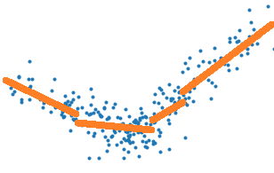

================================
Régression linéaire par morceaux
================================

Le paragraphe :ref:`regressionlineairerst`
étudie le lien entre le coefficient :math:`R^2`
et la corrélation pour finalement illustrer
une façon de réaliser une régression linéaire par
morceaux. L'algorithme s'appuie sur un arbre
de régression pour découper en morceaux ce qui
n'est pas le plus satisfaisant car l'arbre
cherche à découper en segment en approximant
la variable à régresser *Y* par une constante sur chaque
morceaux et non une droite.
On peut se poser la question de comment faire
pour construire à un algorithme qui découpe en approximant
*Y* par une droite et non une constante. Le plus dur
n'est pas de le faire mais de le faire efficacement.
Et pour comprendre là où je veux vous emmener, il faudra
un peu de mathématiques.

.. contents::
    :local:

Problème et regréssion linéaire dans un espace à une dimension
==============================================================

Tout d'abord, une petite
illustration du problème avec la classe
`PiecewiseRegression <http://www.xavierdupre.fr/app/mlinsights/helpsphinx/notebooks/piecewise_linear_regression.html>`_
implémentée selon l'API de :epkg:`scikit-learn`.

.. toctree::
    :maxdepth: 1

    ../notebooks/piecewise_linear_regression

.. image:: piecewise/piecenaive.png

Cette régression par morceaux est obtenue grâce à un arbre
de décision. Celui-ci trie le nuage de points :math:`(X_i, Y_i)`
par ordre croissant selon les *X*, soit :math:`X_i \leqslant X_{i+1}`.
L'arbre coupe en deux lorsque la différence des erreurs quadratiques est
maximale, erreur quadratiques obtenus en approximation *Y* par sa moyenne
sur l'intervalle considéré. On note l'erreur quadratique :

.. math::

    \begin{array}{rcl}
    C_(i,j) &=& \frac{1}{j - i + 1} \sum_{i \leqslant k \leqslant j} Y_i \\
    D_(i,j) &=& \frac{1}{j - i + 1} \sum_{i \leqslant k \leqslant j} Y^2_i \\
    E_(i,j) &=& \frac{1}{j - i + 1} \sum_{i \leqslant k \leqslant j} ( Y_i - C(i,j))^2 =
    \frac{1}{j - i + 1} \sum_{i \leqslant k \leqslant j} Y_i^2 - C(i,j)^2 = D(i,j) - C(i,j)^2
    \end{array}
    
La dernière ligne applique la formule :math:`\var{X} = \esp{X^2} - \esp{X}^2`
qui est facile à redémontrer.
L'algorithme de l'arbre de décision coupe un intervalle en
deux en détermine l'indice *k* qui minimise la différence :

.. math::

    \Delta_k = E(1, n) - (E(1, k) + E(k+1, n))

L'arbre de décision optimise la construction d'une fonction
en escalier qui représente au mieux le nuage de points,
les traits verts sur le graphe suivant, alors qu'il faudrait
choisit une erreur quadratique qui correspondent aux traits
oranges.

Il suffirait donc de remplacer l'erreur *E* par celle obtenue
par une régression linéaire. Mais si c'était aussi simple,
l'implémentation de :epkg:`sklearn:tree:DecisionTreeRegressor`
la proposerait. Alors pourquoi ?
La raison principale est que cela coûte trop cher en
temps de calcul. Pour trouver l'indice *k*, il faut calculer
toutes les erreurs :math:`E(1,k)` :math:`E(k+1,n)`, ce qui
coûte très cher lorsque cette erreur est celle d'une régression
linéaire parce qu'il est difficile de simplifier la différence :

.. math::

    \begin{array}{rcl}
    \Delta_{k} - \Delta_{k-1} &=&  - (E(1, k) + E(k+1, n)) + (E(1, k-1) + E(k, n)) \\
                              &=&  E(1, k-1) - E(1, k) + E(k, n) - E(k+1, n)
    \end{array}

On s'intéresse au terme :math:`E(1, k-1) - E(1, k)` :

.. math::

    \begin{array}{rcl}
    C_(1,k-1) - C_(1,k) &=& \frac{1}{k-1} \sum_{1 \leqslant i \leqslant k-1} Y_i
    - \frac{1}{k} \sum_{1 \leqslant i \leqslant k} Y_i \\
    &=& (\frac{1}{k-1} - \frac{1}{k}) \sum_{1 \leqslant i \leqslant k-1} Y_i - \frac{Y_k}{k} \\
    &=& \frac{1}{k(k-1)} \sum_{1 \leqslant i \leqslant k-1} Y_i- \frac{Y_k}{k} \\
    &=& \frac{1}{k} C(1,k-1) - \frac{Y_k}{k}
    \end{array}

On en déduit que :

.. math::

    \begin{array}{rcl}
    E(1, k-1) - E(1, k) &=& \frac{1}{k} D(1,k-1) - \frac{Y_k^2}{k} +
    (C_(1,k-1) - C_(1,k))(C_(1,k-1) + C_(1,k)) \\
    &=& \frac{1}{k} D(1,k-1) - \frac{Y_k^2}{k} + \pa{\frac{1}{k} C(1,k-1) - \frac{Y_k}{k}}
    \pa{\frac{Y_k}{k} - \frac{1}{k} C(1,k-1) + 2 C(1,k-1)}
    \end{array}

On voit que cette formule ne fait intervenir que :math:`C(1,k-1), D(1,k-1), Y_k`,
elle est donc très rapide à calculer et c'est pour cela qu'apprendre un arbre 
de décision peut s'apprendre en un temps raisonnable. Cela repose sur la possibilité
de calculer le critère optimisé par récurrence. On voit également que ces formules
ne font pas intervenir *X*, elles sont donc généralisables au cas
multidimensionnel. Il suffira de trier les couples :math:`(X_i, Y_i)`
selon chaque dimension et déterminer le meilleur seuil de coupure
d'abord sur chacune des dimensions puis de prendre le meilleur
de ces seuils sur toutes les dimensions. Le problème est résolu.

Le notebook
`Custom Criterion for DecisionTreeRegressor 
<http://www.xavierdupre.fr/app/mlinsights/helpsphinx/notebooks/piecewise_linear_regression_criterion.html>`_
implémente une version pas efficace du critère
`MSE <https://scikit-learn.org/stable/modules/generated/sklearn.metrics.mean_squared_error.html>`_
et compare la vitesse d'exécution avec l'implémentation de :epkg:`scikit-learn`.
Le résultat est sans équivoque. Cette implémentation n'implémente pas
:math:`\Delta_{k} - \Delta_{k-1}` mais plutôt les sommes
:math:`\sum_1^k w_i Y_i`, :math:`\sum_1^k w_i Y_i^2` dans un sens
et dans l'autre. En gros, 
le code stocke les séries des numérateurs et des dénominateurs
pour les diviser au dernier moment.

Le cas d'une régression est plus complexe. Prenons d'abord le cas
où il n'y a qu'un seule dimension,
il faut d'abord optimiser le problème :

.. math::

    E(1, n) = \min_{a,b} = \sum_{k=1}^n (a X_k + b - Y_k)^2

On dérive pour aboutir au système d'équations suivant :

.. math::

    \begin{array}{rcl}
    \frac{\partial E(1,n)}{\partial a} &=& 0 = \sum_{k=1}^n X_k(a X_k + b - Y_k) \\
    \frac{\partial E(1,n)}{\partial b} &=& 0 = \sum_{k=1}^n a X_k + b - Y_k
    \end{array}

Ce qui aboutit à :

.. math::

    \begin{array}{rcl}
    a(1, n) &=& \frac{\sum_{k=1}^n X_kY_k - \pa{\sum_{k=1}^n X_k}\pa{\sum_{k=1}^n Y_k} }
    {\sum_{k=1}^n X_k^2 -\pa{\sum_{k=1}^n X_k}^2 } \\
    b(1, n) &=& \sum_{k=1}^n Y_k - a \pa{\sum_{k=1}^n X_k}
    \end{array}

Pour construire un algorithme rapide pour apprendre un arbre de décision
avec cette fonction de coût, il faut pouvoir calculer
:math:`a(1, k)` en fonction de :math:`a(1, k-1), b(1, k-1), X_k, Y_k`
ou d'autres quantités intermédiaires qui ne font pas intervenir
les valeurs :math:`X_{i<k} < Y_{i<k}`. D'après ce qui précède,
cela paraît tout-à-fait possible. Mais dans le 
`cas multidimensionnel
<https://fr.wikipedia.org/wiki/R%C3%A9gression_lin%C3%A9aire#Estimateur_des_moindres_carr%C3%A9s>`_,
il faut déterminer la vecteur *A* qui minimise :math:`\sum_{k=1}^n \norme{Y - XA}^2`
ce qui donne :math:`A = (X'X)^{-1} X' Y`. Si on note :math:`M_{1..k}` la matrice
*M* tronquée pour ne garder que ses *k* premières lignes, il faudrait pouvoir
calculer rapidement :

.. math::

    A_{k-1} - A_k = (X_{1..k-1}'X_{1..k-1})^{-1} X'_{1..k-1} Y_{1..k-1} -
    (X_{1..k}'X_{1..k})^{-1} X'_{1..k} Y_{1..k}

Pas simple... La documentation de :epkg:`sklearn:tree:DecisionTreeRegressor`
ne mentionne que deux critères pour apprendre un abre de décision
de régression, *MSE* pour
:epkg:`sklearn:metrics:mean_squared_error` et *MAE* pour
:epkg:`sklearn:metrics:mean_absolute_error`. Les autres critères n'ont 
probablement pas été envisagé car il n'existe pas de façon efficace
de les implémenter. L'article [Acharya2016]_ étudie la possibilité
de ne pas calculer la matrice :math:`A_k` pour tous les *k*.
Mais peut-être qu'il n'est pas nécessaire de calculer la solution
du problème d'optimisation pour obtenir l'erreur minimale mais cette
direction ne paraît pas plus facile.

Régression linéaire et corrélation
==================================

On reprend le calcul multidimensionnel mais on s'intéresse au
cas où la matrice :math:`X'X` est diagonale qui correspond au cas
où les variables :math:`X_1, ..., X_C` ne sont pas corrélées.
Si :math:`X'X = diag(\lambda_1, ..., \lambda_C) = diag(\sum_{k=1}^n X^2_{k1}, ..., \sum_{k=1}^n X^2_{kC})`,
la matrice :math:`A` s'exprime plus simplement :math:`A = D^{-1} X' Y`.
On en déduit que :

.. math::

    a_c = \frac{\sum_{k=1}^n X_{kc} Y_k}{\sum_{k=1}^n X^2_{kc}} =
    \frac{\sum_{k=1}^n X_{kc} Y_k}{\lambda_c}

Cette expression donne un indice sur la résolution d'une régression linéaire
pour laquelle les variables sont corrélées. Il suffit d'appliquer d'abord une
`ACP <https://fr.wikipedia.org/wiki/Analyse_en_composantes_principales>`_
(Analyse en Composantes Principales) et de calculer les coefficients
:math:`a_c` associés à des valeurs propres non nulles. On écrit alors
:math:`X'X = P'DP` où la matrice *P* vérifie :math:`P'P = I`.

Idée de l'algorithme
====================

Implémentation
============== 

Bilbiographie
=============

.. [Acharya2016] `Fast Algorithms for Segmented Regression <https://arxiv.org/abs/1607.03990>`_,
    Jayadev Acharya, Ilias Diakonikolas, Jerry Li, Ludwig Schmidt, :epkg:`ICML 2016`

