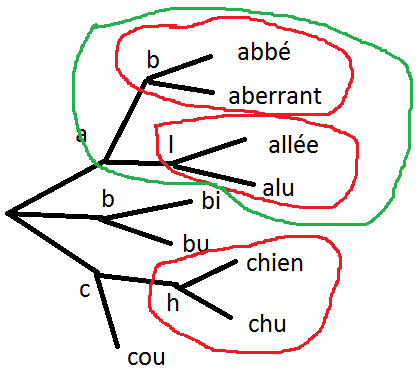

.. _l-completion0:

==========
Complétion
==========

.. index:: complétion, whoosh

La `complétion <https://fr.wikipedia.org/wiki/Compl%C3%A8tement>`_ est un méchanisme
qui permet à un utilisateur de saisir les mots de sa recherche avec moins
de caractères qu'elle n'en contient. L'utilisateur saisit plus rapidement.

.. image:: completion_img/wiki.png

Si ces outils sont appréciables du point de vue utilisateurs,
ils le sont tout autant côté site web en réduisant la variabilité dans
le texte saisie, en particulier les fautes d'orthographes. L'utilisateur
a besoin de moins de requêtes pour trouver son produits et cela diminue 
d'autant la charge du serveur qui lui fournit ses résultats.

Ce chapitre aborde différentes problématiques liées à ce genre de systèmes
qui sont présents partout sur Internet, 
moteurs de recherches, sites de ventes en ligne, journaux...
Il existe de nombreuses librairies qui les implémentent.
La plus connue en Python est `whoosh <https://whoosh.readthedocs.io/en/latest/>`_.

Quelques éléments de codes sont disponibles dans le module
:mod:`completion <mlstatpy.nlp.completion>` et le notebook 
:ref:`completiontrierst`. Vous pouvez également lire 
`How to Write a Spelling Corrector <http://norvig.com/spell-correct.html>`_
de `Peter Norvig <http://norvig.com/>`_ et découvrir le sujet 
avec `On User Interactions with Query Auto-Completion <https://www.semanticscholar.org/paper/On-user-interactions-with-query-auto-completion-Mitra-Shokouhi/71e953caa2542a61b52e684649b3569c00251021/pdf>`_
de Bhaskar Mitra, Milad Shokouhi, Filip Radlinski, Katja Hofmann.

.. contents::
    :local:
    :depth: 1

Notebooks associés :

* :ref:`completiontrierst`
* :ref:`completionprofilingrst`
* :ref:`completiontrielongrst`

Formalisation
=============

.. _l-completion-optim:

Problème d'optimisation
+++++++++++++++++++++++

Je me réfère pour cela à l'article [Sevenster2013]_ qui introduit différentes façons de construire
un système d'autocompétion et qui les compare à l'usage. Et s'il existe plusieurs façons de faire, il 
faut d'abord mettre au point une façon de les comparer.
Je me place dans le cadre d'un moteur de recherche car c'est l'usage principal,
que celui-ci soit un moteur de recherche ou une recherche incluse sur un site de vente.
A la fin de la journée, on sait quelles sont les requêtes saisies par les utilisateurs
et le nombre de fois qu'elles ont été saisies : :math:`(q_i, w_i)` pour
:math:`i \in [[1, N]]`. 

.. index:: caractère saisi, keystroke

Sans système de complétion, les utilisateurs saisissent donc :math:`K=\sum_{i=1}^N l(q_i) w_i`
où :math:`l(q_i)` est la longueur de la complétion :math:`q_i`. Avec le système de complétion,
les utilisateurs saisissent moins de caractères, c'est ce chiffre là qu'on cherche à minimiser.
L'unité est le charactère saisi ou *keystroke* en anglais.

Même avec le même système de complétion, 
il n'est pas dit que tous les utilisateurs saisissent la même requête de la même
façon. Pour simplifier, on va supposer que si malgré tout et ne considérer que la façon
minimale de saisir une requête.

.. image:: completion_img/comp.png

L'exemple précédent illustrent deux façons de saisir le terme *autocomplétion* (sur Wikipédia),
*autocom* + 4 touches vers le bas ou *autocomp* + 1 touche vers le bas, soit 7+4=11 touches 
dans le premier cas ou 8+1=9 touches dans le second cas. 

.. mathdef::
    :title: Minimum Keystroke
    :tag: Définition
    :lid: def-mks
    
    On définit la façon optimale de saisir une requête sachant un système de complétion
    :math:`S` comme étant le minimum obtenu :
    
    .. math::
        :label: completion-metric1
        
        M(q,S) = \min_{0 \infegal k \infegal l(q)}  k + K(q, k, S)
        
    La quantité :math:`K(q, k, S)` représente le nombre de touche vers le bas qu'il faut taper pour
    obtenir la chaîne :math:`q` avec le système de complétion :math:`S` et les :math:`k`
    premières lettres de :math:`q`.

De façon évidente, :math:`K(q, l(q), S)=0` et :math:`M(q,S) \infegal l(q)`
et :math:`K(q, k, S) > 0` si :math:`k < l(q)`.
Certains systèmes proposent des requêtes avant de saisir quoique ce soit,
c'est pourquoi on inclut la valeur :math:`M(q, 0)` qui représente ce cas.
Construire un système de complétion revient à minimiser la quantité :

.. math::

    M(S) = \sum_{i=1}^N M(q_i,S) w_i

Ensemble des complétions
++++++++++++++++++++++++

Il n'y a pas de restriction sur la fonction :math:`K(q, k, S)` mais on se limitera
dans un premier temps à une fonction simple. On suppose que le système d'autocomplétion
dispose d'un ensemble de requêtes ordonnées :math:`S = (s_i)` et la fonction :

.. math::

    K(q, k, S) = position(q, S(q[1..k]))
    
Où :math:`S(q[1..k])` est le sous-ensemble ordonné de :math:`S` des complétions
qui commence par les :math:`k` premières lettres de :math:`q` et de longueur supérieure strictement à :math:`k`.
:math:`position(q, S(q[1..k]))` est la position de :math:`q` dans cet ensemble ordonné
ou :math:`\infty` si elle n'y est pas. Cette position est strictement positive
:math:`K(q, k, S) \supegal 1` sauf si :math`k=l(q)` auquel cas, elle est nulle. 
Cela signifie que l'utilisateur doit descendre d'au moins un cran
pour sélectionner une complétion.
On note :math:`\sigma(q)` la position de la complétion :math:`q` dans l'ensemble :math:`S`.
Par construction, :math:`s_ \neq s_2 \Longrightarrow \sigma(s_1) \neq \sigma(s_2)`.

.. math::
    :label:`nlp-comp-k`

    K(q, k, S) = \#\acc{ i | s_i \succ q[1..k], s_i \in S, \sigma(s_i) < \sigma(q)  }
    
:math:`\#` désigne le cardinal de l'ensemble.
Trouver le meilleur système de complétion :math:`S` revient à trouver la meilleure
fonction :math:`K(q, k, S)` et dans le cas restreint l'ordre sur :math:`S` qui minimise
cette fonction. Le plus souvent, on se contente de trier les complétions par ordre
décroissant de popularité. On considérera par la suite qu'on est dans ce cas.

Gain
++++

On définit le gain en keystroke comme étant le nombre de caractères saisis en moins :

.. math::

    G(q, S) = l(s) - M(q,S)
    
Minimier :math:`M(S)` ou maximiser :math:`G(S) = \sum_{i=1}^N G(q_i, S) w_i` 
revient au même.

.. math::

    G(S) = \sum_{i=1}^N w_i (l(s) - M(q,S)) = \sum_{i=1}^N w_i l(s) - \sum_{i=1}^N w_i  M(q,S))  = K - M(S)

Où :math:`K=\sum_{i=1}^N l(q_i) w_i` l'ensemble des caractères tapés par les utilisateurs.
:math:`\frac{G(S)}{K}` est en quelque sorte le ratio de caractères économisés
par le système de complétion.

.. [Sevenster2013] Algorithmic and user study of an autocompletion algorithm on a large
    medical vocabulary (2013), 
    Merlijn Sevenster, Rob van Ommering, Yuechen Qian
    *Journal of Biomedical Informatics* 45, pages 107-119

Fausses idées reçues
====================

Il faut trier les complétions par fréquence décroissante
+++++++++++++++++++++++++++++++++++++++++++++++++++++

En pratique, cela marche plutôt bien. En théorie, cette assertion est fausse.
Prenons les quatre complétions suivantes :

====== ========= ======
q      fréquence ordre
====== ========= ======
a      4         1
ab     3         2
abc    2         3
abcd   1         4
====== ========= ======

Dans cet exemple, si l'utilisateur tape ``ab``, il verra les complétions :

::

    abc
    abcd
    
Dans tous les cas, :math:`K(q, k, S) = l(q) - k`. Cela veut dire
que l'utilisateur ne gagnera rien. En revanche, avec l'ordre suivant :

====== ======
q      ordre
====== ======
a      4
ab     2
abc    3
abcd   1
====== ======

Si l'utilisateur tape ``ab``, il verra les complétions :

::

    abcd
    abc

Le nombre de caractères économisés sera :

====== ========= ====== ====================== 
q      fréquence ordre  :math:`M(q, S)`
====== ========= ====== ====================== 
a      4         4      1
ab     3         2      2
abc    2         3      3
abcd   1         1      1 = :math:`K(q, 0, S)`
====== ========= ====== ====================== 

D'où un gain total de :math:`G(S)=3`.

Il faut placer les complétions courtes avant
++++++++++++++++++++++++++++++++++++++++++++

Le cas précédent est déjà un contre exemple. 
Mais d'un point de vue utilisateur, il n'est pas facile de lire
des complétions de longueurs différentes. Cela veut peut-être dire aussi
que la métrique considérée pour choisir le meilleur système de complétion
est faux. Cela sera discuté à la prochaine section.

.. _l-nlp-comp-montre:

Il faut montrer toutes les complétions
++++++++++++++++++++++++++++++++++++++

.. index:: requête complète, complétion

Le premier exemple offre aussi un contre exemple.
Dans cet exemple, l'ensemble :math:`Q=(q_i)` des
requêtes utilisateurs et l'ensemble :math:`S=(s_i)`
des **complétions** ou **requêtes complètes** est le même.
Il suffit de la modifier un peu. On enlève 
la requête *ab* de :math:`S`.

====== ========= ============== ================ 
q      fréquence ordre          :math:`M(q, S)`
====== ========= ============== ================ 
a      4         1              1
ab     3         :math:`\infty` 2
abc    2         2              2
abcd   1         3              3
====== ========= ============== ================ 

D'où un gain total de :math:`G(S)=2`. En conclusion,
si j'enlève une petite complétion pour laquelle le gain est nul,
il est possible que le gain pour les suivantes soit positif.
On en retient qu'il ne faut pas montrer trop de complétions 
qui se distinguent d'un caractère. Plus généralement, 
il ne sert à rien de montrer des complétions plus longue que le préfixe d'un caractère.
Par extension, si une complétion est plus longue que
le préfixe de :math:`d` caractères, il faut la montrer à une position
inférieure à :math:`d`.

Et si le poids de chaque complétion est uniforme
++++++++++++++++++++++++++++++++++++++++++++++++

On suppose que les complétions ont toutes le même poids :math:`w_i=1`.
Dans quel ordre faut-il ranger les complétions pour économiser le
plus de caractères. On aurait tendance à dire la plus longue d'abord
ce qu'on peut vérifier dans le notebook :ref:`completiontrierst`.

====== ========= ============== ================
q      fréquence ordre          :math:`M(q, S)`
====== ========= ============== ================
a      1         4              1
ab     1         3              2
abc    1         2              2
abcd   1         1              1
====== ========= ============== ================

Ajouter deux autres complétions disjointes *edf*, *edfh*.
Le gain maximum est 6 et il y a plusieurs ordres :

::

    'edf', 'edfh', 'abc', 'abcd', 'a', 'ab'
    'abcd', 'abc', 'edfh', 'edf', 'ab', 'a'
    ...
    
On a presque l'impression qu'on peut traiter chaque bloc
séparément *a, ab, abc, abcd* d'un côté et *edf, edfh* de l'autre.
A l'intérieur des blocs, les règles seront les mêmes.

En résumé, si on connaît le meilleur ordre pour toutes les mots sur les noeuds 
temrinaux dans les bulles rouges, dans la bulle verte, le meilleur ordre
sera une fusion des deux listes ordonnées.

Quelques essais sur le notebook ont tendance à montrer que l'ordre
a peu d'impact sur le résultat final lorsque les complétions ont le même poids.
Avec quatre mots, la somme des gains est identique quelque soit l'ordre.

::

    p=poids g=gain

    20.0 - actuellement p=1.0 g=11.0 | acte p=1.0 g=2.0 | actes p=1.0 g=2.0 | actualité p=1.0 g=5.0
    20.0 - acte p=1.0 g=3.0 | actuellement p=1.0 g=10.0 | actualité p=1.0 g=6.0 | actes p=1.0 g=1.0
    20.0 - acte p=1.0 g=3.0 | actes p=1.0 g=3.0 | actualité p=1.0 g=6.0 | actuellement p=1.0 g=8.0

Mais si on change le poids de l'une d'elles, elle se retrouve en première position.

::

    19.2 - actes p=2.0 g=4.0 | actuellement p=1.0 g=10.0 | acte p=1.0 g=1.0 | actualité p=1.0 g=5.0
    19.2 - actes p=2.0 g=4.0 | actuellement p=1.0 g=10.0 | actualité p=1.0 g=6.0 | acte p=1.0 g=0.0

Nouvelle métrique
=================

Intuitions
++++++++++

#. La métrique actuelle n'est pas la meilleure.
#. Si les mots n'ont pas de long préfixes en commun, il vaut mieux
   placer le mot le plus fréquent en première position.
   Pour les mots de fréquence identique, l'ordre a peu d'importance.
#. S'il existe une séquence de mots emboîtés, les gains sont minimes
   à moins d'enlever des mots ou de poser les grandes complétions d'abord.

Les intuitions 2 et 3 seront sans doute remise en question en considérant 
une nouvelle métrique.
On considère l'ensemble des complétions
:math:`S` composé de deux mots *actuellement*, *actualité*.
Le gain moyen par mots est de 9 caractères économisés.
Si on ajoute le grand préfixe commun à la liste *actu*,
ce gain moyen tombe à 6.33 (voir :ref:`completiontrierst`) quelque
soit l'ordre choisi pour les complétions. Toutefois, si on ne prend pas 
en compte le gain sur le mot *actu* car ce n'est pas un mot 
correct mais plus un mot qui aide la lecture de la liste, ce gain
moyen tombe à 8 seulement. En conclusion, si l'utilisateur 
tape la lettre **a** et qu'on lui montre ceci :

::

    actu
    actualité
    actuellement

Au lieu de :

::

    actualité
    actuellement
    
Il doit taper en moyenne un caractère de plus pour obtenir le mot qu'il cherche.
Et la métrique ne montre pas réellement de préférence pour l'ordre d'affichage
des complétions. Pourtant, l'utilisateur pourrait très bien utiliser la 
séquence de touches suivantes : 

=========== =================
touche      mot composé
=========== =================
a           a
bas         actu (complétion)
e           actue
bas         actuellement
=========== =================

Dans cet exemple aussi petit, on ne gagnerait pas grand-chose
mais cela vaut le coup d'étudier cette piste pour des vocabulaires plus
grand : se servir des préfixes commun comme tremplin pour les mots
plus grand. L'effect position perdrait un peu de son influence.

Formalisation
+++++++++++++

On reprend la première métrique :eq:`completion-metric1` :

.. math::
    :nowrap:

    \begin{eqnarray*}
    M(q, S) &=& \min_{0 \infegal k \infegal l(q)}  k + K(q, k, S)
    \end{eqnarray*}

La fonction :math:`K(q, k, S)` est définie par :eq:`nlp-comp-k`.
:math:`M(q, k, S)` définit la position de la complétion :math:`q`
dans la liste affichée pour le préfixe composé des :math:`k` premières lettres
de :math:`q`. On va juste changer :math:`k` dans la seconde en ligne.

.. mathdef::
    :title: Dynamic Minimum Keystroke
    :tag: Définition
    :lid: def-mks2
    
    On définit la façon optimale de saisir une requête sachant un système de complétion
    :math:`S` comme étant le minimum obtenu :
    
    .. math::
        :label: completion-metric2
        :nowrap:
        
        \begin{eqnarray*}
        M'(q, S) &=& \min_{0 \infegal k \infegal l(q)} \acc{ M'(q[1..k], S) + K(q, k, S) }
        \end{eqnarray*}

De manière évidente, :math:`M'(q, S) \infegal M(q, S)`.
Il reste à démontrer que cette métrique et bien définie puisqu'elle
fait partie de sa définition. La condition :math:`q[1..k] \in S` impose que
le préfixe composé des :math:`k` premières lettres :math:`q[1..k]` fasse partie 
des complétions :math:`S`. Dans le cas contraire, elle n'est pas
affichée et l'utilisateur ne pourra pas s'en servir comme tremplin.
Si on définit la quantité :math:`M_0(q, S) = M(q, S)` et par récurrence :

.. math::

    M_{t+1}(q, S) = \min_{0 \infegal k \infegal l(q)} \acc{ M_t(q[1..k], S) + K(q, k, S) }
    
La suite :math:`(M_t(q, S))_t` est décroissante et positive. Elle converge nécessaire
vers la valeur cherchée :math:`M'(q, S)`. Cela donne aussi une idée de la façon de le calculer.
Contrairement à la première métrique, le calcul dépend du résultat pour 
tous les préfixes d'une complétion. Il ne peut plus être calculé indépendemment.
Le nombre d'itérations jusqu'à convergence est fini et il est inférieur
uo égal à la profondeur maximal de l'arbre.

Quelques résultats
++++++++++++++++++

On considère la liste des mots ``actuellement``, ``actualité``, ``actuel``.
On compare les ordres qui maximisent la première et la seconde
métriques ainsi que le gain obtenu. Première métrique ::

    7.0 - actuellement p=1.0 g=11.0 | actuel p=1.0 g=4.0 | actualité p=1.0 g=6.0
    7.0 - actuellement p=1.0 g=11.0 | actualité p=1.0 g=7.0 | actuel p=1.0 g=3.0
    7.0 - actuel p=1.0 g=5.0 | actuellement p=1.0 g=10.0 | actualité p=1.0 g=6.0

Seconde métrique ::

    7.333 - actuel p=1.0 g=5.0 | actualité p=1.0 g=7.0 | actuellement p=1.0 g=10.0
    7.0 - actuellement p=1.0 g=11.0 | actuel p=1.0 g=4.0 | actualité p=1.0 g=6.0

On note que la seconde métrique propose un meilleur gain, ce qui est attendu
mais aussi que le mot *actuel* sera placé devant le 
mot *actuellement*, plus long sans que cela souffre d'ambiguïté.

Définition avancée
++++++++++++++++++

Dans les faits, le :ref:`Dynamic Minimum Keystroke <completion-metric2>` sous-estime 
le nombre de caractères nécessaires. Lorsqu'on utilise un mot comme tremplin, on
peut aisément le compléter mais il faut presser une touche ou attendre un peu
pour voir les nouvelles complétions associées à la première complétion choisie et maintenant
considéré comme préfixe. C'est ce que prend en compte la définition suivante.

.. mathdef::
    :title: Dynamic Minimum Keystroke modifié
    :tag: Définition
    :lid: def-mks3
    
    On définit la façon optimale de saisir une requête sachant un système de complétion
    :math:`S` comme étant le minimum obtenu :
    
    .. math::
        :label: completion-metric3
        :nowrap:
        
        \begin{eqnarray*}
        M"(q, S) &=& \min \left\{ \begin{array}{l}
                        \min_{1 \infegal k \infegal l(q)} \acc{ M"(q[1..k-1], S) + 1 + K(q, k, S) } \\
                        \min_{0 \infegal k \infegal l(q)} \acc{ M"(q[1..k], S) + \delta + K(q, k, S) } 
                        \end{array} \right .
        \end{eqnarray*}

Si on prend comme exemple la requête *machine learning*, le premier cas correspond à la séquence :

* sélection de la complétion *machine*
* pression de la touche espace
* sélection de la complétion *machine learning*

Et le second cas à la séquence :

* sélection de la complétion *machine*
* pression de la touche droite pour afficher les nouvelles complétions
* sélection de la complétion *machine learning*

Le coût de la pression de la touche droite est noté :math:`\delta \infegal 1` qu'on prendra inférieur à 1.
On remarque également qu'avec cette nouvelle métrique, il est possible
de diminuer le nombre minimum de touches à presser pour des requêtes en dehors 
de l'ensemble :math:`S` à partir du moment où elles prolongent une complétion existante.
C'est là un point très intéressant de cette métrique.

Questions
+++++++++

Grâce à cette métrique, on peut envisager de trouver des réponses à certaines questions :

#. Les différences entre les trois métriques sont-elles négligeables ou non ?
#. Ajouter des complétions non présentes dans le corpus améliore-t-elle la métrique ?
   Même question pour la suppression ?
#. Existe-t-il un moyen de construire de façon itérative l'ensemble des complétions
   ou plutôt l'ordre qui minimise la métrice :math:`M'(q, S)` ?
#. Comment calculer rapidement les métriques pour les requêtes dans l'ensemble 
   :math:`S` et en dehors ?
  
Pour la première question, une expérience devrait donner une piste
à défaut d'y répondre. Pour la seconde, il n'est pas nécessaire d'envisager 
la suppression de complétions car celles-ci devraient naturellement se positionner 
en fin de liste. L'ajout correspond à la situation où beaucoup de complétions
partagent le même préfixe sans pour autant que ce préfixe fasse partie de la 
liste des complétions.

::

    macérer
    maline
    machinerie
    machinerie infernale
    machinerie infernalissime
    machine artistique
    machine automatique
    machine chaplin
    machine intelligente
    machine learning
    
L'idée consiste à ajouter la complétion *machine* qui sert de
préfixe commun à beaucoup de complétions et cela améliore le gain moyen
dans le cas présent (sans compter le gain sur la requête
*machine*). Enfin, la troisième et la quatrième question,
la réponse requiert la démonstration de quelques propriétés mathématiques.

Propriétés mathématiques
========================

On s'intéresse à la métrique :math:`M'` définie par
:ref:`Dynamic Minimum Keystroke <completion-metric2>`.

Calcul pour une requête en dehors
+++++++++++++++++++++++++++++++++

 Soit une requête :math:`q \notin S`, quelque soit :math:`k`, 
 :math:`K(q, k, S)` est infini et :math:`M(q, S) = l(q)`.
 On définit la métrique :math:`M'(q, S)` pour :math:`q \notin S`
 comme suit :
 
 
 .. math::
 
    M'(q, S) = \inf\acc{ M'(r, S) + l(q) - l(r) | r \in S \, et \, r \preceq q } 

De manière évidente, :math:`M'(q, S) \infegal l(q)`.
Mais il est faux de dire que 
:math:`q_1 \preceq q_2 \Longrightarrow M'(q_1, S) \infegal M'(q_2, S)`.

Complétions emboîtées
+++++++++++++++++++++

On considère les complétions suivantes :

::

    actu
    actualité
    actualités
    actuel
    actuellement
    
Pour le préfixe *actue*, on suggère *actuel* at *actuellement*.
Pour le préfixe *actua*, on suggère *actualité* at *actualités*.
Pour le préfixe *actu*, on suggère la concaténation de ces deux listes.
Par conséquent, pour construire les listes de complétions associées à chaque préfixe,
il paraît de partir des feuilles de l'arbre puis de fusionner les listes
de complétions jusqu'au noeud racine.
Plus concrètement, si deux complétions 
vérifie :math:`q_1 \preceq q_2` alors l'ensemble des complétions 
vérifie :math:`C(q_1) \supset C(q_2)`. On peut même dire que :
:math:`C(q) = \cup \acc{ C(s) | s \succ q \in S}`. Cela signifie qu'une fois qu'on
a construit un trie représentant l'ensemble des complétions, il suffit de
partir des feuilles de l'arbre jusqu'à la racine pour construire la 
liste des complétions à chaque étape et que pour un noeud précis,
la liste des complétions est l'union des listes de complétions des noeuds
fils.

Listes tronquées de complétions
+++++++++++++++++++++++++++++++

On reprend la première métrique :eq:`completion-metric1` qui 
utilise la fonction :math:`K(q, k, S)` définie en :eq:`nlp-comp-k`.

.. math::
    :nowrap:

    \begin{eqnarray*}
    M(q, S) &=& \min_{0 \infegal k \infegal l(q)}  k + K(q, k, S)
    \end{eqnarray*}

Etant donné que le nombre minimum de caractères pour obtenir une complétion dans le trie
ne peut pas être supérieur à la longueur, si :math:`K(q, k, S) > l(q) - k`, on sait déjà que
que le préfixe :math:`q[1..k]` ne sera pas le minimum.

Problème d'optimisation
=======================

Enoncé 1
++++++++

.. mathdef::
    :title: Optimiser un système de complétion
    :lid: optim-nlp-comp
    :tag: Problème

    On suppose que l'ensemble des complétions :math:`C=\acc{c_j}` est connu. 
    On souhaite ordonner cet ensemble pour obtenir l'ensemble ordonné 
    des complétions :math:`S=(s_i)` qu'on considère comme une permutation
    :math:`\sigma` de l'ensemble de départ : :math:`S(\sigma) = (s_i) = (c_{\sigma(j)})`.
    Ce système de complétion est destiné à un des utilisateurs qui forment des recherches ou requêtes
    :math:`Q=(q_i, w_i)_{1 \infegal i \infegal N_Q}`. 
    :math:`q_i` est la requête, :math:`w_i` est la fréquence associée
    à cette requête. On définit l'effort demandé aux utilisateurs 
    par ce système de complétion :
    
    .. math::
        
        E(C, Q, \sigma) = \sum_{i=1}^{N_Q} w_i M'(q_i, S(\sigma))
    
    Déterminer le meilleur système de complétion revient à trouver 
    la permutation :math:`\sigma` qui minimise :math:`E(C, Q, \sigma)`.

La métrique :math:`M'` peut être remplacée par :math:`M"`. La différence
peut paraître insignifiante mais elle ne l'est pas tant que ça. Le système
de complétion peut se concevoir comme une *compression* : 
le système de complétion permet de coder l'ensemble des recherches
d'un utilisateur :math:`Q` avec moins de caractères que celui-ci
en a besoin pour les taper. On ajoute les caractères :math:`rightarrow` 
et :math:`\downarrow` aux lettres de l'alphabet et cela permet de 
coder plus rapidement une requêtes. La quantité suivante peut être
considérée comme le taux de compression :

..math::

    t(C, Q, \sigma) = \frac{ E(C, Q, \sigma) } { \sum_{i=1}^{N_Q} w_i l(q_i) }
    

L'idée derrière cette métaphore est le fait d'avoir une idée de la borne inférieure
pour ce taux de compression. On s'inspirer de la 
`complexité de Lempel-Ziv <https://fr.wikipedia.org/wiki/Complexit%C3%A9_de_Lempel-Ziv>`_
(`calculating Lempel-Ziv (LZ) complexity (aka sequence complexity) of a binary string <http://stackoverflow.com/questions/4946695/calculating-lempel-ziv-lz-complexity-aka-sequence-complexity-of-a-binary-str>`_)
ou du `codage de Huffman <https://fr.wikipedia.org/wiki/Codage_de_Huffman>`_.
:math:`M'` permet une compression avec perte et :math:`M"` sans perte.
Le calcul de :math:`M'` autorise deux *jumps* de suite :

.. math::

    abb (\downarrow \downarrow \downarrow \downarrow \downarrow)
    
Mais les deux dernières touches :math:`\downarrow` peuvent s'appliquer 
au premier préfixe ou aux suggestions montrées par la complétion
obtenue après trois :math:`\downarrow`.

.. math::

    abb (\downarrow \downarrow \downarrow) (\downarrow \downarrow)
    
La métrique :math:`M"` interdit ce cas.

Enoncé 2
++++++++

.. mathdef::
    :title: Optimiser un système de complétion filtré
    :lid: optim-nlp-comp
    :tag: Problème

    On suppose que l'ensemble des complétions :math:`C=\acc{c_j}` est connu. 
    On souhaite ordonner cet ensemble pour obtenir l'ensemble ordonné 
    des complétions :math:`S=(s_i)` qu'on considère comme une permutation
    :math:`\sigma` de l'ensemble de départ : :math:`S(\sigma) = (s_i) = (c_{\sigma(j)})`.
    On utilise aussi une fonction :math:`f` qui filtre les suggestions montrées 
    à l'utilisateur, elle ne change pas l'ordre mais peut cacher certaines suggestions 
    si elles ne sont pas pertinentes.
    Ce système de complétion est destiné à un des utilisateurs qui forment des recherches ou requêtes
    :math:`Q=(q_i, w_i)_{1 \infegal i \infegal N_Q}`. 
    :math:`q_i` est la requête, :math:`w_i` est la fréquence associée
    à cette requête. On définit l'effort demandé aux utilisateurs 
    par ce système de complétion :
    
    .. math::
        
        E(C, Q, \sigma, f) = \sum_{i=1}^{N_Q} w_i M'(q_i, S(\sigma), f)
    
    Déterminer le meilleur système de complétion revient à trouver 
    la permutation :math:`\sigma` qui minimise :math:`E(C, Q, \sigma, f)`.
    
Comme suggéré au paragraphe :ref:`l-nlp-comp-montre`, le filtre :math:`f`
peut rejetter une suggestion si elle est montrée à une position
qui ne permet aucun gain à l'utilisateur, c'est-à-dire que la différence
des longueurs complétion - préfixe est plus petite que la position où elle est montrée.

Intermèdes mathématiques
++++++++++++++++++++++++

L'ensemble des requêtes :math:`s(p) \cup S` regroupe toutes les requêtes
de :math:`S` qui commencent par :math:`p`. Soit :
:math:`s(q) = \acc{ q \in S | q \succ p}`.
On note la quantité :math:`M(q, S, k) = M(q, s(q[[1..k]]))`.
Elle correspond à la même métrique sur un sous-ensemble de :math:`S`
et cette définition est valable pour :math:`M`, :math:`M'`, :math:`M"`.
De manière évidente, :math:`k \infegal l \Longrightarrow M(q, S, k) \infegal M(q, S, l)`.

Notion de trie
==============

Une implémentation des tries est décrites dans deux notebooks :
`Arbre et Trie <http://www.xavierdupre.fr/app/ensae_teaching_cs/helpsphinx3/notebooks/_gs1a_A_arbre_trie.html>`_.
Les résultats de ce chapitre ont été produits avec le module :mod:`completion <mlstatpy.nlp.completion>`
et le notebook :ref:`completiontrierst`. Le notebook
:ref:`completionprofilingrst` montre les résultats du profiling. 
L'implémentation Python est très gourmande en mémoire.

Remarques préliminaires
+++++++++++++++++++++++

**utilisation ou recherche**

C'est différent de construire toutes les complétions pour un préfixe plutôt 
que toutes les complétions pour tous les préfixes. Le premier cas correspond
à un utilisateur qui cherche quelque chose. Il faut être rapide quitte à retourner un 
résultat tronqué.

Le second cas correspond à objectif de recherche des d'optimisation.
Les enjeux sont plus de réussir à calculer toutes les complétions
en un temps raisonnable et avec une utilisation mémoire raisonnable également.

**mémoire**

D'après la remarque précédente, il n'est pas utile de conserver pour un préfixe donné
l'intégralité des complétions qui commencent par ce préfixe. Dans le pire des cas,
cette liste a besoin de contenir autant de complétions que le nombre de caractères de la
plus longue complétioms.

Digressions
===========

Synonymes, Contexte
+++++++++++++++++++

On utilise dabord les préfixes pour chercher les mots dans un trie 
mails il est tout à fait possible de considérer des synonymes.
Avec les préfixes, un noeud a au plus 27 (26 lettres + espaces) 
caractères suivant possibles. Si le préfixe a des synonymes,
rien n'empêche de relier ce noeud avec les successeurs de ses
synonymes. 
A ce sujet, voir `Context-Sensitive Query Auto-Completion <http://technion.ac.il/~nkraus/papers/fr332-bar-yossef.pdf>`_,
de Ziv Bar-Yossef et Naama Kraus.

Source
++++++

Dans le cas d'un moteur de recherche, le trie ou l'ensemble :math:`S` des requêtes complètes
est construit à partir des requêtes des utilisateurs. Lorsque le système
de complétion est mise en place, la distribution des requêtes changent. Les requêtes
les plus utilisées vont être encore plus utilisées car les utilisateurs vont moins
s'égarer en chemin comme s'égarer vers une faute d'orthographe.
Comment corriger la distribution des requêtes malgré l'intervention
du système de complétion ? Cela pourrait faire l'objet d'un sujet de recherche.

Fonction de gain
++++++++++++++++

Jusqu'à présent, on a considéré uniquement le nombre de caractères économisés pour 
déterminer le meilleur ordre. Rien n'empêche d'ajouter une coût supplémenaires lié
à l'ordre des complétions. Une requête est pénalisée si les complétions 
associées sont loin de l'ordre alphabétique. On peut pénaliser un ordre éloigné
à chaque caractère ajouté.

Minuscules, majuscules
++++++++++++++++++++++

C'est bien connu, on fait peu de ces des accents sur internet.
De fait, même si l'accent apparaît à l'écran, le système de complétion 
verra peut de différences entre le ``e`` et ``é``. 
Sur Wikpédia, les homonymes sont distingués par un sous-titre 
entre parenthèse l'année pour un événement sportif régulier. 
On peut imaginer que plusieurs séquences de caractères aboutissent 
à la même entrée.

Suppression de caractères
+++++++++++++++++++++++++

Nous pourrions considérer le fait de pouvoir supprimer des caractères
afin de trouver le chemmin le plus court pour obtenir une requête.

Coût d'un caractère
+++++++++++++++++++

Jusqu'à présent, la pression d'une touche a le même coût quelque soit 
la source, un caractère, une touche vers le bas. Pourtant, plus il y a 
de lettres dans l'alphabet, plus le système de complétion sera performant
à supposer que les mots soient plus ou moins équirépartis selon les
caractères (la probabilité du prochain caractère est uniforme).
On peut concevoir que chercher une touche lorsque l'alphabet est grand peut prendre
un certain temps. Le cas du chinois est intéressant car la 
`saisie des caractères <https://fr.wikipedia.org/wiki/Saisie_du_chinois_sur_ordinateur>`_
peut prendre plusieurs touches. Faut-il considérer un caractère chinois comme unité
de décomposition d'un mot où la séquence des touches qui le construisent ?
Dans le premier cas, il faudrait sans doute pénaliser la saisie d'un caractère
en fonction du nombre de touches nécessaires pour le former par rapport
à la sélection d'une complétion.

Complétion partielle
++++++++++++++++++++

On rappelle la métrique :eq:`completion-metric2` (voir aussi :eq:`nlp-comp-k`).

.. math::
    :nowrap:
    
    \begin{eqnarray*}
    M'(q, S) &=& \min_{0 \infegal k \infegal l(q)} \acc{ M'(q[1..k], S) + K(q, k, S) }
    \end{eqnarray*}

Si on note :math:`L(p, S)` l'ensemble des complétions
pour le préfixe :math:`p`.
Que dire de la définition suivante ?

.. math::
    :nowrap:
    
    \begin{eqnarray*}
    M'_p(q, S) &=& \min_{0 \infegal k \infegal l(q)} \acc{ \begin{array}{l}
                            \indicatrice{ L(q[1..k], S) \neq \emptyset} \cro{M'_p(q[1..k], S) +  K(q, k, S)} + \\
                            \indicatrice{L(q[1..k], S) = \emptyset} \cro { \min_j M'_p(q[1..j], S) + M'_p(q[j+1..], S)  }
                            \end{array} }
    \end{eqnarray*}

Cela revient à considérer que si le système de complétion ne propose aucune complétion
avec le préfixe en cours, on propose des complétions avec un préfixe
qui ne tient compte que des dernières lettres.

